## Name: DIPTANGSHU DEY

## Roll no: 20CS8018

## Reg no: 20U10043

<hr>

## Subject: Computer Organisation and Architecture

## Subject Code: CSS451

<hr>

### Verilog Programming

#### Q1. 
#### SISO:
##### Code: 
```verilog
module SISO(clk, rst, si, so);
input si;
input clk, rst;
output so;
reg so;
always @(posedge clk, posedge rst)
	begin
		if(rst==1'b1)
			so<=1'b0;
		else
			so <= si;
	end
	
endmodule
```

##### RTL:
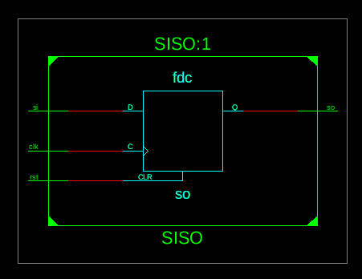

##### Testbench:
```verilog
module SISO_Test;

	// Inputs
	reg clk;
	reg rst;
	reg si;

	// Outputs
	wire so;

	// Instantiate the Unit Under Test (UUT)
	SISO uut (
		.clk(clk), 
		.rst(rst), 
		.si(si), 
		.so(so)
	);
	initial
	clk = 1'b1;
	always #10 clk = ~clk;
	initial begin
		// Initialize Inputs
		si = 1'b0; rst = 1'b1;

		// Wait 100 ns for global reset to finish
		#100 rst = 1'b0;
		#100 si = 1'b1;
		#100 rst = 1'b1;
		#100 rst = 1'b0;
        
		// Add stimulus here

	end
      
endmodule
```

##### Waveform:
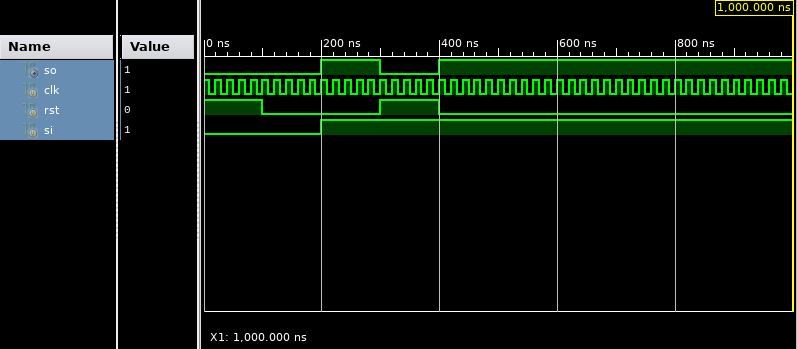

#### SIPO:
##### Code: 
```verilog
module SIPO(input si, clk, rst, output [3:0]PO);
reg [3:0] tmp;

always @(posedge clk, posedge rst)
	begin
		if(rst == 1'b1) begin
			tmp<=4'b0000;
		end else begin 
			tmp<=tmp<<1'b1;
			tmp[0]<=si;
		end
	end
assign PO = tmp;
endmodule

```

##### RTL:
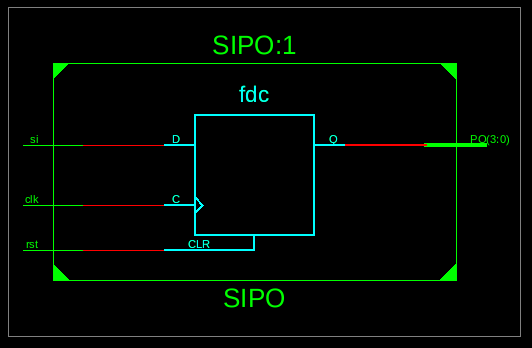

##### Testbench:
```verilog
module SIPO_Test;

	// Inputs
	reg si;
	reg clk;
	reg rst;

	// Outputs
	wire [3:0] PO;

	// Instantiate the Unit Under Test (UUT)
	SIPO uut (
		.si(si), 
		.clk(clk), 
		.rst(rst), 
		.PO(PO)
	);
	initial
	clk = 1'b0;
	always #10 clk = ~clk;
	initial begin
		// Initialize Inputs
		rst = 1'b1; si = 1'b1;

		// Wait 100 ns for global reset to finish
		#500 rst=1'b0;
		#100 si=1'b0;
		#100 si=1'b1;
        
		// Add stimulus here

	end
      
endmodule
```

##### Waveform:
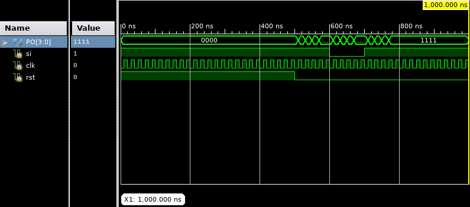

#### PIPO:
##### Code: 
```verilog
module PIPO(clk, rst, pi, po);
input clk, rst;
input [3:0] pi;
output [3:0]po;
reg [3:0]po;

always @(posedge clk, posedge rst)
	begin
		if(rst == 1'b1)
			po<=4'b0000;
		else
			po<=pi;
	end

endmodule

```

##### RTL:
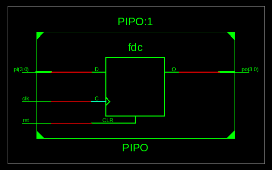

##### Testbench:
```verilog
module PIPO_Test;

	// Inputs
	reg clk;
	reg rst;
	reg [3:0] pi;

	// Outputs
	wire [3:0] po;

	// Instantiate the Unit Under Test (UUT)
	PIPO uut (
		.clk(clk), 
		.rst(rst), 
		.pi(pi), 
		.po(po)
	);
	initial
	clk=1'b1;
	always #10 clk = ~clk;
	initial begin
		// Initialize Inputs
		pi=4'b1101; rst=1'b1;

		// Wait 100 ns for global reset to finish
		#100 rst=1'b0;
		#100 pi=4'b1000;
		#100 rst=1'b1;
		#100 rst=1'b0;
        
		// Add stimulus here

	end
      
endmodule
```

##### Waveform:
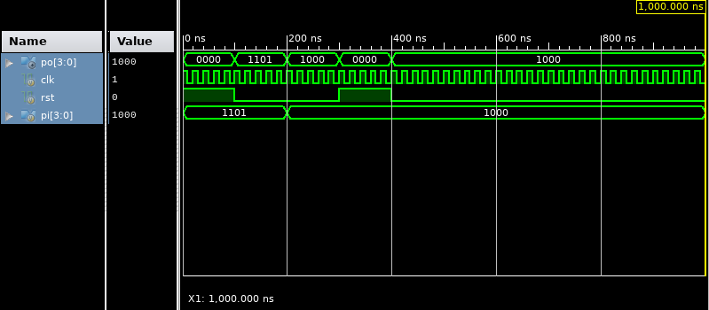

#### PISO:
##### Code: 
```verilog
module PISO(clk, rst, pi, so);
input clk, rst;
input [3:0]pi;
output so;
reg so;
reg [3:0]tmp;

always @(posedge clk, posedge rst)
	begin 
		if(rst==1'b1) begin
			so<=1'b0;
			tmp<=pi;
		end else begin
			so <= tmp[0];
			tmp <= tmp>>1'b1;
		end
	end

endmodule

```

##### RTL:
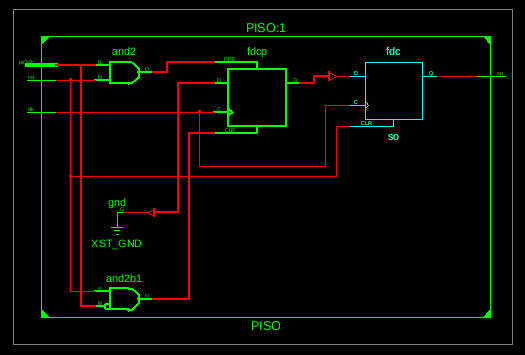

##### Testbench:
```verilog
module PISO_Test;

	// Inputs
	reg clk;
	reg rst;
	reg [3:0] pi;

	// Outputs
	wire so;

	// Instantiate the Unit Under Test (UUT)
	PISO uut (
		.clk(clk), 
		.rst(rst), 
		.pi(pi), 
		.so(so)
	);
	
	initial
	clk = 1'b1;
	always #10 clk = ~clk;
	initial begin
		// Initialize Inputs
		rst=1'b1; pi=4'b1101;
		#300 rst=1'b0;
		#200 rst=1'b1;
		#200 rst=1'b0;

		// Wait 100 ns for global reset to finish
        
		// Add stimulus here

	end
   
endmodule
```

##### Waveform:
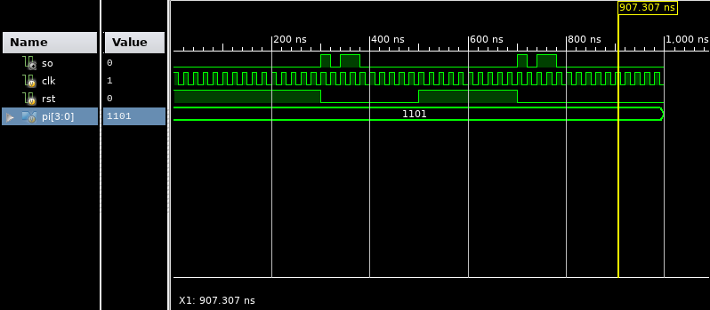

#### Q2.
#### 4-bit Adder:
##### Code: 
```verilog
module Adder(s1, s2, c, sum, carry);
input [3:0] s1, s2;
input c;
output [3:0]sum;
output carry;

assign {carry, sum} = s1+s2+c;
endmodule
```

##### RTL:
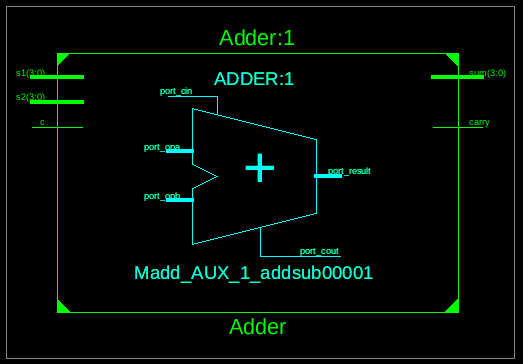

##### Testbench:
```verilog
module Adder_Test;

	// Inputs
	reg [3:0] s1;
	reg [3:0] s2;
	reg c;

	// Outputs
	wire [3:0] sum;
	wire carry;

	// Instantiate the Unit Under Test (UUT)
	Adder uut (
		.s1(s1), 
		.s2(s2), 
		.c(c), 
		.sum(sum), 
		.carry(carry)
	);

	initial begin
		// Initialize Inputs
		s1 = 0;
		s2 = 0;
		c = 0;

		// Wait 100 ns for global reset to finish
		#100 s1=1; s2=3; c=0;
		#100 s1=3; s2=2; c=1;
        
		// Add stimulus here

	end
	initial 
	#400 $stop;
endmodule
```

##### Waveform:
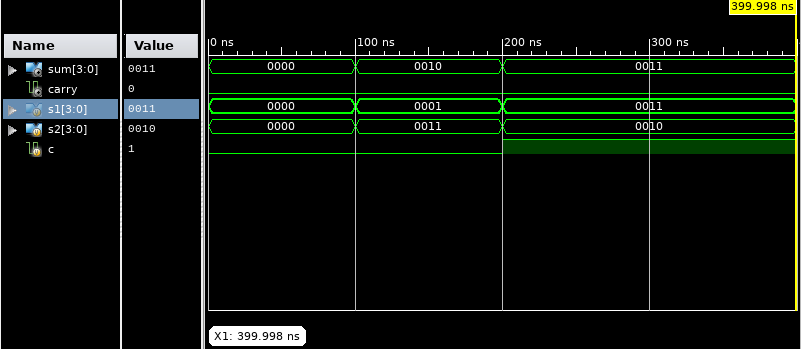

#### Q3.
#### 3-bit Ring Counter:
##### Code: 
```verilog
module ring_counter (input clk, rst, output [2:0]out);
reg [2:0]tmp;
always @(posedge clk, posedge rst) begin
	if(rst == 1'b1) begin
		tmp = 4'b0001;
	end
	else begin
		tmp = {tmp[1:0], tmp[2]};
	end
end
assign out = tmp;
endmodule
```

##### RTL:
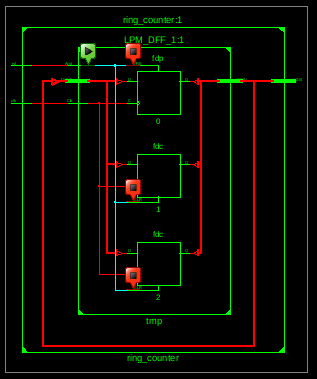

##### Testbench:
```verilog
module Ring_Counter_Test;
	// Inputs
	reg clk;
	reg rst;

	// Outputs
	wire [2:0] out;

	// Instantiate the Unit Under Test (UUT)
	ring_counter uut (
		.clk(clk), 
		.rst(rst), 
		.out(out)
	);
	always #10 clk = ~clk;
	
	initial begin
		// Initialize Inputs
		{clk, rst} <= 0;

		$monitor("T=%0t out=%b", $time, out);
		repeat(2) @(posedge clk);
		rst<=1;
		repeat(15) @(posedge clk);
		$stop;

	end
      
endmodule
```

##### Waveform:
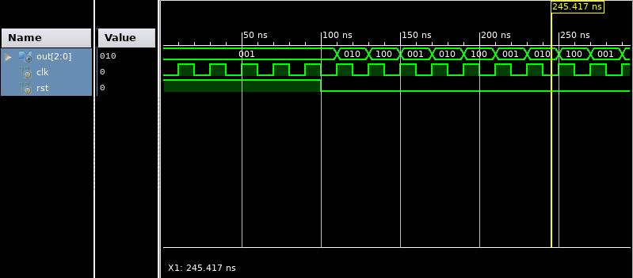

### MIPS:Assembly Language Programming

#### Q1. 
```assembly
.data
	m1: .asciiz "\nType of Input"
	m2: .asciiz "\n1. Cube"
	m3: .asciiz "\n2. Rectangular prism"
	m4: .asciiz "\nEnter Choice: "
	m5: .asciiz "\nEnter Value: "
	m6: .asciiz "\nEnter Length: "
	m7: .asciiz "\nEnter Width: "
	m8: .asciiz "\nEnter Height: "
	m9: .asciiz "\nVolume: "

.text
main: 
	li $v0, 4
	la $a0, m1
	syscall
	
	li $v0, 4
	la $a0, m2
	syscall
	
	li $v0, 4
	la $a0, m3
	syscall
	
	li $v0, 4
	la $a0, m4
	syscall
	
	li $v0, 5
	syscall
	move $t0, $v0
	
	la $t3, 1
	la $t4, 2
	
	beq $t0, $t3, cube
	beq $t0, $t4, rec
	
cube:
	li $v0, 4
	la $a0, m5
	syscall
	
	li $v0, 5
	syscall
	move $t0, $v0
	
	mul $t1, $t0, $t0
	li $v0, 4
	la $a0, m9
	syscall
	
	li $v0, 1
	move $a0, $t1
	syscall
	
	li $v0, 10
	syscall
rec:
	li $v0, 4
	la $a0, m6
	syscall
	
	li $v0, 5
	syscall
	move $t0, $v0
	
	li $v0, 4
	la $a0, m7
	syscall
	
	li $v0, 5
	syscall
	move $t1, $v0
	
	li $v0, 4
	la $a0, m8
	syscall
	
	li $v0, 5
	syscall
	move $t2, $v0

	mul $t3, $t0, $t1
	mul $t3, $t3, $t2
	
	li $v0, 4
	la $a0, m9
	syscall
	
	li $v0, 1
	move $a0, $t3
	syscall
	
	li $v0, 10
	syscall
```

#### Q2. 
```assembly
.data
	m1: .asciiz "Enter a number: "
	m2: .asciiz "\nGreatest Number: "
	m3: .asciiz "\nLeast Number: "
	arr: .space 20
.text

main:
	la $t6, 999999
	la $t7, 0
	
	la $t5, 0
	la $t4, 1
while:			 
	beq $t0,20,exit
	
	li $v0,4	
	la $a0,m1
	syscall
	
	li $v0,5	
	syscall
	move $t1, $v0
	
	slt $t3, $t6, $t1
	beq $t3, $t5, gr
	
	slt $t3, $t7, $t1
	beq $t3, $t4, sm
	
gr:
	move $t6, $t1
	j end

sm:
	move $t7, $t1
	j end
	
end: 
	addi $t0, $t0,4 			
	j while		

exit:

li $v0, 4
la $a0, m3
syscall

li $v0, 1
la $a0, ($t6)
syscall

li $v0, 4
la $a0, m2
syscall

li $v0, 1
la $a0, ($t7)
syscall

li $v0,10
syscall
```

#### Q3. 
```assembly
.data 
	m1: .asciiz "Enter a number: "
	m2: .asciiz "\nAscending Order: "
	m3: .asciiz "\nDescending Order: "
.text
main: 
	li $v0, 4
	la $a0, m1
	syscall
	
	li $v0, 5
	syscall
	move $t0, $v0

	li $v0, 4
	la $a0, m1
	syscall
	
	li $v0, 5
	syscall
	move $t1, $v0

	li $v0, 4
	la $a0, m1
	syscall
	
	li $v0, 5
	syscall
	move $t2, $v0
	
	blt $t0, $t1, p1
	j p2
	
p1:
	blt $t0, $t2, p11
	j p12
p2:
	blt $t1, $t2, p21
	j p22	
p21:
	blt $t0, $t2, p211
	j p212
p11:
	blt $t1, $t2, p111
	j p112
p111:
	li $v0, 4
	la $a0, m1
	syscall
	
	li $v0, 1
	la $a0, ($t0)
	syscall
	la $a0, ($t1)
	syscall
	la $a0, ($t2)
	syscall
	
	li $v0, 4
	la $a0, m2
	syscall
	
	li $v0, 1
	la $a0, ($t2)
	syscall
	la $a0, ($t1)
	syscall
	la $a0, ($t0)
	syscall
	
	li $v0, 10
	syscall
p112:
	li $v0, 4
	la $a0, m1
	syscall
	
	li $v0, 1
	la $a0, ($t0)
	syscall
	la $a0, ($t2)
	syscall
	la $a0, ($t1)
	syscall
	
	li $v0, 4
	la $a0, m2
	syscall
	
	li $v0, 1
	la $a0, ($t1)
	syscall
	la $a0, ($t2)
	syscall
	la $a0, ($t0)
	syscall
	
	li $v0, 10
	syscall
p12:
	li $v0, 4
	la $a0, m1
	syscall
	
	li $v0, 1
	la $a0, ($t2)
	syscall
	la $a0, ($t0)
	syscall
	la $a0, ($t1)
	syscall
	
	li $v0, 4
	la $a0, m2
	syscall
	
	li $v0, 1
	la $a0, ($t1)
	syscall
	la $a0, ($t0)
	syscall
	la $a0, ($t2)
	syscall
	
	li $v0, 10
	syscall
p211:
	li $v0, 4
	la $a0, m1
	syscall
	
	li $v0, 1
	la $a0, ($t1)
	syscall
	la $a0, ($t0)
	syscall
	la $a0, ($t2)
	syscall
	
	li $v0, 4
	la $a0, m2
	syscall
	
	li $v0, 1
	la $a0, ($t2)
	syscall
	la $a0, ($t0)
	syscall
	la $a0, ($t1)
	syscall
	
	li $v0, 10
	syscall
p212: 
	li $v0, 4
	la $a0, m1
	syscall
	
	li $v0, 1
	la $a0, ($t1)
	syscall
	la $a0, ($t2)
	syscall
	la $a0, ($t0)
	syscall
	
	li $v0, 4
	la $a0, m2
	syscall
	
	li $v0, 1
	la $a0, ($t0)
	syscall
	la $a0, ($t2)
	syscall
	la $a0, ($t1)
	syscall
	
	li $v0, 10
	syscall
p22: 
	li $v0, 4
	la $a0, m1
	syscall
	
	li $v0, 1
	la $a0, ($t2)
	syscall
	la $a0, ($t1)
	syscall
	la $a0, ($t0)
	syscall
	
	li $v0, 4
	la $a0, m2
	syscall
	
	li $v0, 1
	la $a0, ($t0)
	syscall
	la $a0, ($t1)
	syscall
	la $a0, ($t2)
	syscall
	
	li $v0, 10
	syscall
exit:
```