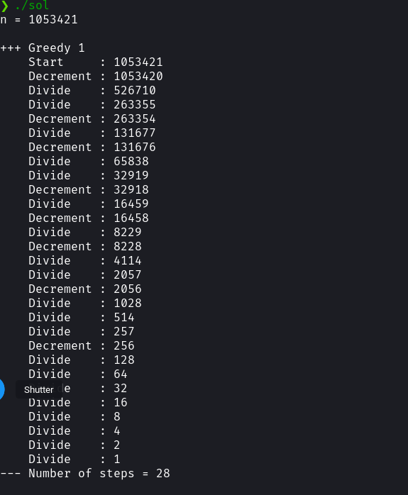
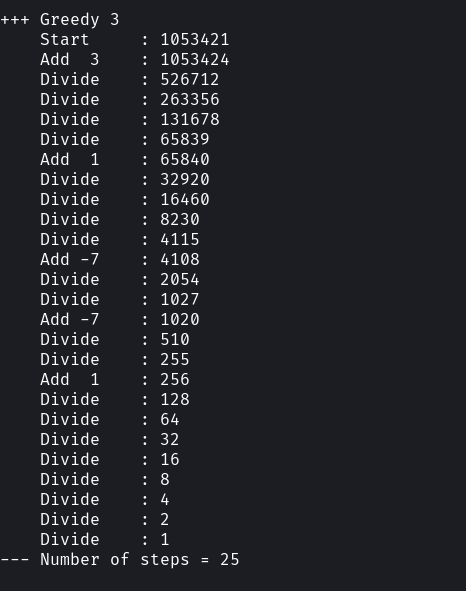

## **Assignment 3**
---
### Name: Sayantani Karmakar
### Roll No. 20CS8024
---
### Code: 
```C
#include <stdio.h>
#include <stdlib.h>
#include <time.h>

#define PLUS_INFINITY 1000000000

int greedy1 ( int n )
{
   int nsteps;

   printf("    Start     : %-8d\n", n);
   nsteps = 0;
   while (n > 1) {
      if (n % 2) {
         --n;
         printf("    Decrement : %d\n", n);
      } else {
         n >>= 1;
         printf("    Divide    : %d\n", n);
      }
      ++nsteps;
   }
   return nsteps;
}

int greedy2 ( int n )
{
   int nsteps;

   printf("    Start     : %d\n", n);
   nsteps = 0;
   while (n > 1) {
      if (n % 2) {
         if ( (n == 3) || ((n - 1) % 4 == 0) ) {
            --n;
            printf("    Decrement : %d\n", n);
         } else {
            ++n;
            printf("    Increment : %d\n", n);
         }
      } else {
         n >>= 1;
         printf("    Divide    : %d\n", n);
      }
      ++nsteps;
   }
   return nsteps;
}

int greedy3 ( int n, int A[], int k )
{
   int i, j, m, M[5], maxmul, minn, nsteps, visited[128], nv;

   printf("    Start     : %d\n", n);
   nsteps = 0; nv = 0;
   while (n > 1) {
      visited[nv] = n; ++nv;
      if (n % 2 == 0) {  /* if n is even */
         n >>= 1;        /* divide by 2 */
         printf("    Divide    : %d\n", n);
      } else {
         for (i=0; i<k; ++i) {  /* Find m such that n + A[m] has largest multiplicity of 2 */
            m = n + A[i];
            if (m <= 0) M[i] = -1;
            else {
               for (j=0; j<nv; ++j) if (visited[j] == m) break;
               if (j < nv) M[i] = -1;
               else {
                  M[i] = 0;
                  while (m % 2 == 0) {
                     m >>= 1;
                     ++M[i];
                  }
               }
            }
         }
         m = -1; maxmul = 0; minn = PLUS_INFINITY;
         for (i=0; i<k; ++i) {
            if (M[i] > maxmul) {  /* larger multiplicity found */
               m = i;
               maxmul = M[i];
               minn = n + A[i];
            } else if (M[i] == maxmul) {  /* same multiplicty */
               if (n + A[i] < minn) {     /* favor smaller numbers */
                  m = i;
                  minn = n + A[i];
               }
            }
         }
         if (m == -1) {
            printf("*** No move found after %d steps\n", nsteps);
            return nsteps;
         }
         if ((maxmul == 0) && (A[m] > 0)) {
            printf("*** No reducing move found after %d steps\n", nsteps);
            return nsteps;
         }
         n += A[m];
         printf("    Add %2d    : %d\n", A[m], n);
      }
      ++nsteps;
   }
   return nsteps;
}

int optimal ( int n, int A[], int k )
{
   int m, logn, nsteps, i, j, l, u, improved;
   int *B, *M;

   logn = 0; m = n;
   while (m > 1) {
      m >>= 1;
      ++logn;
   }
   m = n + 10 * logn; /* We have to explore integers larger than n */
   B = (int *)malloc((m+1) * sizeof(int));
   M = (int *)malloc((m+1) * sizeof(int));
   for (i=0; i<=m; ++i) {
      B[i] = PLUS_INFINITY;    /* Best number of moves */
      M[i] = -1;               /* Last move: 0,1,2,...,k-1 (add), k (divide by 2) */
   }

   B[1] = 0;  /* No move needed for 1 */

   printf("\n");

   /* The (outer) loop makes iterative improvement of best moves.
      It stops until no further improvements are possible. This
      should happen in no more than log_2(n) iterations. */
   l = 0;
   while (1) {
      improved = 0; ++l;
      for (i=2; i<=m; ++i) {
         if (i % 2 == 0) {   /* if i is even */
            j = i / 2;       /* one option is to divide i by 2 */
            if (B[j] + 1 < B[i]) {   /* Better option found */
               B[i] = B[j] + 1;
               M[i] = k;
               ++improved;
            }
         }
         for (u=0; u<k; ++u) {  /* for each of the k increments */
            j = i + A[u];    /* one option is to "reduce" i to j */
            if ((j > 0) && (j <= m) && (B[j] + 1 < B[i])) {  /* Better option */
               B[i] = B[j] + 1;
               M[i] = u;
               ++improved;
            }
         }
      }

      printf("%11d improvements made in iteration no %d\n", improved, l);
      if (!improved) break;
   }

   printf("\n");

   nsteps = 0;
   printf("    Start     : %d\n", n);
   while (n > 1) {
      if (M[n] == k) {
         n >>= 1;
         printf("    Divide    : %d\n", n);
      } else if (M[n] >= 0) {
         u = M[n];
         n += A[u];
         printf("    Add %2d    : %d\n", A[u], n);
      } else {
         printf("*** No sequence of moves detected\n");
         return PLUS_INFINITY;
      }
      ++nsteps;
   }

   free(B); free(M);
   return nsteps;
}

int main ( )
{
   int n, i, j, k, A[5], s;

   srand((unsigned int)time(NULL));
   n = 1000000 + rand() % 1000000;

   k = 5; A[0] = (rand() % 2) ? 1 : -1;
   for (i=1; i<k; ++i) {
      while (1) {
         A[i] = 1 + rand() % 9;
         if (rand() % 2) A[i] = -A[i];
         for (j=0; j<i; ++j) if (A[j] == A[i]) break;
         if (j == i) break;
      }
   }

   printf("n = %d\n", n);

   printf("\n+++ Greedy 1\n");
   s = greedy1(n);
   printf("--- Number of steps = %d\n", s);

   printf("\n+++ Greedy 2\n");
   s = greedy2(n);
   printf("--- Number of steps = %d\n", s);

   printf("\nk = %d\n", k);
   for (i=0; i<k; ++i) printf("%d ", A[i]);
   printf("\n");

   printf("\n+++ Greedy 3\n");
   s = greedy3(n,A,k);
   printf("--- Number of steps = %d\n", s);

   printf("\n+++ Optimal\n");
   s = optimal(n,A,k);
   printf("--- Number of steps = %d\n", s);

   exit(0);
}
```

### Output: 



