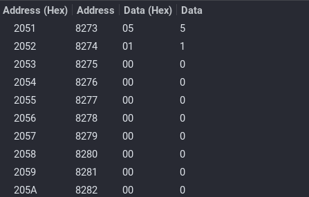
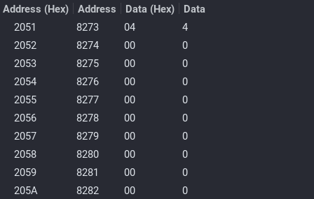
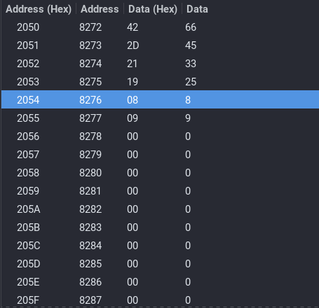
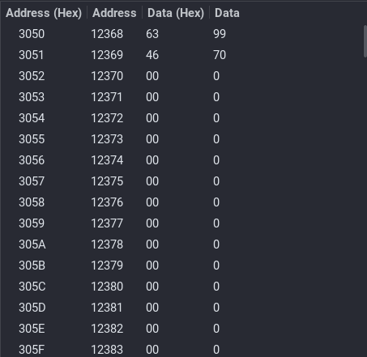
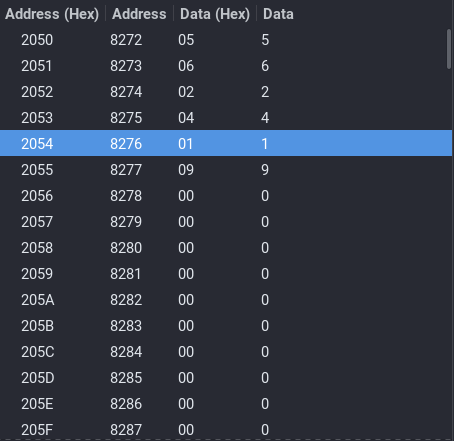
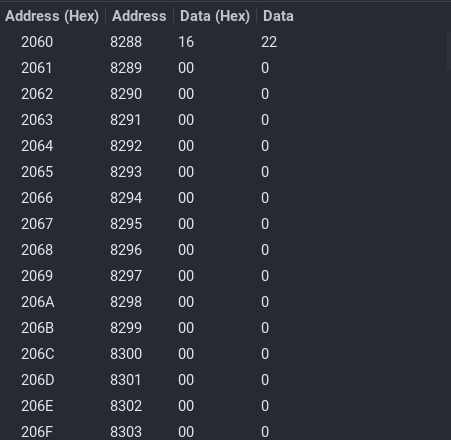
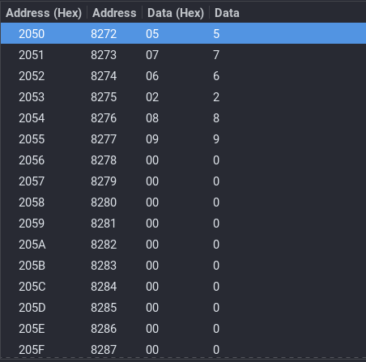
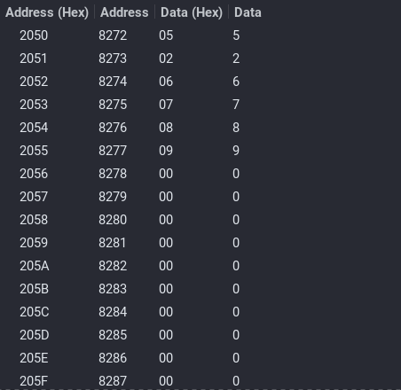

## **Assignment 1**

### **Name**: Diptangshu Dey
### **Roll No**: 20CS8018
----------

### Q1. Program to check whether a number is even or odd.

#### Code: 

```assembly
; ODD_EVEN

LXI H, 2051H
MOV A, M

ANI 01H

JZ EVEN

INX H
MVI M, 01H
HLT

EVEN: INX H
MVI M, 00H
HLT 

```

#### Input 1: 



#### Input 2: 




### Q2. Program to add two 16-bit integers.

#### Code: 
```
; Add two 16bit numbers with carry
LHLD 2050H
XCHG 

LHLD 2052H
DAD D

SHLD 3050H

HLT
```

#### Input: 



#### Output: 



### Q3. Program to add a Series of Numbers.

#### Code: 

```
; SUM OF SERIES
MVI A, 00H
LXI H, 2050H
MOV D, M

LXI H, 2051H

NEXT: ADD M
INX H
DCR D 
JNZ NEXT

STA 2060H
HLT
```

#### Input: 



#### Output: 



### Q4. Program to perform a sorting algorithm

#### Code: 
```
; Bubble Sort
START: LXI H, 2050H
MVI D, 00H
MOV C, M

DCR C
INX H

CHECK: MOV A, M
INX H
CMP M

JC NEXTBYTE
JZ NEXTBYTE

MOV B, M
MOV M, A
DCX H
MOV M, B
INX H

MVI D, 01H

NEXTBYTE: DCR C
JNZ CHECK

MOV A, D

CPI 01H
JZ START

HLT
```

#### Input: 



#### Output: 



