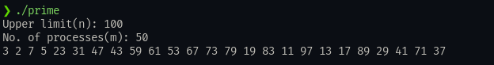

## **Assignment 1**
---
### Name: Diptangshu Dey
### Roll No: 20CS8018
### Subject Code: CSS553
---
### **Q1.** 
#### Code: 

```C
#include <stdio.h>
#include <stdlib.h>
#include <sys/types.h>
#include <sys/wait.h>
#include <unistd.h>

int main() {
  int n;
  printf("Enter the number n: ");
  scanf("%d", &n);

  FILE *file;

  file = fopen("log.txt", "w");

  printf("[parent] pid: %d ppid: %d \n", getpid(), getppid());
  fprintf(file, "%s %d \n", "[parent]:", getpid());
  wait(NULL);
  fclose(file);

  for (int i = 0; i < n; i++) {
    if (fork() == 0) {
      printf("[child] pid: %d from [parent] ppid: %d \n", getpid(), getppid());

      file = fopen("log.txt", "a");
      fprintf(file, "%s %d %s %d \n", "[child", i + 1, "]:", getpid());
      fclose(file);

      exit(0);
    }
  }
  // for (int i = 0; i < n; i++)
  //   wait(NULL);
}
```

#### Output: 
```
[parent]: 54316 
[child 1 ]: 54332 
[child 2 ]: 54333 
[child 4 ]: 54335 
[child 3 ]: 54334 
```

### **Q2.**
#### Code: 
```C
#include <stdio.h>
#include <stdlib.h>
#include <sys/types.h>
#include <sys/wait.h>
#include <unistd.h>

void proc(int n) {
  if (n == 0)
    return;
  else if (fork() == 0) {
    FILE *file;
    file = fopen("log2.txt", "a");
    printf("[child %d ]: %d, [parent]: %d\n", n, getpid(), getppid());
    fprintf(file, "[child %d ]: %d, [parent]: %d\n", n, getpid(), getppid());
    fclose(file);

    proc(--n);
    wait(NULL);
    exit(0);
  }
}

int main() {
  int n;
  FILE *file;
  printf("Enter the number of processes: ");
  scanf("%d", &n);

  file = fopen("log2.txt", "w");
  printf("[parent]: %d\n", getpid());
  fprintf(file, "[parent]: %d\n", getpid());
  fclose(file);
  wait(NULL);

  proc(n);
  wait(NULL);
}
```

#### Output: 
```
[parent]: 320866
[child 3 ]: 320875, [parent]: 320866
[child 2 ]: 320876, [parent]: 320875
[child 1 ]: 320877, [parent]: 320876
```

### **Q3.** 

#### Code: 

```C
#include <stdio.h>
#include <stdlib.h>
#include <sys/types.h>
#include <unistd.h>

int isPrime(int n) {
  for (int i = 2; i * i <= n; i++) {
    if (n % i == 0)
      return 0;
  }

  return 1;
}

void printPrime(int a, int b) {
  FILE *file;
  file = fopen("log3.txt", "a");

  for (int i = a; i <= b; i++) {
    if (isPrime(i) && i >= 2) {
      printf("%d ", i);
      fprintf(file, "%d ", i);
    }
  }

  fclose(file);
}

int main(void) {
  int n;
  printf("Upper limit(n): ");
  scanf("%d", &n);
  int m;
  printf("No. of processes(m): ");
  scanf("%d", &m);

  FILE *file;

  file = fopen("log3.txt", "w");
  fprintf(file, "Prime numbers between 1 and %d : \n", n);
  fclose(file);

  int i = 1;
  pid_t x;

  for (i = 0; i < m; i++) {
    x = fork();
    if (x == 0) {
      printPrime((i * (n / m)) + 1, (i + 1) * (n / m));
      exit(0);
    }
  }

  sleep(1);
  printf("\n");
}
```

#### Input: (Terminal)


#### Output: (Logs)
```
Prime numbers between 1 and 100 : 
2 3 19 29 47 13 17 31 71 79 53 59 67 83 89 97 43 5 7 11 41 37 23 73 61 
```