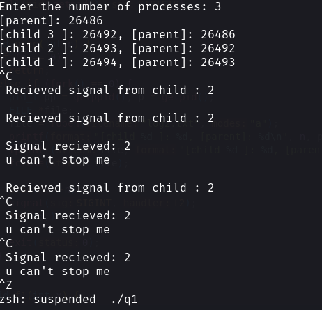
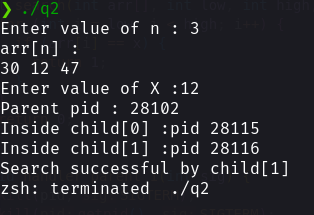
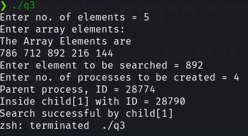
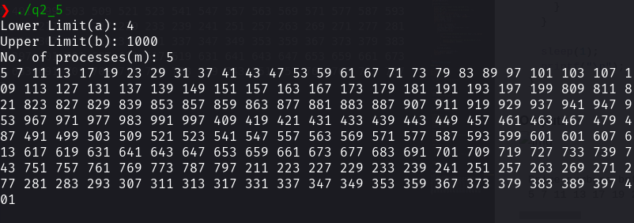

## **Assignment 2**
---
### Sayantani Karmakar
### Roll No. 20CS8024
---
#### **Q1**

**Code:**
```C
#include <signal.h>
#include <stdio.h>
#include <stdlib.h>
#include <sys/types.h>
#include <sys/wait.h>
#include <unistd.h>

void f2(int x) {
  printf("\n Recieved signal from child : %d", x);
  printf("\n Adios");
  kill(getpid(), SIGTSTP);
}

void proc(int n) {
  if (n == 0)
    return;
  else if (fork() == 0) {
    pid_t pp = getppid(), p = getpid();
    FILE *file;
    file = fopen("log2.txt", "a");
    printf("[child %d ]: %d, [parent]: %d\n", n, p, pp);
    fprintf(file, "[child %d ]: %d, [parent]: %d\n", n, p, pp);
    fclose(file);

    proc(--n);
    signal(SIGINT, f2);
    for (;;)
      ;
    exit(0);
  }
}

void f1(int x) {
  printf("\n Signal recieved: %d", x);
  printf("\n u can't stop me \n");
  signal(SIGINT, f1);
}

int main() {
  int n;
  FILE *file;
  printf("Enter the number of processes: ");
  scanf("%d", &n);

  int *pros = malloc((n + 1) * sizeof(int *));

  file = fopen("log2.txt", "w");
  printf("[parent]: %d\n", getpid());
  fprintf(file, "[parent]: %d\n", getpid());
  pros[0] = getpid();
  fclose(file);
  wait(NULL);

  proc(n);

  signal(SIGINT, f1);
  for (;;)
    ;
}
```

**Output:**



#### **Q2.**

**Code:**

```C
#include <time.h>
#include <signal.h>
#include <stdio.h>
#include <stdlib.h>
#include <sys/types.h>
#include <sys/wait.h>
#include <unistd.h>

pid_t pid;
int r;
int search(int arr[], int low, int high, int x) {
  for (int i = low; i < high; i++) {
    if (arr[i] == x) {
      return 1;
    }
  }
  return 0;
}

void handler_parent_1(int sig) {
  kill(pid, SIGTERM);
  kill(getpid(), SIGTERM);
}
void handler_parent_2(int sig) {
  printf("Search unsuccessful\n");
  kill(pid, SIGTERM);
}

int main() {
  srand(time(NULL));
  int n, h1, low = 0, xx;
  printf("Enter value of n : ");
  scanf("%d", &n);
  pid_t chid;
  int eex;
  int arr[n];
  if (n % 2 != 0) {
    h1 = n / 2;
  } else if (n % 2 == 0) {
    h1 = n / 2 - 1;
  }
  for (int i = 0; i < n; i++) {
    int num = rand() % 50 + 1;
    ;
    arr[i] = num;
  }
  printf("arr[n] :\n");
  for (int i = 0; i < n; i++) {
    printf("%d ", arr[i]);
  }
  printf("\n");
  printf("Enter value of X :");
  scanf("%d", &xx);
  printf("Parent pid : %d\n", getpid());

  signal(SIGUSR1, handler_parent_1);
  signal(SIGUSR2, handler_parent_2);
  for (int id = 0; id < 2; id++) {
    pid_t x = fork();
    if (x > 0) {
      chid = wait(&eex);
    } else if (x == 0) {
      pid = getpid();
      printf("Inside child[%d] :pid %d\n", id, pid);
      if (id == 0) {
        r = 0;
        int k = search(arr, 0, h1, xx);
        if (k == 1) {
          printf("Search successful by child[%d] \n", id);
          kill(getppid(), SIGUSR1);
        }
        exit(0);
      } else if (id == 1) {
        r = 1;

        int k = search(arr, h1, n, xx);
        if (k == 1) {
          kill(getppid(), SIGUSR1);
          printf("Search successful by child[%d] \n", id);
        } else {
          sleep(2);
          kill(getppid(), SIGUSR2);
        }
        exit(1);
      }
    }
  }
}
```

**Output:**


#### **Q3.**

**Code:**
```C
#include <stdio.h>
#include <stdlib.h>
#include <unistd.h>
#include <signal.h>
#include <stdbool.h>
#include <sys/wait.h>
#include <sys/types.h>
#include <time.h>

int* p;
int no_of_fails=0;
int m;

void func1()
{
    for(int i=0; i<m; i++)
    {
        kill(p[i], SIGTERM);
    }
    printf("All child processes have been killed\n");
    kill(getpid(), SIGTERM);
}

void func2()
{
    printf("Element not found by any child process\n");
    kill(getpid(), SIGTERM);
}

bool search(int* arr, int low, int high, int x)
{
    for(int i=low; i<high; i++)
    {
        if(arr[i]==x)
        {
            return true;
        }
    }
    return false;
}

int main()
{
	srand(time(NULL));
    int n, x, new_process;
    int status=0;
    pid_t child_pid, wpid;
    printf("Enter no. of elements = ");
    scanf("%d", &n);
    int arr[n];
    printf("Enter array elements:\n");
    for(int i=0; i<n; i++)
    {
	arr[i]=rand()%1000+1;
    }
	printf("The Array Elements are\n");
	for(int i=0;i<n;i++)
	{
	printf("%d ",arr[i]);
	}
    printf("\nEnter element to be searched = ");
    scanf("%d", &x);
    printf("Enter no. of processes to be created = ");
    scanf("%d", &m);
    p=(int*)malloc(sizeof(int)*m);
    int eachGrp = (n / m) + ((n % m) ? 1 : 0);
    printf("Parent process, ID = %d\n", getpid());
    signal(SIGUSR1, func1);
    signal(SIGUSR2, func2);
    for (int i = 0; i < m; i++)
    {
        int lo = i * eachGrp + 1;
        int hi = lo + eachGrp;
        //printf("Searching in group %d\n", i+1);
        new_process = fork();
        if(new_process == 0)
        {
            printf("Inside child[%d] with ID = %d\n", i+1, getpid());
            if(search(arr, lo, hi, x))
            {
                printf("Search successful by child[%d]\n", i+1);
                kill(getppid(), SIGUSR1);
            }
            exit(i);
        }
        p[i]=new_process;
    }
    while((wpid=wait(&status))>0);
    kill(getpid(), SIGUSR2);
    return 0;
}
```

**Output:**


#### **Q4.**

```C
#include <stdio.h>
#include <stdlib.h>
#include <sys/types.h>
#include <unistd.h>

int isPrime(int n) {
  for (int i = 2; i * i <= n; i++) {
    if (n % i == 0)
      return 0;
  }

  return 1;
}

void printPrime(int a, int b) {
  FILE *file;
  file = fopen("log3.txt", "a");

  for (int i = a; i <= b; i++) {
    if (isPrime(i) && i >= 2) {
      printf("%d ", i);
      fprintf(file, "%d ", i);
    }
  }

  fclose(file);
}

int main(void) {
  int a, b;
  printf("Lower Limit(a): ");
  scanf("%d", &a);
  printf("Upper Limit(b): ");
  scanf("%d", &b);
  int m;
  printf("No. of processes(m): ");
  scanf("%d", &m);

  FILE *file;

  file = fopen("log3.txt", "w");
  fprintf(file, "Prime numbers between %d and %d : \n", a, b);
  fclose(file);

  int i = 1;
  pid_t x;

  int d = (b - a) / m;

  for (i = 0; i < m; i++) {
    x = fork();
    if (x == 0) {

      printPrime(a + (i * d), a + ((i + 1) * d));
      exit(0);
    }
  }

  sleep(1);
  printf("\n");
}
```

**Output:**


```txt
Prime numbers between 4 and 1000 : 
5 7 11 13 17 19 23 29 31 37 41 43 47 53 59 61 67 71 73 79 83 89 97 101 103 107 109 113 127 131 137 139 149 151 157 163 167 173 179 181 191 193 197 199 809 811 821 823 827 829 839 853 857 859 863 877 881 883 887 907 911 919 929 937 941 947 953 967 971 977 983 991 997 409 419 421 431 433 439 443 449 457 461 463 467 479 487 491 499 503 509 521 523 541 547 557 563 569 571 577 587 593 599 601 211 223 227 229 233 239 241 251 257 263 269 271 277 281 283 293 307 311 313 317 331 337 347 349 353 359 367 373 379 383 389 397 401 601 607 613 617 619 631 641 643 647 653 659 661 673 677 683 691 701 709 719 727 733 739 743 751 757 761 769 773 787 797 
```