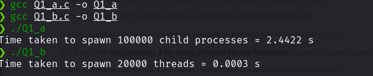
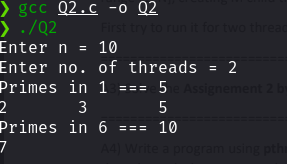
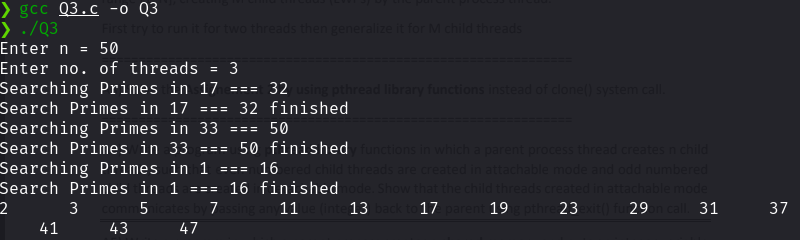
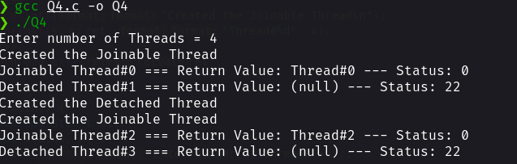
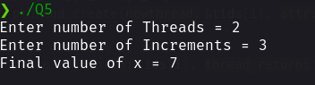
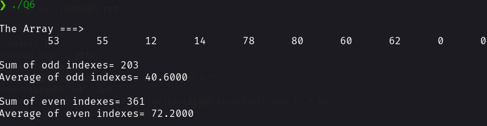

### Assignment 4

---

#### Name: Diptangshu Dey

#### Roll No: 20CS8018

---

Q1. **Code:**

**i:**

```C
#include <stdio.h>
#include <stdlib.h>
#include <sys/time.h>
#include <unistd.h>
int main() {
  int i = 0;
  struct timeval start, end;
  gettimeofday(&start, NULL);
  while (i < 100000) {
    if (fork() == 0)
      exit(0);
    else
      i++;
  }
  gettimeofday(&end, NULL);
  double dif = (double)(end.tv_usec - start.tv_usec) / 1000000 +
               (double)(end.tv_sec - start.tv_sec);
  printf("Time taken to spawn 100000 child processes = %.4f s\n", dif);
  return 0;
}
```

**ii:**

```C
#include <stdio.h>
#include <stdlib.h>
#include <sys/time.h>
#include <unistd.h>
#define __USE_GNU 1
#include <sched.h>
int func(void *arg) {
  printf("Hello World");
  exit(0);
}
int main() {
  int i = 0;
  struct timeval start, end;
  gettimeofday(&start, NULL);
  while (i < 20000) {
    clone(&func, NULL, CLONE_VM, NULL);
    i++;
  }
  gettimeofday(&end, NULL);
  double dif = (double)(end.tv_usec - start.tv_usec) / 1000000 +
               (double)(end.tv_sec - start.tv_sec);
  printf("Time taken to spawn 20000 threads = %.4f s\n", dif);
  return 0;
}
```

**Output:**



Q2. **Code:**

```C
#include <stdio.h>
#include <stdlib.h>
#define __USE_GNU 1
#include <math.h>
#include <sched.h>
#define STACK_SIZE (1024 * 1024)

typedef struct {
  int start;
  int end;
} range;

static int prime_nos(void *arg) {
  range *r = (range *)arg;
  int i, j;
  printf("Primes in %d === %d\n", r->start, r->end);
  for (i = r->start == 1 ? 2 : r->start; i <= r->end; i++) {
    int flag = 1;
    for (j = 2; j <= i / 2; j++) {
      if (i % j == 0) {
        flag = 0;
        break;
      }
    }
    if (flag)
      printf("%d\t", i);
  }
  printf("\n");
  return (0);
}

int main() {
  range r;
  char *stack = malloc(STACK_SIZE);
  int n, m, i;
  printf("Enter n = ");
  scanf("%d", &n);
  printf("Enter no. of threads = ");
  scanf("%d", &m);

  for (i = 0; i < m; i++) {
    r.start = n / m * i + 1;
    if (i == m - 1)
      r.end = n;
    else
      r.end = n / m * (i + 1);
    clone(prime_nos, stack + STACK_SIZE, 0, (void *)(&r));
  }
  return (0);
}
```

**Output:**



Q3. **Code:**

```C
#include <stdio.h>
#include <stdlib.h>
#define __USE_GNU 1
#include <pthread.h>
typedef struct {
  int start;
  int end;
} range;
static int *primes;
static void *prime_nos(void *arg) {
  range *r = (range *)arg;
  int i, j;
  printf("Searching Primes in %d === %d\n", r->start, r->end);
  for (i = r->start == 1 ? 2 : r->start; i <= r->end; i++) {
    int flag = 1;
    for (j = 2; j <= i / 2; j++) {
      if (i % j == 0) {
        flag = 0;
        break;
      }
    }
    if (flag)
      primes[i] = 1;
  }
  printf("Search Primes in %d === %d finished\n", r->start, r->end);
  return (0);
}
int main() {
  int n, m, i;
  printf("Enter n = ");
  scanf("%d", &n);
  printf("Enter no. of threads = ");
  scanf("%d", &m);
  primes = (int *)malloc(sizeof(int) * n);
  for (i = 0; i < n; i++)
    primes[i] = 0;
  pthread_t *tid = (pthread_t *)malloc(m * sizeof(pthread_t));
  for (i = 0; i < m; i++) {
    range *r = (range *)malloc(sizeof(range));
    r->start = n / m * i + 1;
    if (i == m - 1)
      r->end = n;
    else
      r->end = n / m * (i + 1);
    pthread_create(&tid[i], NULL, &prime_nos, (void *)r);
  }
  for (i = 0; i < m; i++)
    pthread_join(tid[i], NULL);
  for (i = 1; i <= n; i++)
    if (primes[i] == 1)
      printf("%-6d ", i);
  printf("\n");
  return (0);
}
```

**Output:**



Q4. **Code:**

```C
#include <stdio.h>
#include <stdlib.h>
#define __USE_GNU 1
#include <errno.h>
#include <pthread.h>
#include <string.h>
static int x = 0;

void *func(void *arg) {
  char *ret;
  ret = (char *)malloc(20);
  if ((int *)arg)
    printf("Created the Detached Thread\n");
  else
    printf("Created the Joinable Thread\n");
  sprintf(ret, "Thread#%d", x);
  x++;
  pthread_exit(ret);
}

int main() {
  pthread_attr_t attr;
  int status, n, i;
  printf("Enter number of Threads = ");
  scanf("%d", &n);
  pthread_t *tid = (pthread_t *)malloc(sizeof(pthread_t) * n);
  status = pthread_attr_init(&attr);

  if (status != 0) {
    printf("Error initalizing attributes");
    exit(0);
  }

  pthread_attr_setdetachstate(&attr, PTHREAD_CREATE_DETACHED);
  for (i = 0; i < n; i++) {
    if (i % 2 == 1)
      status = pthread_create(&tid[i], &attr, &func, (void *)1);
    else
      status = pthread_create(&tid[i], NULL, &func, (void *)0);

    if (status != 0)
      printf("Error creating thread");
    void *retval = NULL;
    status = pthread_join(tid[i], &retval);

    if (status == EINVAL)
      printf("Detached Thread#%d === Return Value: %s --- Status: %d\n", i,
             (char *)retval, status);
    else if (status == 0)
      printf("Joinable Thread#%d === Return Value: %s --- Status: %d\n", i,
             (char *)retval, status);
  }
  return (0);
}
```

**Output:**



Q5. **Code:**

```C
#include <stdio.h>
#include <stdlib.h>
#define __USE_GNU 1
#include <pthread.h>
static int x = 1;

void *func(void *arg) {
  int* m = (int *)arg;
  for (int i = 0; i < *m; i++)
    x = x + 1;
  pthread_exit(0);
}

int main() {
  int n, m, i;
  printf("Enter number of Threads = ");
  scanf("%d", &n);
  printf("Enter number of Increments = ");
  scanf("%d", &m);
  pthread_t *tids = (pthread_t *)malloc(sizeof(pthread_t) * n);

  for (i = 0; i < n; i++)
    pthread_create(&tids[i], NULL, &func, (void *)(&m));

  for (i = 0; i < n; i++)
    pthread_join(tids[i], NULL);

  printf("Final value of x = %d\n", x);
}
```

**Output:**



Q6. **Code:**

```C
#include <stdio.h>
#include <stdlib.h>
#define __USE_GNU 1
#include <pthread.h>
#include <time.h>
#define N 10
static int nums[N] = {0};
void *func(void *arg) {
  int i, sum = 0;
  for (i = 0; i < N; i += 2) {
    if (nums[i] != 0)
      nums[i + 1] = nums[i] + 2;
    sum = sum + nums[i];
  }
  printf("\nThe Array ===>\n");
  for (i = 0; i < N; i++)
    printf("\t%d", nums[i]);
  printf("\n");
  printf("\nSum of odd indexes= %d\nAverage of odd indexes= %.4f\n", sum,
         sum / 5.0);
  pthread_exit(0);
}
int main() {
  srand(time(NULL));
  int i, sum = 0;
  pthread_t tid;
  for (i = 0; i < N; i += 2)
    nums[i] = rand() % 100;
  pthread_create(&tid, NULL, &func, NULL);
  pthread_join(tid, NULL);
  for (i = 1; i < N; i++)
    sum = sum + nums[i];
  printf("\nSum of even indexes= %d\nAverage of even indexes= %.4f\n", sum,
         sum / 5.0);
  return (0);
}
```

**Output:**


