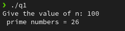
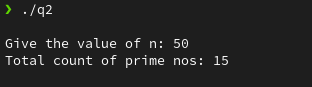
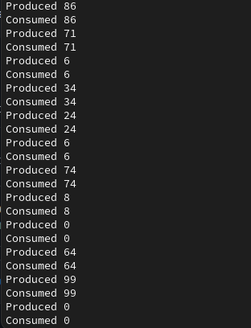

### Assignment 5

---

#### Name: Sayantani Karmakar

#### Roll No: 20CS8024

---

Q1. Write program in C where the parent thread creates 10 threads to find prime number.
The child threads increments the count of primes in a Globally declared integer variable
Count. The acess to Count should be protected by semaphores. Solve the problem using
POSIX unnamed semaphores

**Code:**

```C
#include <linux/sched.h>
#include <stdio.h>
#include <stdbool.h>
#include <fcntl.h>
#include <sys/stat.h>
#include <semaphore.h>
#include <stdlib.h>
#include <unistd.h>
#include <pthread.h>
#include <sys/syscall.h>
#include <sys/types.h>
#include <sys/wait.h>
#include <string.h>
int c=0;
sem_t sem;
int cp(int n)
{
 for (int k = 2; k <= (n / 2); k++)
 {
 if (n % k == 0)
 {
 return 0;
 }
 }
 return 1;
}
void *fp(void *at)
{
 int k = (*(int *)(at)), xt = *((int *)(at) + 1);

 for (int j = k; j <= xt; j++)
 {
 if ((cp(j) == 1) && (j != 1))
 {
 sem_wait(&sem);
 c++;


 sem_post(&sem);
 }
 }
}
void main()
{
 long long int i = 0, n = 0, t = 0;
 printf("Give the value of n: ");
 scanf("%lld", &n);
 t = sem_init(&sem, 1, 1);
 int d = n / 2;

 pthread_t id[2];
 int a[2][2];
 for (i = 1; i <= 2; i++)
 {
 int x = (i * d) + 1, k = ((i - 1) * d) + 1;
 a[i - 1][0] = k;
 a[i - 1][1] = x;
 pthread_create(&id[i - 1], NULL, fp, &a[i - 1]);
 }
 for (i = 1; i <= 2; i++)
 {
 int res = pthread_join(id[i - 1], NULL);
 }
 sem_destroy(&sem);
 printf(" prime numbers = %d \n", c);
}
```

**Output:**



Q2. Solve the above problem A1 by creating multiple process instead of threads and
implement access synchronization using named semaphores

**Code:**

```C
#include <stdio.h>
#include <stdlib.h>
#include <sys/types.h>
#include <unistd.h>
#include <stdbool.h>
#include <math.h>
#include <sys/wait.h>
#include <pthread.h>
#include <errno.h>
#include <fcntl.h>
#include <sys/stat.h>
#include <semaphore.h>
#include <sys/ipc.h>
#include <sys/shm.h>
#define SEMAPHORE_NAME "/sem-mutex"
#define SHM_KEY 0x1234
bool isprime(int n)
{
 if (n == 1)
 return 0;
 for (int i = 2; i * i <= n; i++)
 {
 if (n % i == 0)
 return false;
 }
 return true;
}
void *printprime(int st, int en, sem_t *sem, int *count)
{
 for (int i = st; i <= en; i++)
 {
 if (isprime(i))
 {
 sem_wait(sem);
 (*count)++;
 sem_post(sem);
 }
 }
 return NULL;
}
int main()
{
 int shmid;
 void *sh_mem;
 int *count;
 shmid = shmget(SHM_KEY, sizeof(int), 0666 | IPC_CREAT);
 sh_mem = shmat(shmid, NULL, 0);
 count = (int *)sh_mem;
 *count = 0;
 int n, m = 10;
 printf("\nGive the value of n: ");
 scanf("%d", &n);
 int range = n;
 m = m > range ? range : m;
 int grpsize = range / m;
 if (range % m != 0)
 grpsize++;
 int j = 1;
 for (int i = 1; i <= m; i++)
 {
 if (i == range % m + 1 && i != 1)
 grpsize--;
 if (fork())
 {
 j += grpsize;
 continue;
 }
 else
 {
 sem_t *binary_sem = sem_open(SEMAPHORE_NAME,O_CREAT, 0660, 1);
 printprime(j, j + grpsize - 1, binary_sem, count);
 shmdt(sh_mem);
 exit(1);
 }
 }
 while (wait(NULL) > 0);
 printf("Total count of prime nos: %d\n\n", *count);
 sem_unlink(SEMAPHORE_NAME);
 shmctl(shmid, IPC_RMID, 0);
}
```

**Output:**



Q3. Implement a solution for the producer-consumer (infinite buffer) problem using
semaphores

**Code:**

```C
#define __USE_GNU 1
#include <pthread.h>
#include <fcntl.h>
#include <sys/stat.h>
#include <semaphore.h>
#include <stdio.h>
#include <stdlib.h>
#include <unistd.h>
#define NRFULL "/sem-nrfull"
#define NREMPTY "/sem-nrempty"
#define MUTEXPD "/sem-mutexPd"
#define MUTEXCN "/sem-mutexCn"
#define BUFFER_SIZE 10
int in = 0;
int out = 0;
int buffer[BUFFER_SIZE];
sem_t *nrfull, *nrempty, *mutexPd, *mutexCn;
int *producer(void)
{
 int item;
 while (1)
 {
 sem_wait(mutexPd);
 sem_wait(nrempty);
 item = rand() % 100;
 buffer[in] = item;
 in = (in + 1) % BUFFER_SIZE;
 printf("Produced %d\n", item);
 sem_post(mutexCn);
 sem_post(nrfull);
 }
}
int *consumer(void)
{
 int item;
 while (1)
 {
 sem_wait(mutexCn);
 sem_wait(nrfull);
 item = buffer[out];
 out = (out + 1) % BUFFER_SIZE;
 printf("Consumed %d\n", item);
 sem_post(mutexPd);
 sem_post(nrempty);
 }
}
int main()
{
 nrfull = sem_open(NRFULL, O_CREAT, 0660, 0);
 nrempty = sem_open(NREMPTY, O_CREAT, 0660, 1);
 mutexPd = sem_open(MUTEXPD, O_CREAT, 0660, 1);
 mutexCn = sem_open(MUTEXCN, O_CREAT, 0660, 1);
 pthread_t *prod = (pthread_t *)malloc(BUFFER_SIZE * sizeof(pthread_t));
 pthread_t *cons = (pthread_t *)malloc(BUFFER_SIZE * sizeof(pthread_t));
 for(int i = 0; i < 5; i++)
 {
 pthread_create(&prod[i], NULL, (void *)producer, NULL);
 pthread_create(&cons[i], NULL, (void *)consumer, NULL);
 }
 for(int i = 0; i < 5; i++)
 {
 pthread_join(prod[i], NULL);
 pthread_join(cons[i], NULL);
 }
 return 0;
}
```

**Output:**


