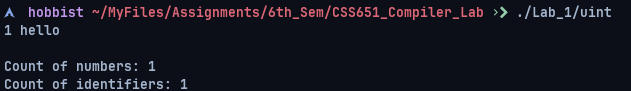
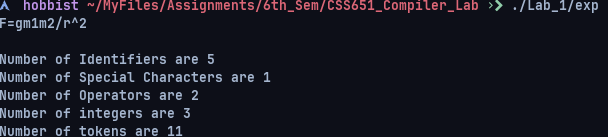
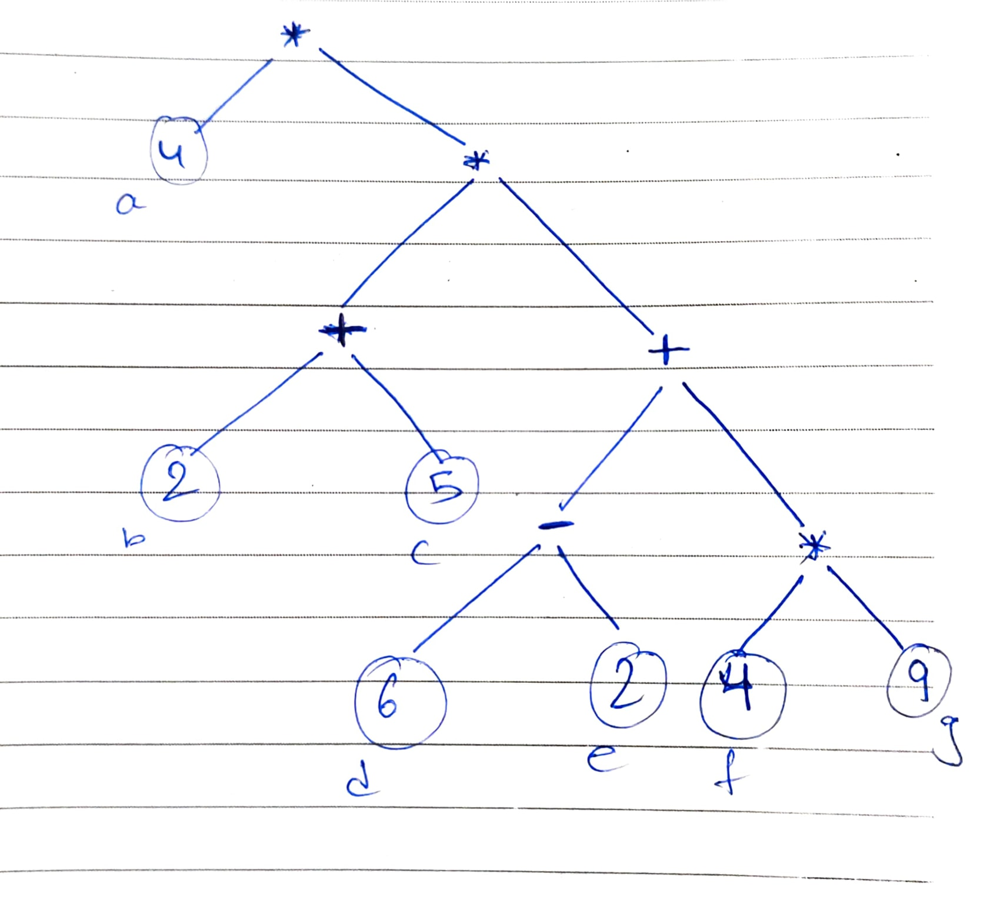
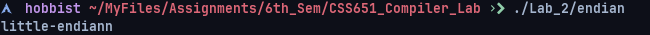
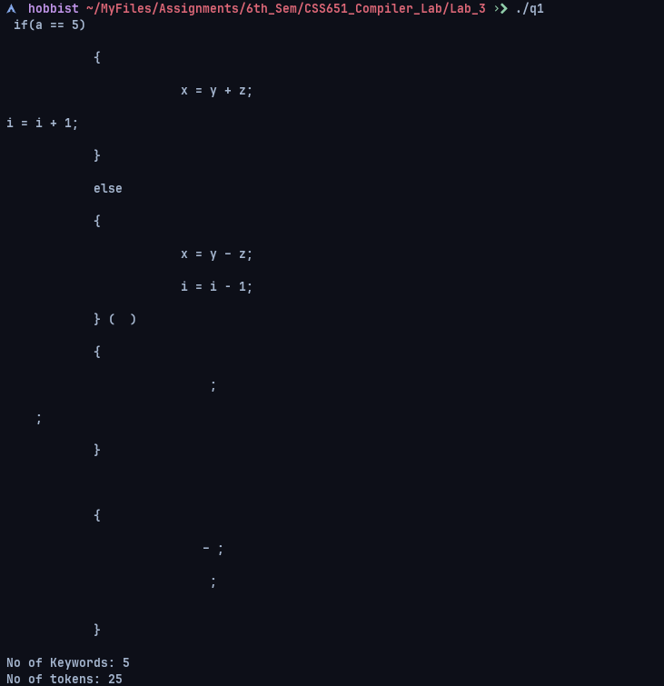
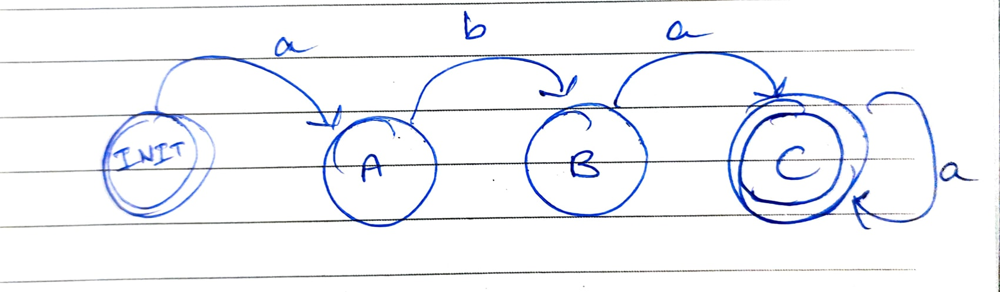
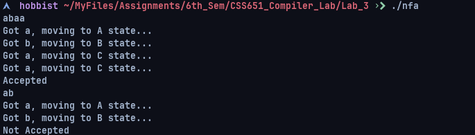
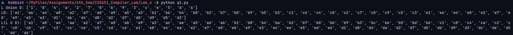
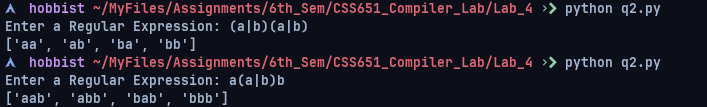

## **CSS651: Compiler Design Laboratory**
---
### **Name:** Sayantani Karmakar	
### **Roll No:** 20CS8024
---
### Assignment 1
1. Write a Lex program to count unsigned numbers and identifiers.

Code:
```lex
%{
    //#include<stdio.h>

    int count_num = 0;
    int count_id = 0;
%}

%%
[a-zA-Z_][a-zA-Z0-9_]* {
    count_id++;
    
}
[0-9]* {
    count_num++;
    
}

[!@#$%^&()_.,?0-9-][!@#$%^&()_.,?a-zA-Z0-9_]* {
    printf("invalid identifier or number");
}

%%
int main(){
    
    while(yylex());
        printf("Count of numbers: %d \n", count_num);
        printf("Count of identifiers: %d \n", count_id);
    
    return 0;
}

int yywrap(){
    return 1;
}
```

Output: 


2. Write a Lex program for the following assignment statement.
F=gm1m2/r^2.

Code: 
```
%{
    //#include<stdio.h>
    int id = 0, chr = 0, num = 0, op = 0;
%}

%%
[a-zA-Z_] {id++;}
[+*=/-] {op++;}
[0-9] {num++;}
[!@#$%^&()_.,?] {chr++;}

%%
int main(){

    while(yylex());

    printf("Number of Identifiers are %d \n", id);
    printf("Number of Special Characters are %d \n", chr);
    printf("Number of Operators are %d \n", op);
    printf("Number of integers are %d \n", num);
    printf("Number of tokens are %d \n", id+chr+op+num);

    return 0;
}

int yywrap(){
    return 1;
}
```
Output: 


---
### Assignment 2
1. Simulate (on paper) the Sethi-Ullman algorithm (pdf of their research
paper is supplied) on the following expression and generate optimal code
with only sequential instructions, without branches and loops with
adequate explanations. Take into consideration the associativity and
commutativity of both the + and * operators. What is the running time
of the code?
`{return 4*((2*5) *((6-2) +(4*9)));}`

Solution:
The Sethi-Ullman algorithm is a method for generating an optimal sequence of instructions for an expression tree, by assigning a number (called a register number) to each node in the tree and then translating the tree into a sequence of instructions that uses these registers. The goal is to minimize the number of registers used and thus the number of memory accesses.

The first step of the Sethi-Ullman algorithm is to number the nodes in the expression tree using a post-order traversal, starting with the leaves of the tree and working our way up. Here is the numbered expression tree for the expression `{return 4*((2*5) ((6-2) +(4*9)));}`:



Next, we can generate the optimal code by translating the numbered expression tree into a sequence of instructions, using the following rules:

1.For each leaf node, generate a load instruction to load the value of the leaf into a register.
2.For each node with two children, generate a binary operation instruction that takes the values from the two child nodes and stores the result in a new register.
3.For the root node, generate a store instruction to store the result in the final destination.

Using these rules, we can generate the following code for the expression:

```asm
load 2, r1
load 5, r2
mul r1, r2, r3
load 6, r4
load 2, r5
sub r4, r5, r6
load 4, r7
load 9, r8
mul r7, r8, r9
add r6, r9, r10
mul r3, r10, r11
load 4, r12
mul r11, r12, r13
```
The running time of this code is O(n), where n is the number of nodes in the expression tree. This is because each node is processed exactly once, and the amount of work required to process a node is constant.

2. Write a C program to check the endianness of your machine. Compile
the program and generate assembly code.
Explain the working of your generated assembly code.
The guides to X86-64 Assembly and GCC were supplied in the compiler
classroom of last semester.

Code: 
```C
#include<stdio.h>
#include<inttypes.h>

int main() {
    uint32_t data;
    uint8_t* cptr;

    data = 1;
    cptr = (uint8_t *)&data;

    if(*cptr == 1) printf("little-endiann \n");
    else if(*cptr == 0) printf("big-endiann \n");
    return 0;
}
```

Assembly Code:
```asm
	.file	"endian.c"
	.text
	.section	.rodata
.LC0:
	.string	"little-endiann "
.LC1:
	.string	"big-endiann "
	.text
	.globl	main
	.type	main, @function
main:
.LFB0:
	.cfi_startproc
	pushq	%rbp
	.cfi_def_cfa_offset 16
	.cfi_offset 6, -16
	movq	%rsp, %rbp
	.cfi_def_cfa_register 6
	subq	$32, %rsp
	movq	%fs:40, %rax
	movq	%rax, -8(%rbp)
	xorl	%eax, %eax
	movl	$1, -20(%rbp)
	leaq	-20(%rbp), %rax
	movq	%rax, -16(%rbp)
	movq	-16(%rbp), %rax
	movzbl	(%rax), %eax
	cmpb	$1, %al
	jne	.L2
	leaq	.LC0(%rip), %rax
	movq	%rax, %rdi
	call	puts@PLT
	jmp	.L3
.L2:
	movq	-16(%rbp), %rax
	movzbl	(%rax), %eax
	testb	%al, %al
	jne	.L3
	leaq	.LC1(%rip), %rax
	movq	%rax, %rdi
	call	puts@PLT
.L3:
	movl	$0, %eax
	movq	-8(%rbp), %rdx
	subq	%fs:40, %rdx
	je	.L5
	call	__stack_chk_fail@PLT
.L5:
	leave
	.cfi_def_cfa 7, 8
	ret
	.cfi_endproc
.LFE0:
	.size	main, .-main
	.ident	"GCC: (GNU) 12.2.1 20230111"
	.section	.note.GNU-stack,"",@progbits
```

Output: 


3. Let the syntax of a programming language construct such as while-
loop be:
while ( cond. )
begin
stmt1 ;
stmt2 ;
end
Write a context free grammar for the above construct, and create
an operator precedence parsing table based on the grammar.

Solution: 
Here is a context-free grammar for the while-loop construct:
```
S -> WHILE COND BEGIN STMTS END
WHILE -> "while"
COND -> "(" E ")"
BEGIN -> "begin"
END -> "end"
STMTS -> STMT STMTS | STMT 
STMT -> ID ";" | WHILE COND BEGIN STMTS END
ID -> any sequence of letters
E -> any expression
```

And here is an operator precedence parsing table based on the grammar:

Precedence Level | Operator | Associativity
|---|---|---|
|1               | ;                              | Left-to-right|
|2               | while                     | Right-to-left|
|3               | (                             | Left-to-right|
|4               | )                             | Left-to-right|
|5               | begin                     | Left-to-right|
|6               | end                        | Left-to-right|
|7               | ID                           | Left-to-right|
|8               | any expression     | Left-to-right|#

This table determines the order in which the operators are processed by the parser. The operators with higher precedence levels are processed first, followed by operators with lower precedence levels. The associativity of an operator determines the order in which operations with the same precedence level are processed. In this table, the associativity is left-to-right for all operators except for the while operator, which is right-to-left.

### Assignment 3

1.  Identify lexeme patterns, keywords and tokens in the given piece of code below.

```C
            if(a == 5)
            {
                		x = y + z;
     					i = i + 1;
            }
            else
            {
                		x = y – z;
                		i = i - 1;
            }
```

Code:
```lex
%{
    //#include<stdio.h>
    int key = 0, tk = 0;
%}

%%
[if|else|main] {key++; tk++;}
[a-zA-Z_0-9]* {tk++;}
[==|(){}+*=/-] {tk++;}
%%
int main(){
    yylex();
    printf("\nNo of Keywords: %d", key);
    printf("\nNo of tokens: %d \n", tk);
}
```

Output: 


2. WAP to convert the regular expression (RE) aba+ to an equivalent NFA. (Hints: output should be generated as 0-a-1-b-2-a-3-a+. It would be good if you generate the NFA diagram)

NFA Diagram: 


Code: 
```lex
%{
    //#include<stdio.h>
%}

%s A B C DEAD

%%
<INITIAL>[a] BEGIN A; {printf("Got a, moving to A state...\n");}
<INITIAL>[b] BEGIN DEAD; {printf("Not Accepted, Moving to DEAD state... \n");}
<INITIAL>[\n] BEGIN INITIAL; {printf("Empty string...\n");}
<A>[b] BEGIN B; {printf("Got b, moving to B state...\n");}
<A>[a] BEGIN DEAD; {printf("Not Accepted, Moving to DEAD state... \n");}
<A>[\n] BEGIN INITIAL; {printf("Not Accepted \n");}
<B>[a] BEGIN C; {printf("Got a, moving to C state...\n");}
<B>[b] BEGIN DEAD; {printf("Not Accepted, Moving to DEAD state... \n");}
<B>[\n] BEGIN INITIAL; {printf("Not Accepted\n");}
<C>[a] BEGIN C; {printf("Got a, moving to C state...\n");}
<C>[\n] BEGIN INITIAL; {printf("Accepted \n");}
<C>[b] BEGIN DEAD; {printf("Not Accepted, Moving to DEAD state... \n");}
<DEAD>[\n] BEGIN INITIAL; {printf("Moving to INITIAL State...\n");}
%%

int main(){
    yylex();
}

```

Output: 



### Assignment 4
1. If L and D are sets of first five english letters and digits, then construct the following languages. 
```
L Union D
LD
L(L U D)
```

Code: 
```python 
L = set(["a", "b", "c", "d", "e"])
D = set(["0", "1", "2", "3", "4", "5", "6", "7", "8", "9"])

def construct_language(lang):
    result = []
    for item in lang:
        result.append(item)
    return result

# L Union D
LD = L.union(D)
print("L Union D:", construct_language(LD))

# LD
LD_strings = []
for l in L:
    for d in D:
        LD_strings.append(l + d)
print("LD:", LD_strings)

# L(L U D)
LLD = []
for l in L:
    for item in LD:
        LLD.append(l + item)
print("L(L U D):", LLD)
```

Output: 


2. Generate languages from the following regular expressions.
```
(a|b)(a|b)
a(a|b)b
```

Code: 
```python 
def generate_languages(regex, language=""):
    if not regex:
        return [language]
    
    first_char = regex[0]
    if first_char == "a":
        return generate_languages(regex[1:], language + "a") + generate_languages(regex[1:], language + "b")
    elif first_char == "b":
        return generate_languages(regex[1:], language + "b")
    elif first_char == "(":
        end_index = regex.index(")")
        options = regex[1:end_index].split("|")
        languages = []
        for option in options:
            languages += generate_languages(regex[end_index+1:], language + option)
        return languages

rgx = input("Enter a Regular Expression: ")
print(generate_languages(rgx))
```

Output: 


