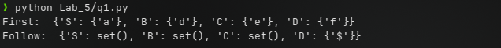
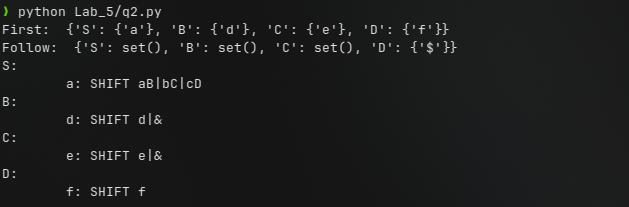
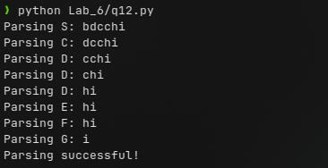
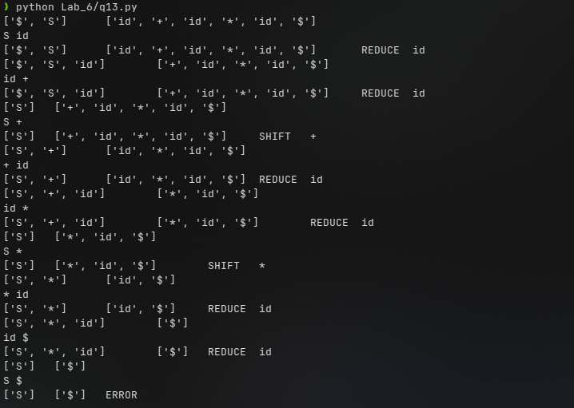
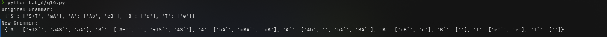
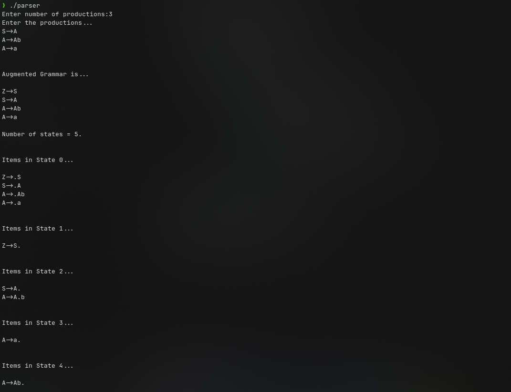
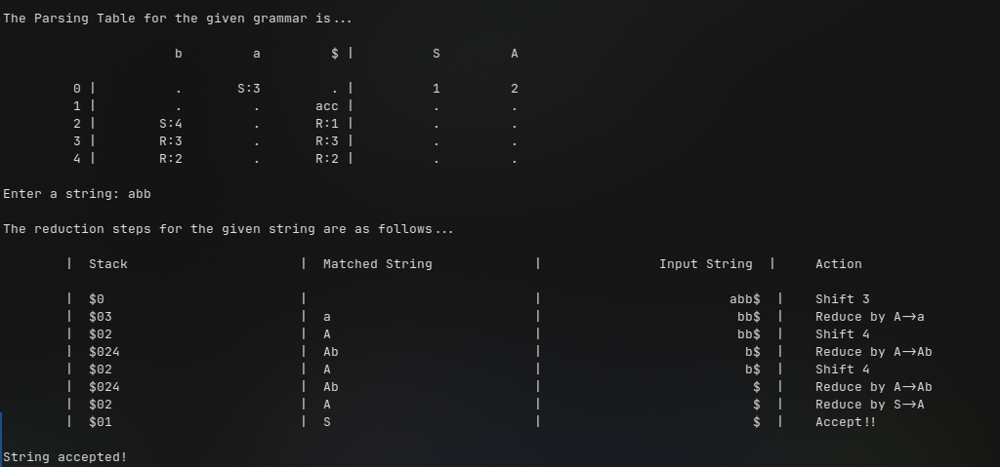

10. Compute FIRST and FOLLOW of the following CFG.
```
S -> aB|bC|cD
B -> d|ε
C -> e|ε
D -> f
```

Code:
```python
grammar = [
    "S -> aB|bC|cD",
    "B -> d|&",
    "C -> e|&",
    "D -> f"
] # Using & as a substitute for EPSILON

def generate_first_sets(grammar):
    first_sets = {}
    for production in grammar:
        lhs, rhs = production.split(' -> ')
        if lhs not in first_sets:
            first_sets[lhs] = set()
        if rhs[0].islower() or rhs[0] == '&':
            first_sets[lhs].add(rhs[0])
        else:
            for symbol in rhs:
                if symbol in first_sets:
                    first_sets[lhs].update(first_sets[symbol])
                    if '&' not in first_sets[symbol]:
                        break
                else:
                    break
    return first_sets

def generate_follow_sets(grammar, first_sets):
    follow_sets = {}
    productions = []
    for production in grammar:
        lhs, rhs = production.split(' -> ')
        productions.append(rhs)
        if lhs not in follow_sets:
            follow_sets[lhs] = set()

    for rhs in productions:
        for i, symbol in enumerate(rhs):
            if symbol.isupper():
                if i == len(rhs) - 1 or rhs[i+1].islower():
                    follow_sets[symbol].add('$')
                for j in range(i+1, len(rhs)):
                    if rhs[j].islower():
                        follow_sets[symbol].add(rhs[j])
                        break
                    elif rhs[j] in first_sets:
                        follow_sets[symbol].update(first_sets[rhs[j]])
                        if '&' not in first_sets[rhs[j]]:
                            break
                    else:
                        break
    return follow_sets

first = generate_first_sets(grammar)
follow = generate_follow_sets(grammar, first)
print("First: ", first)
print("Follow: ", follow)
```

Output: 



11. Construct the predictive parsing table on the same grammar provided in Q(10).

Code:
```python
from q1 import grammar, generate_first_sets, generate_follow_sets
first_sets = generate_first_sets(grammar)
follow_sets = generate_follow_sets(grammar, first_sets)
# Grammar uses & as symbol for EPSILON

def print_predictive_parsing_table(grammar, first_sets, follow_sets):
    # Initialize an empty parsing table
    parsing_table = {}

    # Iterate over each production in the grammar
    for production in grammar:
        lhs, rhs = production.split(' -> ')

        
        # Iterate over each terminal in the FIRST set of the production
        for terminal in first_sets[lhs]:
            # Add a SHIFT action to the parsing table
            if lhs not in parsing_table:
                parsing_table[lhs] = {}
            if terminal not in parsing_table[lhs]:
                parsing_table[lhs][terminal] = "SHIFT " + rhs

        # If the FIRST set of the production contains &, add a FOLLOW set action
        if '&' in first_sets[lhs]:
            for terminal in follow_sets[lhs]:
                if lhs not in parsing_table:
                    parsing_table[lhs] = {}
                if terminal not in parsing_table[lhs]:
                    parsing_table[lhs][terminal] = "FOLLOW " + lhs

        # If the FIRST set of the production doesn't contain &, add a REDUCE action
        else:
            for terminal in first_sets[lhs]:
                if lhs not in parsing_table:
                    parsing_table[lhs] = {}
                if terminal not in parsing_table[lhs]:
                    parsing_table[lhs][terminal] = "REDUCE " + production

    # Print the parsing table
    for nonterminal, actions in parsing_table.items():
        print(f"{nonterminal}:")
        for terminal, action in actions.items():
            print(f"\t{terminal}: {action}")

print_predictive_parsing_table(grammar, first_sets, follow_sets)
```

Output:



12. Consider the following grammar and the parsing table created using LL(1) parser. Find the
sequence of moves on the input string bdcchi using non-recursive predictive parsing and
show the moves in a table.
```
S -> bCEi
C -> dD
D -> cD | ε
E -> FG
F -> h | ε
G -> g | ε
```

Code:
```python
# Define the grammar
grammar = {
    'S': ['bCEi'],
    'C': ['dD'],
    'D': ['cD', '&'],
    'E': ['FG'],
    'F': ['h', '&'],
    'G': ['g']
}


# Define the recursive descent parser with added print statements
def parse_S(tokens):
    print(f'Parsing S: {tokens}')
    if tokens[0] == 'b':
        if tokens[1] == 'd':
            parse_C(tokens[1:])
            if tokens[-1] == 'i':
                return
            else:
                raise Exception('Invalid input')
        else:
            raise Exception('Invalid input')
    else:
        raise Exception('Invalid input')

def parse_C(tokens):
    print(f'Parsing C: {tokens}')
    if tokens[0] == 'd':
        parse_D(tokens[1:])
    elif tokens[0] == 'h':
        parse_E(tokens)
        return
    else:
        return

def parse_D(tokens):
    print(f'Parsing D: {tokens}')
    if tokens[0] == 'c':
        parse_D(tokens[1:])
    elif tokens[0] == 'h':
        parse_E(tokens)
        return
    else:
        return

def parse_E(tokens):
    print(f'Parsing E: {tokens}')
    parse_F(tokens[0:])
    parse_G(tokens[1:])

def parse_F(tokens):
    print(f'Parsing F: {tokens}')
    if tokens[0] == 'h':
        return
    elif tokens[0] == '&':
        return
    else:
        return

def parse_G(tokens):
    print(f'Parsing G: {tokens}')
    if tokens[0] == 'g':
        return
    elif tokens[0] == '&':
        return
    else:
        return

# Define the input string
input_string = 'bdcchi'

# Parse the input string
parse_S(input_string)

# Print success message
print('Parsing successful!')
```

Output:



13. Consider the following grammar and the string id+id*id. Perform shift-reduce parsing on the string and show that parsing depicts ‘shift-reduce conflict.
```
S -> S+S | S*S | id
```

Code:
```python
# Define the grammar
grammar = {
    'S': ['S+S', 'S*S', 'id'],
}

# Input string
input_string = 'id + id * id'

# Initialize the stack and input buffer
stack = ['$', 'S']
input_buffer = input_string.split(' ') + ['$']

# Define a function to print the current state of the parser
def print_state(action, symbol):
    print(f'{stack}\t{input_buffer}\t{action}\t{symbol}')

# Perform the parsing
while True:
    # Print the current state of the parser
    print_state('', '')

    # Get the top symbol of the stack and the first symbol of the input buffer
    top_symbol = stack[-1]
    first_symbol = input_buffer[0]
    print(top_symbol, first_symbol)

    # Check for the shift-reduce conflict
    if top_symbol == 'S' and (first_symbol == '+' or first_symbol == '*'):
        print_state('SHIFT', first_symbol)
        stack.append(first_symbol)
        input_buffer.pop(0)
    elif top_symbol == 'id':
        print_state('REDUCE', top_symbol)
        stack.pop()
        stack.pop()
        stack.pop()
        stack.append('S')
    elif first_symbol == 'id':
        print_state('REDUCE', first_symbol)
        stack.append(first_symbol)
        input_buffer.pop(0)
    elif top_symbol == '$' and first_symbol == '$':
        print_state('ACCEPT', '')
        break
    else:
        print_state('ERROR', '')
        break
```

Output:



14. Eliminate left-recursion from the following grammar.
```
S -> S+T | aA
A -> Ab | cB
B -> d
T -> e
```

Code:
```python
# Define the original grammar
grammar = {
    'S': ["S+T", "aA"],
    'A': ["Ab", "cB"],
    'B': ["d"],
    'T': ["e"]
}

# Define the new grammar
new_grammar = {}

# Step 1: Create a new non-terminal for each left-recursive production
for symbol in grammar:
    new_productions = []
    new_symbol = symbol + "`"
    for production in grammar[symbol]:
        if production[0] == symbol:
            new_productions.append(production[1:] + new_symbol)
        else:
            new_productions.append(production + new_symbol)
    new_grammar[symbol] = new_productions
    new_grammar[new_symbol] = [production for production in grammar[symbol] if production[0] == symbol] + ['']

# Step 2: Add productions for the new non-terminals
for symbol in grammar:
    for production in grammar[symbol]:
        if production[0] == symbol:
            new_symbol = symbol + "`"
            new_productions = [production[1:] + new_symbol for production in grammar[symbol]]
            new_grammar[new_symbol].extend(new_productions)
        else:
            new_grammar[symbol].append(production)

# Print the new grammar
print("Original Grammar:\n", grammar)
print("New Grammar:\n", new_grammar)
```

Output:



15. Consider the following grammar and construct LR(0) and SLR(1) parsing tables. Also parse the input string abb using LR(0) and SLR(1) parsers. Check if any Shift-Reduce conflict is occurred.

```
S -> A
A -> Ab|a
```

Code:

```C
// closure_goto.h
//Variables used in most of the other modules.

char items[30][100][100];
char augmented_grammar[100][100], terminals[10], nonterminals[10];
int no_of_productions = 0, no_of_states = 0, no_of_items[30], no_of_terminals = 0, no_of_nonterminals = 0;

char FIRST[2][10][10];
char FOLLOW[10][10];


//Variables used only in this module.

int state_index = 0, goto_state_index = 0, closure_item_index = 0;

int check(char c) {
	int i;

	for(i = 0; i < no_of_terminals; i++)
		if(terminals[i] == c)
			return 1;

	return 0;
}

void generate_terminals() {
	int i, j;
	int index = 0;

	for(i = 0; i < no_of_productions; i++) {
		for(j = 0; augmented_grammar[i][j] != '>'; j++);
		j++;

		for(; augmented_grammar[i][j] != '\0'; j++) {
			if(augmented_grammar[i][j] < 65 || augmented_grammar[i][j] > 90) {
				if(!check(augmented_grammar[i][j])) {
					terminals[index] = augmented_grammar[i][j];
					no_of_terminals++;
					index++;
				}
			}
		}
	}

	terminals[index] = '$';
	no_of_terminals++;
	index++;
	terminals[index] = '\0';
}	

int check2(char c, int index) {
	int i;

	for(i = 0; i < index; i++)
		if(nonterminals[i] == c)
			return 1;

	return 0;
}

void generate_nonterminals() {
	int i, index = 0;
	
	for(i = 0; i < no_of_productions; i++)
		if(!check2(augmented_grammar[i][0], index)) {
			nonterminals[index] = augmented_grammar[i][0];
			index++;
		}

	no_of_nonterminals = index;
	nonterminals[index] = '\0';
}

void initialize_items() {
	generate_terminals();
	generate_nonterminals();
	
	int i;

	for(i = 0; i < 30; i++)
		no_of_items[i] = 0;
}

void generate_item(char *s, char *t) {
	int i;

	for(i = 0; i < 3; i++)
		t[i] = s[i];
	
	t[i] = '.';

	if(s[i] != '@')
		for(; i < strlen(s); i++)
			t[i+1] = s[i];
	
	t[i+1] = '\0';
}

int item_found(char *s) {	//Check for items in a state.
	int i;

	for(i = 0; i < closure_item_index; i++) {
		if(!strcmp(s, items[state_index][i]))	//If the strings match.
			return 1;
	}

	return 0;
}

int isterminal(char s) {
	int i;

	for(i = 0; i < no_of_terminals; i++)
		if(s == terminals[i])
			return 1;
	
	return 0;
}

void closure(char *s) {
	int i, j;

	for(i = 0; s[i] != '.'; i++);
	
	i++;

	if(!item_found(s)) {
		strcpy(items[state_index][closure_item_index], s);
		closure_item_index++;

//		printf("%s\n", items[state_index][closure_item_index-1]);
	}

	if(s[i] == s[0] && s[i-2] == '>')	//To avoid infinite loop due to left recursion.
		return;

	if(isterminal(s[i]))
		return;
	
	else 	{	//Not a terminal
		for(j = 0; j < no_of_productions; j++) {
			char temp[100];
	
			if(augmented_grammar[j][0] == s[i]) {
				generate_item(augmented_grammar[j], temp);
				closure(temp);
			}
		}	
	}
}

int Goto1(char s, char temp[][100]) {	//Find Goto on symbol s. GOTO(goto_state_index, s)
	int i, j;
	int n = 0;
	char t, temp2[100];

	if(s == '\0') {
		return n;
	}

	for(i = 0; i < no_of_items[goto_state_index]; i++) {
		strcpy(temp2, items[goto_state_index][i]);

		for(j = 0; temp2[j] != '.'; j++);

		if(temp2[j+1] == '\0')
			continue;

		if(temp2[j+1] == s) {
			t = temp2[j];
			temp2[j] = temp2[j+1];
			temp2[j+1] = t;

			strcpy(temp[n], temp2);
			n++;
		}
	}

	return n;
}

int state_found(char *s) {	//Checks for existance of same state.
	int i;
	
	for(i = 0; i < state_index; i++) {
		if(!strcmp(s, items[i][0]))	//Compare with the first item of each state.
			return 1;
	}

	return 0;
}

int transition_item_found(char * t_items, char s, int t_index) {
	int i;

	for(i = 0; i < t_index; i++)
		if(s == t_items[i])
			return 1;
	
	return 0;
}

void compute_closure_goto() {
	char temp[100][100], transition_items[100];
	int i, no_of_goto_items,j, transition_index = 0;
	
	generate_item(augmented_grammar[0], temp[0]);
	
	closure(temp[0]);

	no_of_items[state_index] = closure_item_index;
	closure_item_index = 0;

	state_index++;
	//state_index is 1 now.

	while(goto_state_index < 30) {
		transition_index = 0;
		transition_items[transition_index] = '\0';

		for(i = 0; i < no_of_items[goto_state_index]; i++) {
			for(j = 0; items[goto_state_index][i][j] != '.'; j++);
			j++;

			if(!transition_item_found(transition_items, items[goto_state_index][i][j], transition_index)) {
				transition_items[transition_index] = items[goto_state_index][i][j];
				transition_index++;
			}
		}

		transition_items[transition_index] = '\0';

		for(i = 0; i < transition_index; i++) {
			int add_flag = 0;

			no_of_goto_items = Goto1(transition_items[i], temp);
	
			for(j = 0; j < no_of_goto_items; j++) {
				if(!state_found(temp[j])) {
					add_flag = 1;
					closure(temp[j]);
				}
				else
					break;
			}
			if(add_flag) {
				no_of_items[state_index] = closure_item_index;
				closure_item_index = 0;
				state_index++;
			}
		}

		goto_state_index++;
	}
	
	no_of_states = state_index;
}

void print() {
	int i, j;

	printf("\nNumber of states = %d.\n", no_of_states);

	for(i = 0; i < no_of_states; i++) {
		printf("\n\nItems in State %d...\n\n", i);

		for(j = 0; j < no_of_items[i]; j++)
			printf("%s\n", items[i][j]);
	}
}


void start() {
	char str[100];

	printf("Enter number of productions:");
	scanf("%d", &no_of_productions);

	printf("Enter the productions...\n");
	
	int i;
	for(i = 1; i <= no_of_productions; i++)
		scanf("%s", augmented_grammar[i]);

	printf("\n\nAugmented Grammar is...\n\n");

	strcpy(augmented_grammar[0], "Z->");
	str[0] = augmented_grammar[1][0];
	str[1] = '\0';
	strcat(augmented_grammar[0], str);

	no_of_productions++;

	for(i = 0; i < no_of_productions; i++)
		printf("%s\n", augmented_grammar[i]);

	initialize_items();

	compute_closure_goto();

	print();
}
```

```C
//first_follow.h
int epsilon_flag = 0;

initialize_first_follow() {	//Initialize to null strings.
	int i;

	for(i = 0; i < no_of_terminals; i++)
		FIRST[0][i][0] = '\0';

	for(i = 0; i < no_of_nonterminals; i++) {
		FIRST[1][i][0] = '\0';
		FOLLOW[i][0] = '\0';
	}
}

void add_symbol(int flag, char *f, char *s) {		//Adds a symbol to FIRST or FOLLOW if it doesn't already exist in it.
	int i, j;
	int found;

	if(flag == 0) {		//For FIRST.
		for(i = 0; i < strlen(s); i++) {
			found = 0;

			for(j = 0; j < strlen(f); j++) {
				if(s[i] == f[j])
					found = 1;
			}

			if(!found) {
				char temp[2];
				temp[0] = s[i];
				temp[1] = '\0';
				strcat(f, temp);
			}
		}
	}

	else {		//For FOLLOW.
		for(i = 0; i < strlen(s); i++) {
			found = 0;

			if(s[i] == '@') {
				epsilon_flag = 1;
				continue;
			}

			for(j = 0; j < strlen(f); j++) {
				if(s[i] == f[j])
					found = 1;
			}

			if(!found) {
				char temp[2];
				temp[0] = s[i];
				temp[1] = '\0';
				strcat(f, temp);
			}
		}
	}
}

void first(char s) {
	if(isterminal(s)) {	//For terminals.
		FIRST[0][get_pos(0, s)][0] = s;
		FIRST[0][get_pos(0, s)][1] = '\0';
	}

	else {		//For non-terminals.
		int i, flag = 0;
		for(i = 0; i < no_of_productions; i++) {
			if(augmented_grammar[i][0] == s) {		//Productions with head as s.
				int j;

				for(j = 0; augmented_grammar[i][j] != '>'; j++);
				j++;
				char next_sym = augmented_grammar[i][j];

				if(next_sym == '@') {	//Epsilon Production.
					add_symbol(0, FIRST[1][get_pos(1, s)], "@");
					flag = 1;
				}

				else {
					if(next_sym == s) {		//In case of left recursion, to avoid infinite loop.
						if(flag)
							next_sym = augmented_grammar[i][++j];
						else
							continue;
					}

					first(next_sym);		//Recursive call, to find FIRST of next symbol.

					if(isterminal(next_sym)) 	//Add first of next symbol to first of current symbol.
						add_symbol(0, FIRST[1][get_pos(1, s)], FIRST[0][get_pos(0, next_sym)]);

					else
						add_symbol(0, FIRST[1][get_pos(1, s)], FIRST[1][get_pos(1, next_sym)]);
				}
			}
		}
	}
}

void compute_first() {
	int i;

	for(i = 0; i < no_of_terminals; i++)
		first(terminals[i]);
	
	for(i = 0; i < no_of_nonterminals; i++)
		first(nonterminals[i]);

//	for(i = 0; i < no_of_nonterminals; i++)
//		printf("%s\n", FIRST[1][get_pos(1, nonterminals[i])]);
}


//FOLLOW

void follow(char s) {
	if(s == nonterminals[0]) 
		add_symbol(1, FOLLOW[0], "$");

	else if(s == nonterminals[1])
		add_symbol(1, FOLLOW[1], "$");
	
	int i, j;
	for(i = 0; i < no_of_productions; i++) {
		for(j = 3; j < strlen(augmented_grammar[i]); j++) {
			epsilon_flag = 0;

			if(augmented_grammar[i][j] == s) {
				char next_sym = augmented_grammar[i][j+1];

				if(next_sym != '\0') {		//If current symbol is not the last symbol of production body.
					if(isterminal(next_sym))	//For terminals.
						add_symbol(1, FOLLOW[get_pos(1, s)], FIRST[0][get_pos(0, next_sym)]);
					else {		//For non-terminals.
						add_symbol(1, FOLLOW[get_pos(1, s)], FIRST[1][get_pos(1, next_sym)]);

						if(epsilon_flag) {	//If FIRST[next_sym] has epsilon, find FOLLOW[next_sym].
							follow(next_sym);
							add_symbol(1, FOLLOW[get_pos(1, s)], FOLLOW[get_pos(1, next_sym)]);
						}
					}
				}

				else {		//If current symbol is the last symbol of production body.
					follow(augmented_grammar[i][0]);	//Follow of production head.
					add_symbol(1, FOLLOW[get_pos(1, s)], FOLLOW[get_pos(1, augmented_grammar[i][0])]);
				}
			}
		}
	}
}

compute_follow() {
	int i;
	
	for(i = 0; i < no_of_nonterminals; i++)
		follow(nonterminals[i]);

//	for(i = 0; i < no_of_nonterminals; i++)
//		printf("%s\n", FOLLOW[get_pos(1, nonterminals[i])]);
}

```

```C
//parse.h
struct Stack {	//Holds states.
	int states[100];
	int top;
} stack;

void push(int a) {
	stack.top++;
	stack.states[stack.top] = a;
}

void pop() {
	int a = stack.states[stack.top];
	stack.top--;
}

int get_top() {		//Returns top of stack state.
	return stack.states[stack.top];
}

void initialize_stack() {	//Initialize stack to have state 0 on top.
	stack.top = -1;
	
	push(0);
}

int get_int(char *s) {		//Get integer part of the strings found in table entries.
	int i, j;
	char temp[10];
	
	for(i = 0; s[i] != ':'; i++);
	i++;

	for(j = i; s[i] != '\0'; i++)
		temp[i-j] = s[i];
	
	temp[i-j] = '\0';

	return atoi(temp);
}

int get_length(char *production) {	//Returns length of string in the production body.
	int i, j;

	for(i = 0; production[i] != '>'; i++);
	i++;

	for(j = 0; production[i] != '\0'; i++, j++);

	return j;
}


//Start of functions meant only for displaying the result. (Doesn't affect the actual string parsing)

void get_stack_contents(char *t) {	//Stores stack contents in t.
	int i;
	char c[5];

	strcpy(t, "$");

	for(i = 0; i <= stack.top; i++) {
		int n = stack.states[i];
		sprintf(c, "%d", n);
		strcat(t, c);
	}
}

void get_remaining_input(char *string, int index, char *t) {	//Stores remaining Input string in t.
	int i, j;

	for(i = index, j = 0; string[i] != '\0'; i++, j++)
		t[j] = string[i];

	t[j] = '\0';
}

void print_contents(char *string, int index, char *matched_string) {	//Prints the required stuff.
	char t1[20], t2[20];

	get_stack_contents(t1);
	get_remaining_input(string, index, t2);

	printf("\t|  %-25s  |  %-25s  |   %25s  |  \t", t1, matched_string, t2);
}

//End of functions meant only for displaying the result.


void parse() {
	char string[100];
	char matched_string[100];

	initialize_stack();

	printf("\nEnter a string: ");
	scanf("%s", string);

	strcat(string, "$");	//Appending $ to end of input string.
	matched_string[0] = '\0';
	
	printf("\nThe reduction steps for the given string are as follows...\n\n");

	printf("\t|  %-25s  |  %-25s  |  %25s  |  \t%-30s\n\n", "Stack", "Matched String", "Input String", "Action");
	
	int index = 0, m_index = 0;
	
	while(1) {
		char a = string[index];

		print_contents(string, index, matched_string);

		if(table.ACTION[get_top()][get_pos(0, a)][0] == 'S') {		//Shift Action. (Table entry starts with char 'S')
			int t = get_int(table.ACTION[get_top()][get_pos(0, a)]);
			push(t);	//Push state t onto stack.
			index++;

			//Printing the result.
			char t1[20];
			char state[5];

			strcpy(t1, "Shift ");
			sprintf(state, "%d", t);
			strcat(t1, state);

			matched_string[m_index++] = a;
			matched_string[m_index] = '\0';

			printf("%-30s\n", t1);
		}

		else if(table.ACTION[get_top()][get_pos(0, a)][0] == 'R') {	//Reduce Action.
			int i, j = get_int(table.ACTION[get_top()][get_pos(0, a)]);

			for(i = 0; i < get_length(augmented_grammar[j]); i++)	//Pop "length of string" times, w.r.t production 'j'.
				pop();
			
			int t = get_top();
			char A = augmented_grammar[j][0];	//Production head of 'j'th production. (non-terminal)

			push(table.GOTO[t][get_pos(1, A)]);	//Push state using GOTO of the table.

			//Printing the result.
			m_index -= get_length(augmented_grammar[j]);
			matched_string[m_index++] = A;
			matched_string[m_index] = '\0';

			char t1[20];
			strcpy(t1, "Reduce by ");
			strcat(t1, augmented_grammar[j]);

			printf("%-30s\n", t1);
		}

		else if(table.ACTION[get_top()][get_pos(0, a)][0] == 'a') {	//Acceptance.
			printf("%-30s\n", "Accept!!");
			break;
		}

		else {								//Error.
			printf("%-30s\n", "Error!!\n\n");
			printf("String doesn't belong to the language of the particular grammar!\n");
			exit(0);
		}
	}

	printf("\nString accepted!\n");
}

```

```C
//parsingtable.h
//Parsing Table.
struct Parsing_Table {	//Structure to represent the Parsing Table.	
	char ACTION[30][100][100];
	int GOTO[30][100];
} table;

void initialize_table() {  //Initialize all entries to indicate Error.
	int i, j;

	for(i = 0; i < no_of_states; i++) {
		for(j = 0; j < no_of_terminals; j++)
			strcpy(table.ACTION[i][j], "e");

		for(j = 0; j < no_of_nonterminals; j++)
			table.GOTO[i][j] = -1;
	}
}

void print_table() {
	int i, j;

	printf("\nThe Parsing Table for the given grammar is...\n\n");

	printf("%10s   ", "");
	
	for(i = 0; i < no_of_terminals; i++)
		printf("%10c", terminals[i]);

	printf(" | ");
	
	for(i = 1; i < no_of_nonterminals; i++)
		printf("%10c", nonterminals[i]);

	printf("\n\n");

	for(i = 0; i < no_of_states; i++) {
		printf("%10d | ", i);

		for(j = 0; j < no_of_terminals; j++) {
			if(!strcmp(table.ACTION[i][j], "e"))
				printf("%10s", ".");
			else
				printf("%10s", table.ACTION[i][j]);
		}

		printf(" | ");

		for(j = 1; j < no_of_nonterminals; j++) {
			if(table.GOTO[i][j] == -1)
				printf("%10s", ".");
			else
				printf("%10d", table.GOTO[i][j]);
		}

		printf("\n");
	}
}

void Goto(int i, int item, char *temp) {	//Computes goto for 'item'th item of 'i'th state.
	char t;

	strcpy(temp, items[i][item]);

	for(i = 0; temp[i] != '\0'; i++)
		if(temp[i] == '.') {
			t = temp[i];
			temp[i] = temp[i+1];
			temp[i+1] = t;
			break;
		}
}

int get_state(char *t, int state) {	//Returns the state of a given item.
	int i, j;

	for(i = state; i < (no_of_states + state); i++) {	//Start searching from current state and then wrap around.
		for(j = 0; j < no_of_items[i % no_of_states]; j++) {
			if(!strcmp(t, items[i % no_of_states][j]))
				return i % no_of_states;
		}
	}

	printf("No match for string! (%s)\n", t);
}

int get_pos(int flag, char symbol) {	//Returns index of a terminal or a non-terminal from the corresponding arrays.
	int i;

	if(flag == 0)
		for(i = 0; i < no_of_terminals; i++) {
			if(terminals[i] == symbol) 
				return i;
		}
	else
		for(i = 0; i < no_of_nonterminals; i++) {
			if(nonterminals[i] == symbol) 
				return i;
		}				

	if(flag == 0)
		printf("Terminal not found in get_pos! (%c)\n", symbol);
	else
		printf("Non-terminal not found in get_pos! (%c)\n", symbol);
}

int get_production_no(char * item) {	//Given an item, it returns the production number of the equivalent production.
	int i, j;
	
	char production[20];

	for(i = 0, j = 0; item[i] != '\0'; i++)
		if(item[i] != '.') {
			production[j] = item[i];
			j++;
		}
	
	if(j == 3) {		//If it's an epsilon production, the production won't have a body.
		production[j] = '@';
		j++;
	}
	
	production[j] = '\0';

	for(i = 0; i < no_of_productions; i++) {
		if(!strcmp(production, augmented_grammar[i]))
			return i;
	}

	printf("Production not found! (%s)\n", production);
}

void compute_action() {
	int i, item, j;
	char temp[100], symbol;
	
	for(i = 0; i < no_of_states; i++) {
		for(item = 0; item < no_of_items[i]; item++) {
			char *s = strchr(items[i][item], '.');	//Returns a substring starting with '.'
			
			if(!s) {	//In case of error.
				printf("Item not found! State = %d, Item = %d\n", i, item);
				exit(-1);
			}

			if(strlen(s) > 1) {	//dot is not at end of string. SHIFT ACTION!!
				if(isterminal(s[1])) {		//For terminals. Rule 1.
					if(strcmp(table.ACTION[i][get_pos(0,s[1])], "e")) {		//Multiple entries conflict.
						printf("\n\nConflict(1): Multiple entries found for (%d, %c)\n", i, s[1]);
						printf("\nGrammar is not in LR(0)!\n");
						exit(-1);
					}

					char state[3];
	
					Goto(i, item, temp);	//Store item in temp.
					j = get_state(temp, i);

					sprintf(state, "%d", j);
					strcpy(temp, "S:");
					strcat(temp, state);

					strcpy(table.ACTION[i][get_pos(0, s[1])], temp);
				}
				
				else {		//For non-terminals. Rule 4.
					
					Goto(i, item, temp);	//Store item in temp.
					j = get_state(temp, i);

					if(table.GOTO[i][get_pos(1, s[1])] == -1)	//To avoid multiple entries.
						table.GOTO[i][get_pos(1, s[1])] = j;
				}
			}

			else {	//dot is at end of string. Rule 2. REDUCE ACTION!!	
				char f[10], production_no[3];
				int k, n;
				n = get_production_no(items[i][item]);		//Get production number from Augmented Grammar.

				sprintf(production_no, "%d", n);
				strcpy(temp, "R:");
				strcat(temp, production_no);
				
				strcpy(f, FOLLOW[get_pos(1, items[i][item][0])]);	//Get follow of production head.
				for(k = 0; f[k] != '\0'; k++) {
					if(strcmp(table.ACTION[i][get_pos(0, f[k])], "e")) {		//Multiple entries conflict.
						printf("\n\nConflict(3): Multiple entries found for (%d, %c)\n", i, f[k]);
						printf("\nGrammar is not in LR(0)!\n");
						exit(-1);
					}

					strcpy(table.ACTION[i][get_pos(0, f[k])], temp);
				}
			}
		}
	}

	strcpy(table.ACTION[1][get_pos(0, '$')], "acc");	//Accept-entry for item [S'->S.]
}

void create_parsing_table() {
	initialize_table();

	compute_action();

	print_table();
}

//End of Parsing Table.
```

```C
// parse.c
#include<stdio.h>
#include<stdlib.h>
#include<string.h>

#include"closure_goto.h"
#include"parsingtable.h"
#include"first_follow.h"
#include"parse.h"

int main() {
	start();	//Compute closure and goto.

	initialize_first_follow();
	compute_first();
	compute_follow();

	create_parsing_table();

	parse();	//Parse the input string.

	return 0;
}

```

Output:



