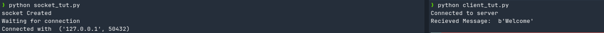

### Assignment 1
---
### **Name:** Diptangshu Dey
### **Roll No:** 20CS8018
---
1. Write a client and server program using socket programming in python. To establish connection between server and client.

Server Code: 
```python
import socket
s = socket.socket() # creating socket object
print("socket Created")

s.bind(('localhost', 9999)) # Binding to localhost at port 9999
s.listen(3) # Listen to atmost 3 clients at a time
print("Waiting for connection")

# Running the socket to listed for client connections
message = "Welcome"
while True: 
    c, addr = s.accept()
    print("Connected with ", addr)
    c.send(bytes("Welcome", 'utf-8'))
    c.close()
```

Client Code:
```python
import socket
c = socket.socket()
c.connect(('localhost', 9999))
print("Connected to server")

msg = c.recv(1024)
print("Recieved Message: ", msg)

c.close()
```

Output:
