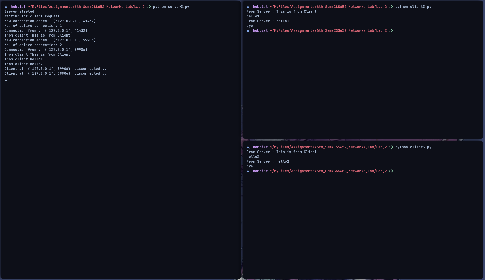

### Assignment 2

---

### **Name:** Sayantani Karmakar

### **Roll No:** 20CS8024

---

1. Make a Multi-threaded Server-Client Network

Server Code:

```python
import socket, threading

class ClientThread(threading.Thread):

    def __init__(self,clientAddress,clientsocket):
        threading.Thread.__init__(self)
        self.csocket = clientsocket
        print ("New connection added: ", clientAddress)

    def run(self):
        print ("Connection from : ", clientAddress)
        #self.csocket.send(bytes("Hi, This is from Server..",'utf-8'))
        msg = ''
        while True:
            data = self.csocket.recv(2048)
            msg = data.decode()
            if msg=='bye':
              break
            print ("from client", msg)
            self.csocket.send(bytes(msg,'UTF-8'))
        print ("Client at ", clientAddress , " disconnected...")

LOCALHOST = "127.0.0.1"
PORT = 8080
server = socket.socket()
server.bind((LOCALHOST, PORT))
print("Server started")
print("Waiting for client request..")

while True:
    server.listen(1)
    clientsock, clientAddress = server.accept()
    newthread = ClientThread(clientAddress, clientsock)
    print(f"No. of active connection: {threading.active_count()}")
    newthread.start()
```

Client Code:

```python
import socket

SERVER = "127.0.0.1"
PORT = 8080
client = socket.socket()
client.connect((SERVER, PORT))
client.sendall(bytes("This is from Client",'UTF-8'))


while True:
  in_data =  client.recv(1024)
  print("From Server :" ,in_data.decode())
  out_data = input()
  client.sendall(bytes(out_data,'UTF-8'))
  if out_data=='bye':
    break
client.close()
```

Output:

