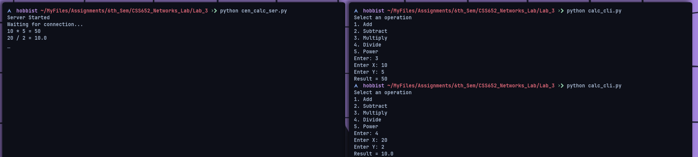
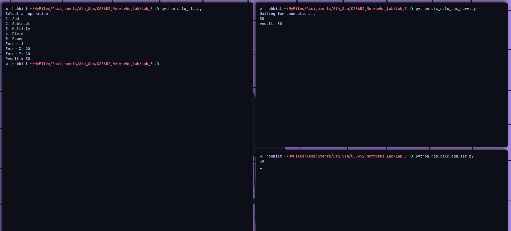
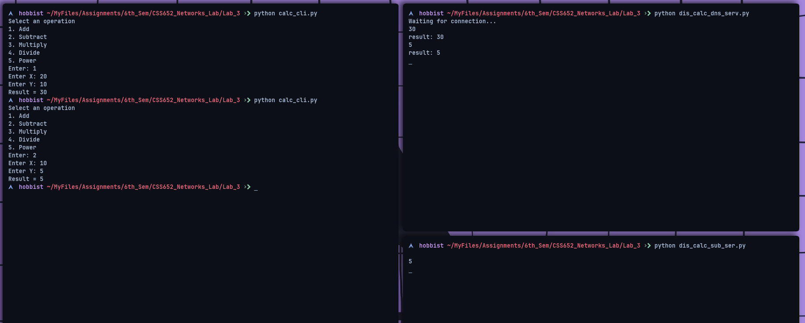
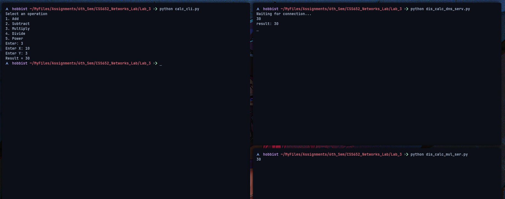
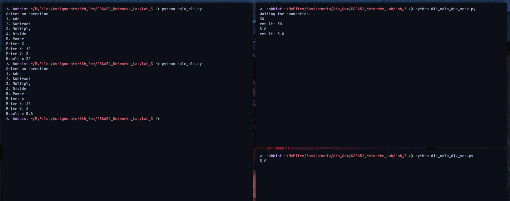
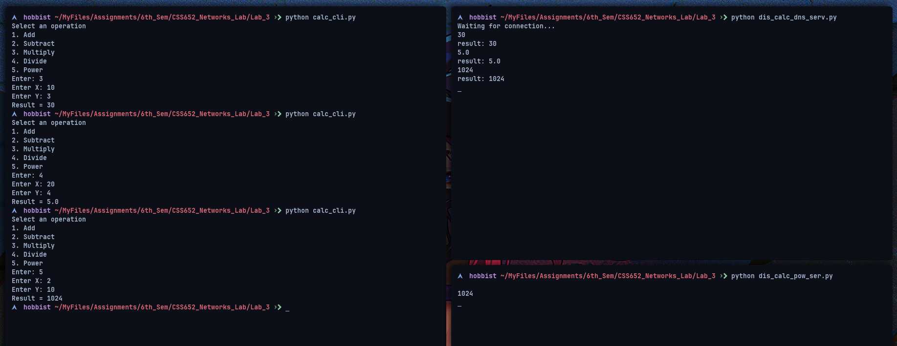

### Assignment 3

---

### **Name:** Sayantani Karmakar

### **Roll No:** 20CS8024

---

1. Write a client and server program using socket programming in python to create a calculator of centralized and distributed manner.

Client Code:

```python
import socket

host = 'localhost'
port = 9999
client = socket.socket()
client.connect((host, port))

print("Select an operation")
print("1. Add")
print("2. Subtract")
print("3. Multiply")
print("4. Divide")
print("5. Power")

sel = input("Enter: ")
x = input("Enter X: ")
y = input("Enter Y: ")
string = sel + "#" + x + "#" + y

client.send(string.encode())
data = client.recv(1024).decode()
print("Result = {}".format(data))
client.close()
```

Centralisede Server Code:

```python
import socket

host = 'localhost'
port = 9999
server = socket.socket()
server.bind((host, port))
server.listen(1)
print("Server Started")
print("Waiting for connection...")

while True:
    c, addr = server.accept()
    data = c.recv(1024).decode()
    t = data.split("#", 3)
    opr = int(t[0])
    num1 = int(t[1])
    num2 = int(t[2])

    res = 0
    if opr == 1:
        res = num1 + num2
        print("{} + {} = {}".format(num1, num2, res))
    elif opr == 2:
        res = num1 - num2
        print("{} - {} = {}".format(num1, num2, res))
    elif opr == 3:
        res = num1 * num2
        print("{} * {} = {}".format(num1, num2, res))
    elif opr == 4:
        res = num1 / num2
        print("{} / {} = {}".format(num1, num2, res))
    elif opr == 5:
        res = num1 ** num2
        print("{} ^ {} = {}".format(num1, num2, res))
    else:
        res = 0

    c.send(str(res).encode())
    c.close()
```

Centralised Server Output:


Desentralised Main Server Code:

```python
import socket

s = socket.socket()
s.bind(('localhost', 9999))
s.listen(3)
print("Waiting for connection...")

while True:
    c, addr = s.accept()
    data = c.recv(1024).decode()
    p = data.split("#", 3)
    opr = int(p[0])
    res = None

    s1 = socket.socket()
    s1.connect(('localhost', 9999-opr))
    s1.send(data.encode())

    while res == None:
        res = s1.recv(1024).decode()

    print(res)
    print("result: {}".format(res))

    c.send(str(res).encode())
    c.close()
```

Decentralised Add Server Code:

```python
import socket

s = socket.socket()
s.bind(('localhost', 9998))
s.listen(3)

while True:
    c, addr = s.accept()
    data = c.recv(1024).decode()
    p = data.split('#')
    x = int(p[1])
    y = int(p[2])
    res = str(x + y)
    print(res)
    c.send(res.encode())
    c.close()
```

Decentralised Subtract Server Code:

```python
import socket

s = socket.socket()
s.bind(('localhost', 9997))
s.listen(3)

while True:
    c, addr = s.accept()
    data = c.recv(1024).decode()
    p = data.split('#')
    x = int(p[1])
    y = int(p[2])
    res = str(x - y)
    print(res)
    c.send(res.encode())
    c.close()
```

Decentralised Multiply Server Code:

```python
import socket

s = socket.socket()
s.bind(('localhost', 9996))
s.listen(3)

while True:
    c, addr = s.accept()
    data = c.recv(1024).decode()
    p = data.split('#')
    x = int(p[1])
    y = int(p[2])
    res = str(x * y)
    print(res)
    c.send(res.encode())
    c.close()

```

Decentralisede Division Server Code:

```python
import socket

s = socket.socket()
s.bind(('localhost', 9995))
s.listen(3)

while True:
    c, addr = s.accept()
    data = c.recv(1024).decode()
    p = data.split('#')
    x = int(p[1])
    y = int(p[2])
    res = str(x / y)
    print(res)
    c.send(res.encode())
    c.close()

```

Decentralised Power Server Code:

```python
import socket

s = socket.socket()
s.bind(('localhost', 9994))
s.listen(3)

while True:
    c, addr = s.accept()
    data = c.recv(1024).decode()
    p = data.split('#')
    x = int(p[1])
    y = int(p[2])
    res = str(x ** y)
    print(res)
    c.send(res.encode())
    c.close()
```

Decentralised Output:









