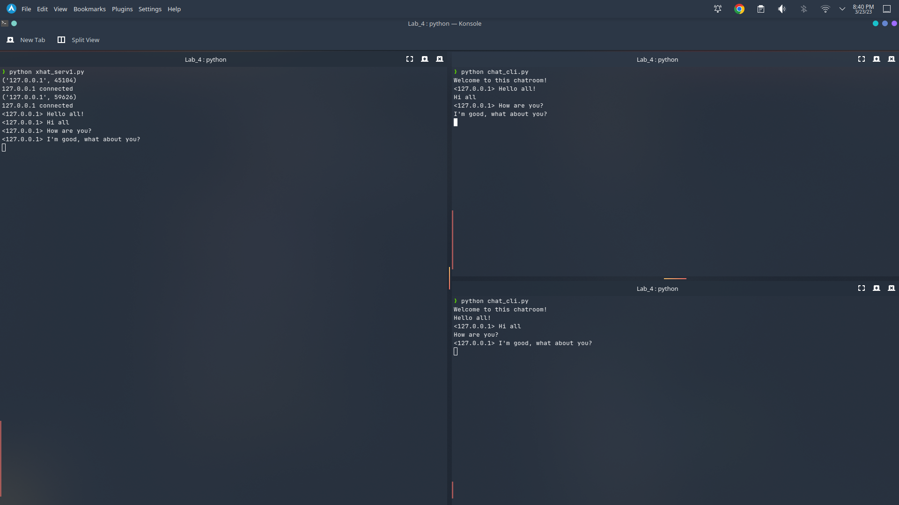

### Assignment 4
---
### **Name:** Sayantani Karmakar
### **Roll No:** 20CS8024
---
1. Write a client and server program using socket programming in python. To create a 1 to 1 chat application (threaded server and client)

Server Code: 
```python
import socket
import select
import sys
from _thread import *

server = socket.socket()

host='localhost'
port=9999

server.bind((host, port))

server.listen(100)

list_of_clients = []

def clientthread(conn, addr):

    conn.send("Welcome to this chatroom!".encode())

    while True:
            try:
                message = conn.recv(2048).decode()
                if message:
                    if message == "quit":
                        conn.close()
                        print(addr[0]+"closed")
                        remove(conn)
                    else:
                        print ("<" + addr[0] + "> " + message)
                        message_to_send = "<" + addr[0] + "> " + message
                        broadcast(message_to_send, conn)
                else:
                    remove(conn)
            except:
                continue

def broadcast(message, connection):
    for clients in list_of_clients:
        if clients!=connection:
            try:
                clients.send(message.encode())
            except:
                clients.close()
                remove(clients)

def remove(connection):
    if connection in list_of_clients:
        list_of_clients.remove(connection)

while True:

    conn, addr = server.accept()
    list_of_clients.append(conn)
    print(addr)

    print (addr[0] + " connected")

    start_new_thread(clientthread,(conn,addr))	

conn.close()
server.close()
```

Client Code:
```python
import socket
import select
import sys
import threading


class myThreadSend(threading.Thread):
    global s
    def __init__(self, threadID, name, counter):
        threading.Thread.__init__(self)
        self.threadID = threadID
        self.name = name
        self.counter = counter

    def run(self):
        msgSend(s)

class myThreadRecv(threading.Thread):
    global s
    def __init__(self, threadID, name, counter):
        threading.Thread.__init__(self)
        self.threadID = threadID
        self.name = name
        self.counter = counter

    def run(self):
        msgRecv(s)
    

def msgRecv(s):
    while True:
        data = s.recv(2048).decode()
        print(data)
        if(data == "quit"):
            s.close()
            exit(0)

def msgSend(s):
    msg = input("")
    while msg:
        s.send(msg.encode())
        if(msg=="quit"):
            s.close()
            exit(0)
        msg = None

if __name__ == "__main__":
    s = socket.socket()

    host = 'localhost'
    port = 9999
    s.connect((host, port))

    while True:
        threadSend = myThreadSend(1, "ThreadSend", 1)
        threadRecv = myThreadRecv(2, "threadRecv", 2)

        threadSend.start()
        threadRecv.start()
        threadSend.join()
        threadSend.join()
    
    s.close()
```

Output: 
