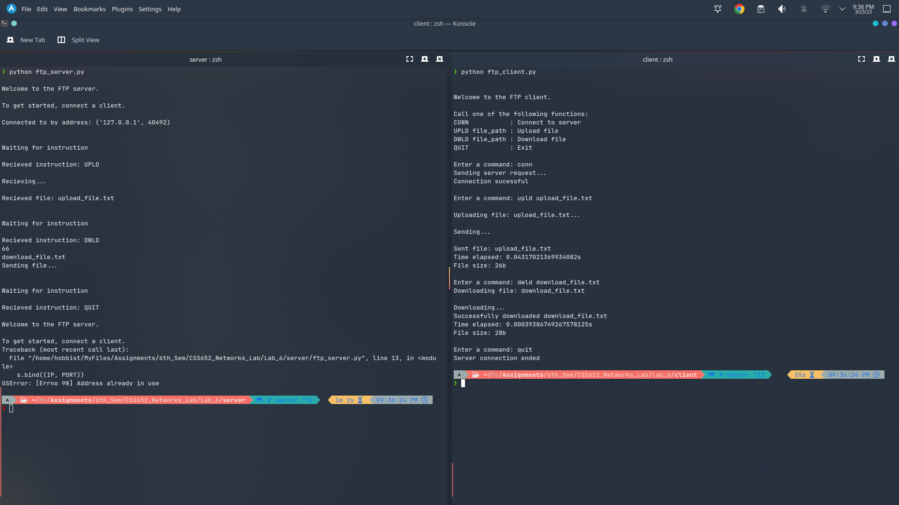

### Assignment 6
---
### **Name:** Diptangshu Dey
### **Roll No:** 20CS8018
---
1. Write a client and server program using socket programming in python. To implement a rudimentary idea of File Transfer Protocol (FTP).

Server Code: 
```python
import socket
import sys
import time
import os
import struct

print("\nWelcome to the FTP server.\n\nTo get started, connect a client.")

IP = "localhost"
PORT = 9999 
BUFFER_SIZE = 1024 
s = socket.socket(socket.AF_INET, socket.SOCK_STREAM)
s.bind((IP, PORT))
s.listen(1)
conn, addr = s.accept()

print("\nConnected to by address: {}".format(addr))

def upld():
    
    conn.send("1".encode())
    
    file_name_size = struct.unpack("h", conn.recv(2))[0]
    file_name = conn.recv(file_name_size).decode()

    conn.send("1".encode())
    
    file_size = struct.unpack("i", conn.recv(4))[0]

    start_time = time.time()
    output_file = open(file_name, "wb")
    bytes_recieved = 0
    print("\nRecieving...")
    while bytes_recieved < file_size:
        l = conn.recv(BUFFER_SIZE)
        output_file.write(l)
        bytes_recieved += BUFFER_SIZE
    output_file.close()
    print("\nRecieved file: {}".format(file_name))
   
    conn.send(struct.pack("f", time.time() - start_time))
    conn.send(struct.pack("i", file_size))
    return

def dwld():
    conn.send("1".encode())
    file_name_length = struct.unpack("h", conn.recv(2))[0]
    print(file_name_length)
    file_name = conn.recv(file_name_length).decode()
    print(file_name)
    if os.path.isfile(file_name):
        
        conn.send(struct.pack("i", os.path.getsize(file_name)))
    else:
    
        print("File name not valid")
        conn.send(struct.pack("i", -1))
        return
    
    conn.recv(BUFFER_SIZE).decode()
  
    start_time = time.time()
    print("Sending file...")
    content = open(file_name, "rb")
    
    l = content.read(BUFFER_SIZE)
    while l:
        conn.send(l)
        l = content.read(BUFFER_SIZE)
    content.close()
  
    conn.recv(BUFFER_SIZE).decode()
    conn.send(struct.pack("f", time.time() - start_time))
    return

def quit():
    # Send quit conformation
    conn.send("1".encode())
    # Close and restart the server
    conn.close()
    s.close()
    os.execl(sys.executable, sys.executable, *sys.argv)

while True:
    
    print("\n\nWaiting for instruction")
    data = conn.recv(BUFFER_SIZE).decode()
    print("\nRecieved instruction: {}".format(data))
  
    if data == "UPLD":
        upld()
    elif data == "DWLD":
        dwld()
    elif data == "QUIT":
        quit()
 
    data = None
```

Client Code:
```python
import socket
import sys
import os
import struct

IP = "localhost" 
PORT = 9999
BUFFER_SIZE = 1024 
s = socket.socket(socket.AF_INET, socket.SOCK_STREAM)

def conn():
    # Connect to the server
    print("Sending server request...")
    try:
        s.connect((IP, PORT))
        print("Connection sucessful")
    except:
        print("Connection unsucessful. Make sure the server is online.")

def upld(file_name):
    # Upload a file
    print("\nUploading file: {}...".format(file_name))
    try:
        # Check the file exists
        content = open(file_name, "rb")
    except:
        print("Couldn't open file. Make sure the file name was entered correctly.")
        return
    try:
        # Make upload request
        s.send("UPLD".encode())
    except:
        print("Couldn't make server request. Make sure a connection has bene established.")
        return
    try:
        # Wait for server acknowledgement then send file details
        # Wait for server ok
        s.recv(BUFFER_SIZE).decode()
        # Send file name size and file name
        s.send(struct.pack("h", sys.getsizeof(file_name)))
        s.send(file_name.encode())
        # Wait for server ok then send file size
        s.recv(BUFFER_SIZE).decode()
        s.send(struct.pack("i", os.path.getsize(file_name)))
    except Exception as e:
        print("Error sending file details")
        print("Error: ", e)
    try:
        # Send the file in chunks defined by BUFFER_SIZE
        # Doing it this way allows for unlimited potential file sizes to be sent
        l = content.read(BUFFER_SIZE)
        print("\nSending...")
        while l:
            s.send(l)
            l = content.read(BUFFER_SIZE)
        content.close()
        # Get upload performance details
        upload_time = struct.unpack("f", s.recv(4))[0]
        upload_size = struct.unpack("i", s.recv(4))[0]
        print("\nSent file: {}\nTime elapsed: {}s\nFile size: {}b".format(file_name, upload_time, upload_size))
    except Exception as e:
        print("Error sending file")
        print("Error: ",e)
        return
    return

def dwld(file_name):
    # Download given file
    print("Downloading file: {}".format(file_name))
    try:
        # Send server request
        s.send("DWLD".encode())
    except:
        print("Couldn't make server request. Make sure a connection has bene established.")
        return
    try:
        # Wait for server ok, then make sure file exists
        s.recv(BUFFER_SIZE).decode()
        # Send file name length, then name
        s.send(struct.pack("h", sys.getsizeof(file_name)))
        s.send(file_name.encode())
        # Get file size (if exists)
        file_size = struct.unpack("i", s.recv(4))[0]
        if file_size == -1:
            # If file size is -1, the file does not exist
            print("File does not exist. Make sure the name was entered correctly")
            return
    except:
        print("Error checking file")
    try:
        # Send ok to recieve file content
        s.send("1".encode())
        # Enter loop to recieve file
        output_file = open(file_name, "wb")
        bytes_recieved = 0
        print("\nDownloading...")
        while bytes_recieved < file_size:
            # Again, file broken into chunks defined by the BUFFER_SIZE variable
            l = s.recv(BUFFER_SIZE)
            output_file.write(l)
            bytes_recieved += BUFFER_SIZE
        output_file.close()
        print("Successfully downloaded {}".format(file_name))
        # Tell the server that the client is ready to recieve the download performance details
        s.send("1".encode())
        # Get performance details
        time_elapsed = struct.unpack("f", s.recv(4))[0]
        print("Time elapsed: {}s\nFile size: {}b".format(time_elapsed, file_size))
    except:
        print("Error downloading file")
        return
    return

def quit():
    s.send("QUIT".encode())
    # Wait for server go-ahead
    s.recv(BUFFER_SIZE).decode()
    s.close()
    print("Server connection ended")
    return

print("\n\nWelcome to the FTP client.\n\nCall one of the following functions:\nCONN           : Connect to server\nUPLD file_path : Upload file\nDWLD file_path : Download file\nQUIT           : Exit")

while True:
    # Listen for a command
    prompt = input("\nEnter a command: ")
    if prompt[:4].upper() == "CONN":
        conn()
    elif prompt[:4].upper() == "UPLD":
        upld(prompt[5:])
    elif prompt[:4].upper() == "DWLD":
        dwld(prompt[5:])
    elif prompt[:4].upper() == "QUIT":
        quit()
        break
    else:
        print("Command not recognised; please try again")
```

Output: 
