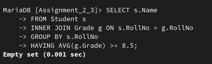

## **Assignment 2 & 3**
---
### **Name:** Sayantani Karmakar
### **RollNo:** 20CS8024
---
**Question:**

**University database:**

A student is described by a unique Roll Number, Name Adress, and Semester. Each student enrolls himself in
an Academic programme offered by a Department. Academic programmes have programme name(unique),
duration, a programme code(unique) and a list of courses (both core and elective course) while the
departments have department code (unique), department name (unique), HoD who is a Teacher and list of
courses offered by it. Each teacher is described by employee code (unique), name, department and
designation. A student registers some courses in a semester. A course is described by a unique course number,
title of the course, credit allotted for the course and offering department. Database stores the grades obtained
by different student in different courses registered by him/her in different semesters. Database also stores
information about the courses offered by a department in a semester, the corresponding teacher(s) for each
course.

**Assignment 2:**

Make appropriate tables for the above database and try to find out the following queries:

1. Find all the students’ name, city, course allotted from the CSE department.
2. List the total number of Faculty in the CSE department.
3. List the available courses from the CSE department.
4. List the all students in a particular semester.
5. List the students who earned CGPA greater than or equal to 8.5

**Assignment 3:**

Make appropriate tables for the above database and try to find out the following queries:
1. How much subjects are registered by a student in each semester.
2. List the common students who are allotted the same courses of both the programme MCA and M.Tech.
3. List the total number of student enrolled in the subject DBMS.
4. Retrieve the semester of the student under DBMS subject.
5. Retrieve all the student name and arrange into ascending order.

---
**Solution**

Create Tables and insert data
```sql
CREATE TABLE `Academic_Programmes` (
  `Name` tinytext DEFAULT NULL,
  `Programme_Code` varchar(10) NOT NULL,
  `Duration` int(2) DEFAULT NULL,
  PRIMARY KEY (`Programme_Code`),
  UNIQUE KEY `Name` (`Name`) USING HASH
)

CREATE TABLE `Course` (
  `CourseNo` varchar(3) NOT NULL,
  `Title` tinytext DEFAULT NULL,
  `Credits` int(2) DEFAULT NULL,
  PRIMARY KEY (`CourseNo`)
)

CREATE TABLE `Courses_Offerred` (
  `CourseNo` varchar(3) DEFAULT NULL,
  `Department` varchar(3) DEFAULT NULL,
  `Teacher` varchar(3) DEFAULT NULL,
  `Programme` varchar(10) DEFAULT NULL
)

CREATE TABLE `Department` (
  `DepartmentCode` varchar(3) NOT NULL,
  `Name` tinytext DEFAULT NULL,
  PRIMARY KEY (`DepartmentCode`)
)


CREATE TABLE `Enrollment` (
  `RollNo` varchar(4) DEFAULT NULL,
  `ProgrammeCode` varchar(10) DEFAULT NULL,
  `RegistrationNo` varchar(10) NOT NULL,
  PRIMARY KEY (`RegistrationNo`)
)

CREATE TABLE `Grade` (
  `RollNo` varchar(4) DEFAULT NULL,
  `CourseNo` varchar(3) DEFAULT NULL,
  `Grade` float(2,2) DEFAULT NULL
)

CREATE TABLE `Registration` (
  `RollNo` varchar(4) DEFAULT NULL,
  `CourseNo` varchar(3) DEFAULT NULL,
  `Semester` int(2) DEFAULT NULL
)

CREATE TABLE `Student` (
  `RollNo` varchar(4) NOT NULL,
  `Name` tinytext DEFAULT NULL,
  `Address` varchar(40) DEFAULT NULL,
  `Semester` int(2) DEFAULT NULL,
  PRIMARY KEY (`RollNo`)
)

CREATE TABLE `Teacher` (
  `EmployeeCode` varchar(3) NOT NULL,
  `Name` tinytext DEFAULT NULL,
  `Department` varchar(3) DEFAULT NULL,
  `Designation` tinytext DEFAULT NULL,
  PRIMARY KEY (`EmployeeCode`)
)

INSERT INTO Academic_Programmes (Name, Programme_Code, Duration)
VALUES ('Bachelor of Technology', 'BTech', 4),
       ('Master of Technology', 'MTech', 2),
       ('Master of Computer Applications', 'MCA', 3);

INSERT INTO Course (CourseNo, Title, Credits)
VALUES ('CSC101', 'Introduction to Computer Science', 3),
       ('ENG101', 'English Composition', 3),
       ('MAT101', 'Calculus I', 4);

INSERT INTO Department (DepartmentCode, Name)
VALUES ('CSC', 'Computer Science'),
       ('ENG', 'English'),
       ('MAT', 'Mathematics');

INSERT INTO Teacher (EmployeeCode, Name, Department, Designation)
VALUES ('T001', 'John Doe', 'CSC', 'Associate Professor'),
       ('T002', 'Jane Smith', 'ENG', 'Assistant Professor'),
       ('T003', 'Mike Johnson', 'MAT', 'Professor');

INSERT INTO Courses_Offerred (CourseNo, Department, Teacher, Programme)
VALUES ('CSC101', 'CSC', 'T001', 'BTech'),
       ('ENG101', 'ENG', 'T002', 'MTech'),
       ('MAT101', 'MAT', 'T003', 'MCA');
      
INSERT INTO Student (RollNo, Name, Address, Semester)
VALUES ('S001', 'Alice Smith', '123 Main St', 1),
       ('S002', 'Bob Johnson', '456 Maple Ave', 2),
       ('S003', 'Carol Lee', '789 Oak St', 3);

INSERT INTO Enrollment (RollNo, ProgrammeCode, RegistrationNo)
VALUES ('S001', 'BTech', 'R001'),
       ('S002', 'MTech', 'R002'),
       ('S003', 'MCA', 'R003');

INSERT INTO Registration (RollNo, CourseNo, Semester)
VALUES ('S001', 'CSC101', 1),
       ('S002', 'ENG101', 2),
       ('S003', 'MAT101', 3);

INSERT INTO Grade (RollNo, CourseNo, Grade)
VALUES ('S001', 'CSC101', 3.5),
       ('S002', 'ENG101', 4.0),
       ('S003', 'MAT101', 3.7);
```

Tables:


Queries:

1.1. Find all the students’ name, city, course allotted from the CSE department.

```sql
SELECT s.Name, s.Address, c.Title 
FROM Student s
INNER JOIN Registration r ON s.RollNo = r.RollNo
INNER JOIN Courses_Offerred co ON r.CourseNo = co.CourseNo
INNER JOIN Course c ON r.CourseNo = c.CourseNo 
WHERE co.Department = 'CSC';
```


1.2. List the total number of Faculty in the CSE department.

```sql
SELECT COUNT(*) as TotalFaculty
FROM Teacher t
INNER JOIN Department d ON t.Department = d.DepartmentCode
WHERE d.DepartmentCode = 'CSC';
```


1.3. List the available courses from the CSE department.

```sql
SELECT c.Title, c.Credits
FROM Courses_Offerred co
INNER JOIN Course c ON co.CourseNo = c.CourseNo
INNER JOIN Department d ON co.Department = d.DepartmentCode
WHERE d.DepartmentCode = 'CSC';
```


1.4. List the all students in a particular semester.

```sql
SELECT Name 
FROM Student
WHERE Semester = 2;
```


1.5. List the students who earned CGPA greater than or equal to 8.5

```sql
SELECT s.Name
FROM Student s
INNER JOIN Grade g ON s.RollNo = g.RollNo
GROUP BY s.RollNo
HAVING AVG(g.Grade) >= 8.5;
```



2.1. How much subjects are registered by a student in each semester.

```sql
SELECT s.RollNo, s.Name, r.Semester, COUNT(r.CourseNo) AS NumCourses
FROM Student s
INNER JOIN Registration r ON s.RollNo = r.RollNo
GROUP BY s.RollNo, r.Semester;
```


2.2. List the common students who are allotted the same courses of both the programme MCA and M.Tech.

```sql
SELECT s.RollNo, s.Name, c.CourseNo
FROM Student s
INNER JOIN Enrollment e ON s.RollNo = e.RollNo
INNER JOIN Registration r ON r.RollNo = s.RollNo 
INNER JOIN Course c ON c.CourseNo = r.CourseNo  
WHERE e.ProgrammeCode IN ('MCA', 'MTech')
GROUP BY s.RollNo, c.CourseNo
HAVING COUNT(DISTINCT e.ProgrammeCode) = 2;
```


2.3. List the total number of student enrolled in the subject DBMS.

```sql
SELECT COUNT(DISTINCT RollNo) AS Total_Students
FROM Registration
WHERE CourseNo = 'DBMS';
```


2.4. Retrieve the semester of the student under DBMS subject.

```sql
SELECT DISTINCT s.Semester
FROM Student s
INNER JOIN Registration r ON s.RollNo = r.RollNo
WHERE r.CourseNo = 'DBMS';
```


2.5. Retrieve all the student name and arrange into ascending order.

```sql
SELECT Name
FROM Student
ORDER BY Name ASC;
```


