## **Assignment 5**
---
### **Name:** Diptangshu Dey
### **RollNo:** 20CS8018
---
**Question:**
**Library information system:**

Database should store information about books, journals, megazines etc. Searching for books can be
done by author, title, subject. Similarly journals can be searched by subject area, publisher etc. It
should also be possible to see which book is issued to which student and belonging department.
Create the tables having appropriate referential integrity constraints. Make and state assumptions, if
any. Write and run the following SQL queries on the tables:

1. List the names of the books issued between 21-aug-08 and 29-Aug-08.
2. Retrieve the name and number of books by a particular author.
3. Retrieve the name of the publisher which has maximum number of books.
4. Count the total number of books in the library.
5. Count the number of books issued to a student with Roll no ‘CSB06001’
6. Change the author of the book to ‘ABC’ with book id=’BK003’.
7. Retrieve the name of the student to whom the book named ‘Database System’, ‘E.Navathe’ is issued.
8. Display the total number of books issued to different departments.
9. List the name of the books where subject is like ‘ora’.  

**Solution**

```sql
CREATE TABLE Books (
    book_id varchar(5) PRIMARY KEY,
    title TEXT,
    author TEXT,
    subject TEXT,
    total_copies INT(3),
    available_copies INT(3)
);

CREATE TABLE Journals (
    journal_id varchar(5) PRIMARY KEY,
    title TEXT,
    publisher TEXT,
    subject_area TEXT,
    total_copies INT(3),
    available_copies INT(3)
);

CREATE TABLE Magazines (
    magazine_id varchar(5) PRIMARY KEY,
    title TEXT,
    publisher TEXT,
    total_copies INT(3),
    available_copies INT(3)
);

CREATE TABLE Departments (
    dept_id VARCHAR(5) PRIMARY KEY,
    dept_name TEXT
);

CREATE TABLE Students (
    student_id varchar(10) PRIMARY KEY,
    student_name TEXT,
    dept_id VARCHAR(5),
    FOREIGN KEY (dept_id) REFERENCES Departments(dept_id)
);

CREATE TABLE Issued_Books (
    issue_id VARCHAR(5) PRIMARY KEY,
    book_id VARCHAR(5),
    student_id VARCHAR(6),
    issue_date DATE,
    return_date DATE,
    FOREIGN KEY (book_id) REFERENCES Books(book_id),
    FOREIGN KEY (student_id) REFERENCES Students(student_id)
);
```

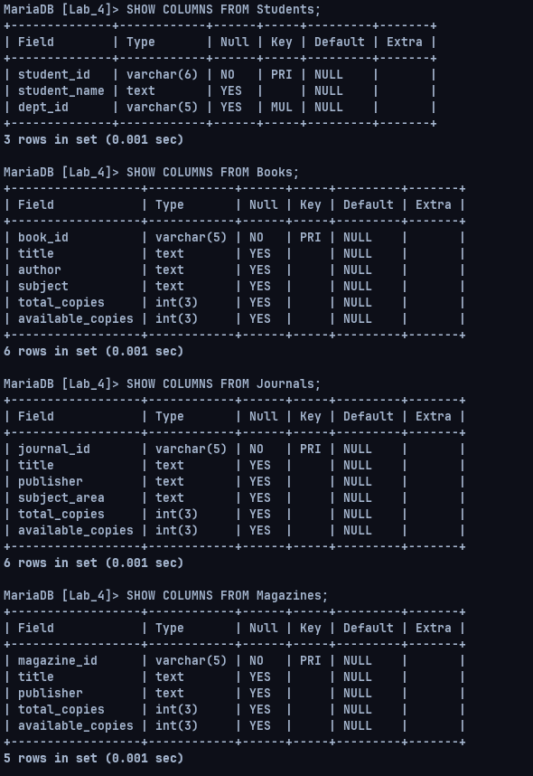

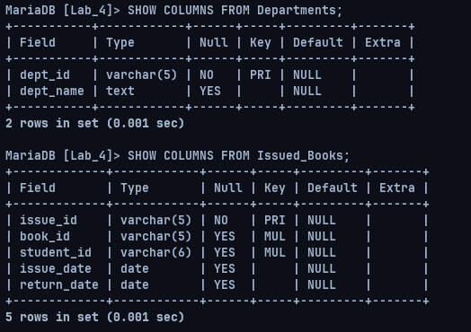

```sql
INSERT INTO Books VALUES 
('BK001', 'To Kill a Mockingbird', 'Harper Lee', 'Fiction', 100, 50),
('BK002', 'The Great Gatsby', 'F. Scott Fitzgerald', 'Fiction', 150, 75),
('BK003', 'One Hundred Years of Solitude', 'Gabriel García Márquez', 'Fiction', 200, 100),
('BK004', '1984', 'George Orwell', 'Fiction', 120, 60),
('BK005', 'Pride and Prejudice', 'Jane Austen', 'Fiction', 80, 40),
('BK006', 'To the Lighthouse', 'Virginia Woolf', 'Fiction', 90, 45),
('BK007', 'The Catcher in the Rye', 'J.D. Salinger', 'Fiction', 110, 55),
('BK008', 'The Lord of the Rings', 'J.R.R. Tolkien', 'Fantasy', 130, 65),
('BK009', 'The Hobbit', 'J.R.R. Tolkien', 'Fantasy', 100, 50),
('BK010', 'Database System', 'E. Navathe', 'Computer Science', 50, 20);

INSERT INTO Journals VALUES 
("JN001", "Galaxy CLustering with Convolutional Neural Networks", "IEEE", "Deep Learning", 20, 10),
("JN002", "Area of the Biggest Triangle in a given Simple Polygon", "ISI", "Computational Geometry", 20, 20),
('JN003', 'Journal of Applied Physics', 'American Institute of Physics', 'Physics', 100, 50),
('JN004', 'Journal of Biological Chemistry', 'American Society for Biochemistry and Molecular Biology', 'Biochemistry', 150, 75),
('JN005', 'Journal of Finance', 'Wiley-Blackwell', 'Finance', 200, 100),
('J0006', 'Journal of Marketing', 'American Marketing Association', 'Marketing', 120, 60),
('JN006', 'Journal of Political Science', 'Cambridge University Press', 'Political Science', 80, 40);

INSERT INTO Magazines VALUES
('MZ001', 'National Geographic', 'National Geographic Society', 200, 100),
('MZ002', 'The Economist', 'The Economist Group', 150, 75),
('MZ003', 'People', 'Meredith Corporation', 300, 150),
('MZ004', 'Vogue', 'Condé Nast', 120, 60),
('MZ005', 'Time', 'Time USA, LLC', 250, 125),
('MZ006', 'Sports Illustrated', 'Meredith Corporation', 100, 50),
('MZ007', 'Scientific American', 'Springer Nature', 180, 90),
('MZ008', 'Fortune', 'Fortune Media IP Limited', 90, 45),
('MZ009', 'Entertainment Weekly', 'Meredith Corporation', 130, 65),
('MZ010', 'Wired', 'Condé Nast', 220, 110);

INSERT INTO Departments VALUES 
('D0001', 'Computer Science'),
('D0002', 'Electrical Engineering'),
('D0003', 'Mechanical Engineering'),
('D0004', 'English'),
('D0005', 'Mathematics');

INSERT INTO Students VALUES 
('CSB06001', 'John Doe', 'D0001'),
('CSB06002', 'Jane Smith', 'D0001'),
('CSB06003', 'Mike Johnson', 'D0002'),
('CSB06004', 'Emily Brown', 'D0002'),
('CSB06005', 'David Lee', 'D0003'),
('CSB06006', 'Samantha Kim', 'D0003'),
('CSB06007', 'Alex Chen', 'D0004'),
('CSB06008', 'Jessica Wang', 'D0004'),
('CSB06009', 'Kevin Liu', 'D0005'),
('CSB06010', 'Maggie Wu', 'D0005');

INSERT INTO Issued_Books VALUES 
    ('IS001', 'BK001', 'CSB06001', '2008-08-23', '2008-09-02'),
    ('IS002', 'BK002', 'CSB06002', '2008-08-21', '2008-09-04'),
    ('IS003', 'BK003', 'CSB06003', '2008-08-25', '2008-09-06'),
    ('IS004', 'BK004', 'CSB06004', '2008-08-27', '2008-09-07'),
    ('IS005', 'BK005', 'CSB06005', '2008-08-22', '2008-09-01'),
    ('IS006', 'BK006', 'CSB06006', '2008-08-24', '2008-09-03'),
    ('IS007', 'BK007', 'CSB06007', '2008-08-26', '2008-09-05'),
    ('IS008', 'BK008', 'CSB06008', '2008-08-28', '2008-09-08'),
    ('IS009', 'BK009', 'CSB06009', '2008-08-21', '2008-09-10'),
    ('IS010', 'BK010', 'CSB06010', '2008-08-23', '2008-09-12');
```

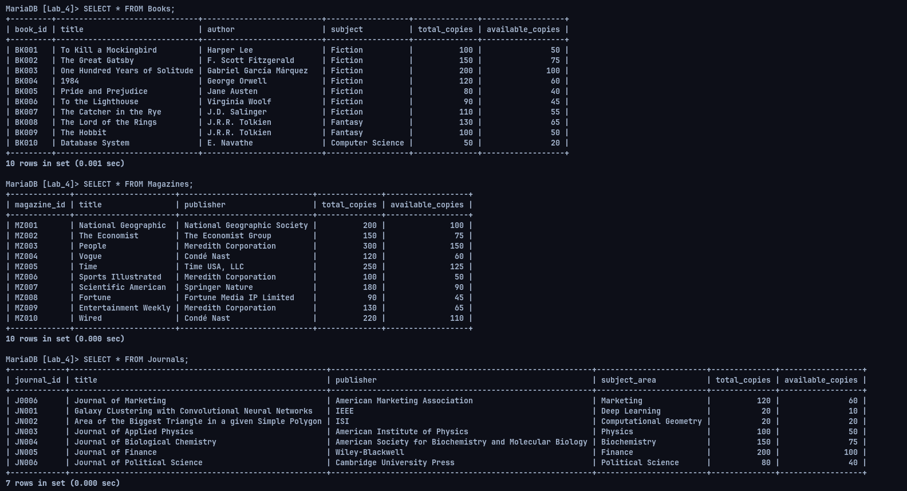

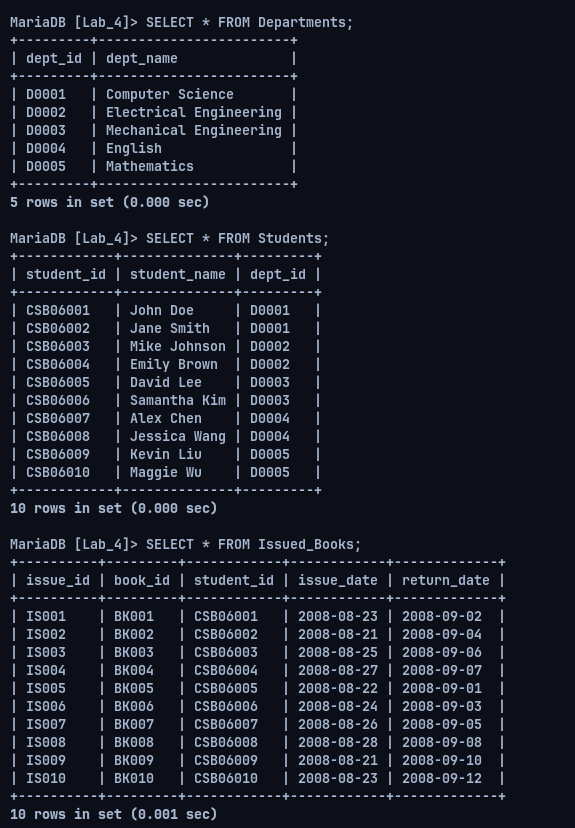

**Queries**
1. List the names of the books issued between 21-aug-08 and 29-Aug-08.

```sql
SELECT Books.title FROM Issued_Books INNER JOIN Books ON Issued_Books.book_id=Books.book_id WHERE issue_date>"2008-08-21" AND issue_date<"2008-08-29";
```

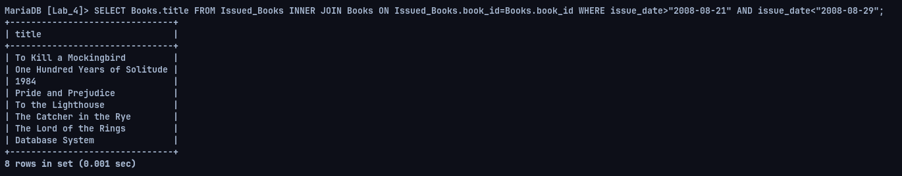

2. Retrieve the name and number of books by a particular author.

```sql
SELECT COUNT(title) FROM Books WHERE author='J.R.R. Tolkien';
SELECT title FROM Books WHERE author='J.R.R. Tolkien';
```

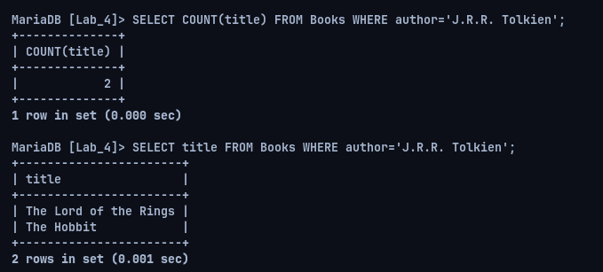

3. Retrieve the name of the publisher which has maximum number of books.

```sql
SELECT author FROM Books GROUP BY author HAVING COUNT(book_id)=( SELECT max(count) FROM (SELECT count(book_id) AS count, author FROM Books GROUP BY author) s );
```

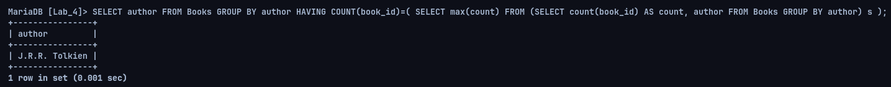

4. Count the total number of books in the library.

```sql
SELECT COUNT(*) FROM Books;
```

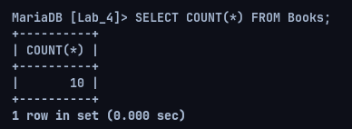

5. Count the number of books issued to a student with Roll no ‘CSB06001’

```sql
SELECT COUNT(*) FROM Issued_Books WHERE student_id="CSB06001";
```

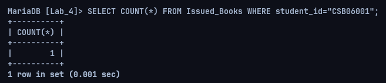

6. Change the author of the book to ‘ABC’ with book id=’BK003’.

```sql
UPDATE Books
SET author='ABC' WHERE book_id='BK003';
```


7. Retrieve the name of the student to whom the book named ‘Database System’, ‘E.Navathe’ is issued.

```sql
SELECT Students.student_name FROM Issued_Books INNER JOIN Students ON Issued_Books.student_id=Students.student_id INNER JOIN Books ON Issued_Books.book_id=Books.book_id WHERE Books.title='Database System' AND Books.author='E. Navathe';
```

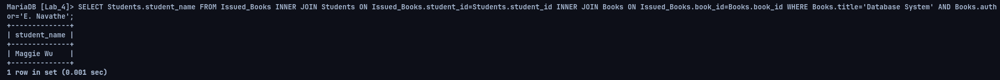

8. Display the total number of books issued to different departments.

```sql
SELECT Students.dept_id, COUNT(book_id)  FROM Issued_Books INNER JOIN Students ON Issued_Books.student_id=Students.student_id GROUP BY Students.dept_id;
```

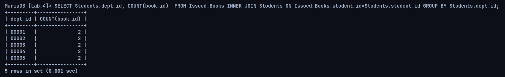

9. List the name of the books where subject is like ‘ora’. 

```sql
SELECT title FROM Books WHERE subject LIKE 'ora';
```

