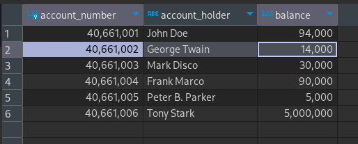
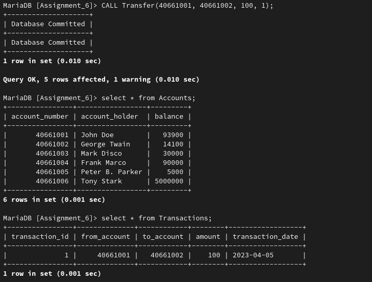
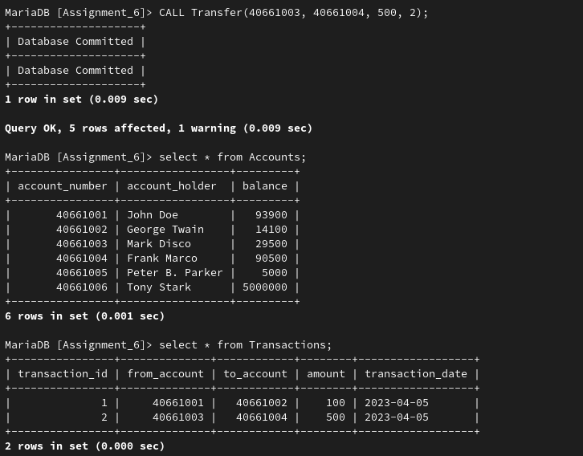
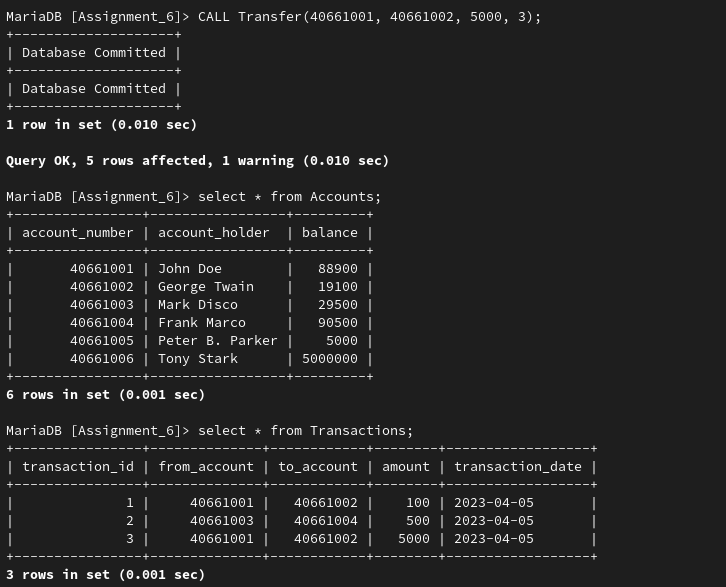

## **Assignment 6**

---

### **Name:** Sayantani Karmakar

### **Roll No:** 20CS8024

---

**Question:**

Suppose you have two tables named "Accounts" and "Transactions":

-   "Accounts" table, which contains the following columns:
    -   account_number (integer)
    -   account_holder (text)
    -   balance (float)
-   "Transactions" table, which contains the following columns:
    -   transaction_id (integer)
    -   from_account (integer)
    -   to_account (integer)
    -   amount (float)
    -   transaction_date (date)

1. Write an SQL transaction that transfers $100 from account number 1234 to account
   number 5678, and records the transaction in the "Transactions" table. The transaction
   should only occur if the balance of account number 1234 is greater than or equal to
   $100. If the transaction occurs successfully, the balance of account number 1234
   should be reduced by $100, and the balance of account number 5678 should be
   increased by $100.
2. Write an SQL transaction that transfers $500 from account "A" to account "B", and
   inserts a new row into the "Transactions" table to record the transfer. However, the
   transaction should only be committed if both updates (i.e. transferring the money and
   inserting the transaction record) occur successfully.
3. Write an SQL transaction that transfers $1000 from account number 1234 to account
   number 5678, and inserts a new row into the "Transactions" table to record the
   transfer. However, the transaction should only be committed if all of the following
   conditions are met: 
   - The balance of account 1234 is greater than or equal to $1000. 
   - The balance of account 5678 is less than or equal to $5000. 
   - The transaction date is on or after the current date.

**Solution**

Creating tables

```sql
CREATE TABLE `Accounts` (
  `account_number` int(10) NOT NULL,
  `account_holder` text DEFAULT NULL,
  `balance` float DEFAULT NULL,
  PRIMARY KEY (`account_number`)
)

CREATE TABLE `Transactions` (
  `transaction_id` int(10) NOT NULL,
  `from_account` int(10) DEFAULT NULL,
  `to_account` int(10) DEFAULT NULL,
  `amount` float DEFAULT NULL,
  `transaction_date` date DEFAULT NULL,
  PRIMARY KEY (`transaction_id`),
  FOREIGN KEY (`from_account`) REFERENCES `Accounts` (`account_number`),
  FOREIGN KEY (`to_account`) REFERENCES `Accounts` (`account_number`)
)
```

Current Table with data:



Transaction code inside a procedure:

```sql
CREATE DEFINER=`hobbist`@`localhost` PROCEDURE `Assignment_6`.`Transfer`(
	IN v_from_account INT(10), 
	IN v_to_account INT(10), 
	IN v_amount FLOAT(10),
	IN v_id INT(10))
BEGIN
	DECLARE senderBal, recvBal, id int;
	
	SELECT balance into senderBal FROM Accounts WHERE account_number=v_from_account;

	IF senderBal >= v_amount THEN 
		START TRANSACTION;
			SELECT balance INTO recvBal FROM Accounts WHERE account_number=v_to_account;
			UPDATE Accounts 
				SET balance=senderBal-v_amount WHERE account_number=v_from_account;
			UPDATE Accounts 
				SET balance=recvBal+v_amount WHERE account_number=v_to_account;
				
			INSERT INTO Transactions VALUES
			(v_id, v_from_account, v_to_account, v_amount, NOW());
		COMMIT;
		SELECT 'Database Committed';
	ELSE
		SELECT 'Not Enough Balance';
		ROLLBACK;
	END IF;
END
```
1. Transaction for Q1.

```sql
CALL Transfer(40661001, 40661002, 100, 1);
```



2. Transaction for Q2.

```sql
CALL Transfer(40661003, 40661004, 500, 2);
```



3. Transaction for Q3.

```sql
CALL Transfer(40661001, 40661002, 5000, 3);
```

