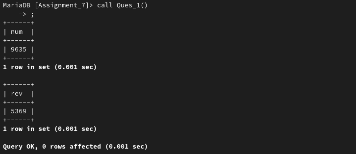
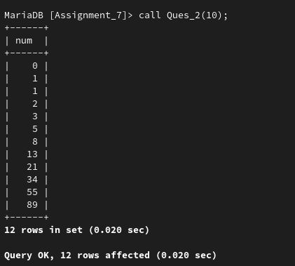
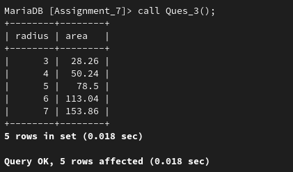

## **Assignment 7**

---

### **Name:** Sayantani Karmakar

### **Roll No:** 20CS8024

---

1. Write a PL/SQL block of code for inverting a number 9635 to 5369.

**Solution**

Code:
```sql
CREATE PROCEDURE `Assignment_7`.`Ques_1`()
BEGIN
	DECLARE 
		num, rev INT;
	SET num:= 9635;
	SET rev:=0;
	select num;
	WHILE num>0 DO
		SET rev:=(rev*10) + mod(num, 10);
		SET num:=floor(num/10);
	END WHILE;
	SELECT rev;
END
```
Output:



2. Write a PL/SQL block of code to generate fibonacci series.

**Solution**

Code:
```sql
CREATE PROCEDURE `Assignment_7`.`Ques_2`(IN n INT(5))
BEGIN
	DECLARE num1, num2, temp INT;
	set num1:=0;
	set num2:=1;
	create table series(num int(5));
	insert into series values (num1), (num2);
	WHILE n>0 DO
		SET temp:=num1+num2;
		set num1:=num2;
		set num2:=temp;
		insert into series values (temp);
		set n := n-1;
	END WHILE;
	select * from series;
END
```

Output:



3. Write a PL/SQL block of code to calculate the area of a circle for a value of radius varying from 3 to 7. Store the radius and the corresponding values of calculated area in a table, Areas.

**Solution**

Code:
```sql
CREATE PROCEDURE `Assignment_7`.`Ques_3`()
BEGIN
	declare r int;
	declare a float;
	set r:=3;
	create table areas(radius int(5), area float(5));
	while r<=7 do
		set a=3.14*r*r;
		insert into areas values (r, a);
		set r:=r+1;
	end while;
	select * from areas;
END
```

Output:

