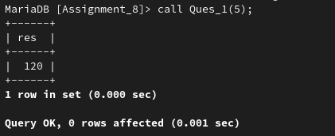
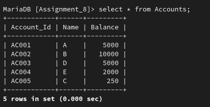
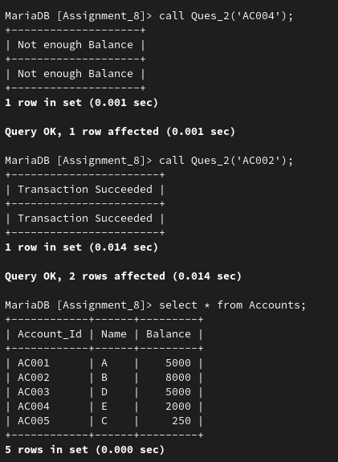

## **Assignment 8**

---

### **Name:** Diptangshu Dey

### **Roll No:** 20CS8018

---

1. Write a PL/SQL block of code to calculate the factorial of a number.

**Solution**

Code:
```sql
CREATE PROCEDURE `Assignment_8`.`Ques_1`(IN n INT(5))
BEGIN
	DECLARE res INT;
	SET res := 1;
	
	WHILE n>0 DO
		SET res:=res*n;
		SET n:=n-1;
	END WHILE;
	SELECT res;
END
```

Output:



2. Write a PL/SQL code block that will accept an account number from the user and debit an amount of Rs. 2000 from the account if the account has a minimum balance of Rs. 500 after the amount is debited. The process is to be fired on the Account table.

Table Name: Accounts

Account_Id | Name | Balance
---|---|---
AC 001 | A | 5000
AC 002 | B | 10000
AC 003 | D | 5000
AC 004 | E | 2000
AC 005 | C | 250

**Solution**

Creating Tables:
```sql
CREATE TABLE `Accounts` (
  `Account_Id` varchar(5) NOT NULL,
  `Name` text DEFAULT NULL,
  `Balance` int(5) DEFAULT NULL,
  PRIMARY KEY (`Account_Id`)
)
```

Table after inserting values:



Code:
```sql
CREATE PROCEDURE `Assignment_8`.`Ques_2`(IN acc varchar(5))
BEGIN
	DECLARE bal INT(5);
	SELECT Balance into bal from Accounts where Account_Id=acc;
	IF bal>=2500 THEN
		update Accounts set Balance=bal-2000 where Account_id=acc;
		select 'Transaction Succeeded';
	ELSE
		select 'Not enough Balance';
	END IF;
END
```

Output:

