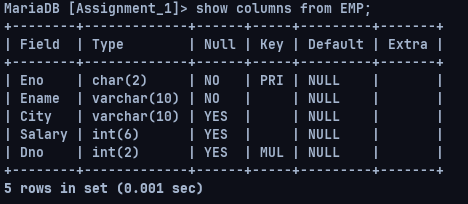
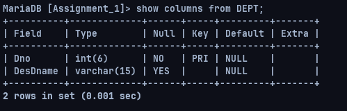
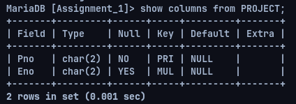
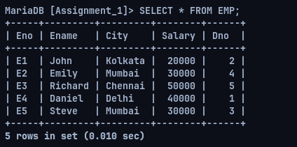
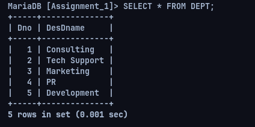
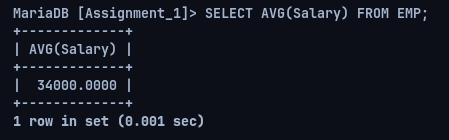

## Assignment 4

---

### **Name:** Sayantani Karmakar

### **Roll No:** 20CS8024

---

### **Question:**

Create the Following tables:

EMP
Attribute | Data Type | Size | Constraints
|---|---|---|---|
Eno | Char | 2 | Primary key and first character must be “E”
Ename | Varchar2 | 10 | Not null
City | Varchar2 | 10 | Cities allowed “Chennai”,“Mumbai”, “Delhi”, “Kolkata”
Salary | Number | 6
Dno | Number | 2 | Foreign key references DEPT table

DEPT
Attribute | Data Type | Size | Constraints
|---|---|---|---|
Dno | Number | 6 | Primary key
DesDname | Varchar2 | 15

PROJECT
Attribute | Data Type | Size | Constraints
|---|---|---|---|
Pno | Char | 2 | PK, first character must be “P”
Eno | Char | 2 | PK and FK references EMP

**Insert at least five data values into the respective tables related with the following queries. Perform the following queries:**

1. **Find the average salary of all employees.**
2. **List all the employee names whose salary is greater than 7000 and lesser than 18000.**
3. **Retrieve all information about employees where the Ename is 4 characters long and the first two characters are ‘AS’.**
4. **Display the number of employees in each department.**
5. **Find the difference between highest and lowest salary.**

**Solution:**

Creation of Tables

```sql
CREATE DATABASE Assignment_1;
USE Assignment_1;

--Creating EMP Table
CREATE TABLE EMP( Eno char(2), Ename Varchar(10), City Varchar(10), Salary int(6), Dno int(2));

ALTER TABLE EMP ADD PRIMARY KEY(Eno);
ALTER TABLE EMP MODIFY COLUMN Ename varchar(10) NOT NULL;
ALTER TABLE EMP  ADD CHECK (SUBSTRING(Eno, 1, 1) = 'E');
ALTER TABLE EMP ADD CHECK (City = 'Chennai' OR City = 'Mumbai' OR City = 'Delhi' OR City = 'Kolkata');

--Creating DEPT Table
CREATE TABLE DEPT ( Dno int(6) PRIMARY KEY, DesDname varchar(15) );

--Creating Project Table
CREATE TABLE PROJECT ( Pno char(2) PRIMARY KEY , Eno char(2), FOREIGN KEY(Eno) REFERENCES EMP(Eno) );
ALTER TABLE PROJECT ADD CHECK (LEFT(Pno, 1) = 'P');

ALTER TABLE EMP ADD FOREIGN KEY (Dno) REFERENCES DEPT(Dno);
ALTER TABLE EMP ADD FOREIGN KEY (Dno) REFERENCES DEPT(Dno);
```







```sql
INSERT INTO DEPT VALUES
(1, 'Consulting'),
(2, 'Tech Support'),
(3, 'Marketing'),
(4, 'PR'),
(5, 'Development');

INSERT INTO EMP VALUES
("E1", "John", "Kolkata", 20000, 2),
("E2", "Emily", "Mumbai", 30000, 4),
("E3", "Richard", "Chennai", 50000, 5),
("E4", "Daniel", "Delhi", 40000, 1),
("E5", "Steve", "Mumbai", 30000, 3);

INSERT INTO PROJECT VALUES
('P1', 'E1'),
('P2', 'E2'),
('P3', 'E3'),
('P4', 'E4'),
('P5', 'E5');
```






**Required Operations:**

1. Find the average salary of all employees.



2. List all the employee names whose salary is greater than 7000 and lesser than 18000.


3. Retrieve all information about employees where the Ename is 4 characters long and the first two characters are ‘AS’.


4. Display the number of employees in each department.


5. Find the difference between highest and lowest salary.


