## Assignment 5

---

### **Name:** Sayantani Karmakar

### **Roll No:** 20CS8024

---

### **Question:**

**Hospital information system:**

Patients - indoor/outdoor, medicines/lab tests (including results) prescribed to patients, information if a patient if referred to other expert/hospital. Doctors - specialization, patients attended etc. Different wards/beds and patients alloted to them etc.

Patient registration form should include Registration number, Patient name, Address, Gender, Bed number, DATE of registration, refer doctor id etc.

Doctor information should include Doctor code, Doctor Name, Specialization etc.

Lab test information should include Test name, test number, test DATE, results and referred doctor’s code.

Bed information should include bed number, ward number and status (whether allotted or not).

Create the tables having appropriate referential integrity constraints. Make and state assumptions, if any.

Write and run the following SQL queries on the tables:

**Queries:**

1. Display the details of patients admitted between ‘20-jul-02’ and ’20-aug-08’.
2. Change the name of the patient to ‘Ram’ whose patient id=’PT011’
3. Display the names of the patients and lab test results performed on ‘20-jul- 08’.
4. Display the number of patients taking treatment under doctor =’ABC’.
5. Retrieve the name of doctor who is taking care of maximum number of patients.
6. Change the bed number of the patient to 456 where patient id=’PT023’
7. Change the status of bed with bed number 123 with ‘not allotted’.
8. List the bed details which are free in ward number 10.
9. List the name of male patients in ward no 13 taking treatment under doctor ‘XYZ’
10. List the details of patients with age more than 50 taking treatment under a doctor, whose name like ‘das’.

**Solution:**

Creating Tables

```sql
CREATE TABLE Patient( PatientID VARCHAR(5) PRIMARY KEY, Name TEXT, Address TEXT, Gender CHAR(1), Age INT(3), BedNo INT(3), WardNo INT(3), Date_Of_Registration DATE, Doctor VARCHAR(5) );

CREATE TABLE Doctor( DoctorID VARCHAR(5) PRIMARY KEY, Name TEXT, Specialization text );

CREATE TABLE Lab_Tests( TestNo VARCHAR(5) PRIMARY KEY, Test_Name TEXT, Test_Date DATE, Result text, Doctor VARCHAR(5), Patient VARCHAR(5));

CREATE TABLE Bed( BedNo INT(3) , WardNo INT(3), Status TEXT, PRIMARY KEY(BedNo, WardNo));

ALTER TABLE Patient ADD FOREIGN KEY (BedNo) REFERENCES Bed(BedNo);
ALTER TABLE Patient ADD FOREIGN KEY (Doctor) REFERENCES Doctor(DoctorID);
ALTER TABLE Lab_Tests ADD FOREIGN KEY (Doctor) REFERENCES Doctor(DoctorID);
ALTER TABLE Lab_Tests ADD FOREIGN KEY (Patient) REFERENCES Patient(PatientID);
```

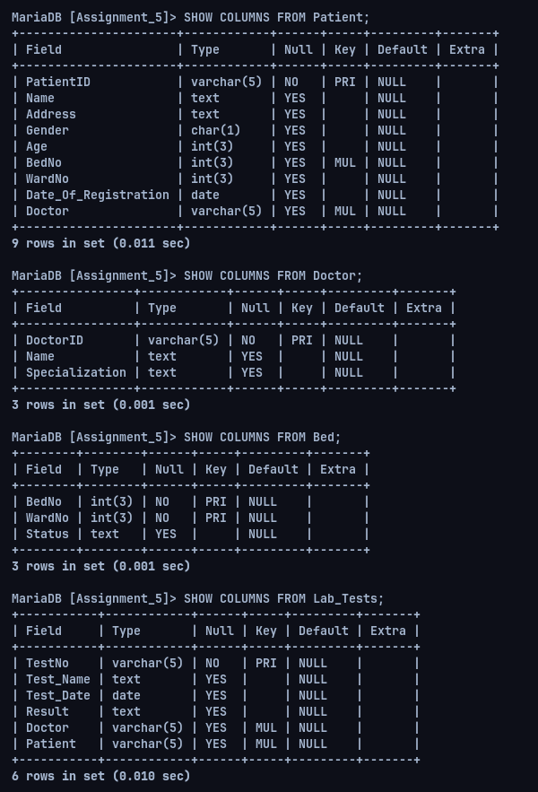

```sql
INSERT INTO Bed VALUES
(1, 1, "UNOCCUPIED"),
(2, 1, "UNOCCUPIED"),
(3, 1, "UNOCCUPIED"),
(4, 1, "UNOCCUPIED"),
(5, 1, "UNOCCUPIED"),
(1, 10, "UNOCCUPIED"),
(2, 10, "UNOCCUPIED"),
(3, 10, "UNOCCUPIED"),
(4, 10, "UNOCCUPIED"),
(5, 10, "UNOCCUPIED"),
(1, 13, "UNOCCUPIED"),
(2, 13, "UNOCCUPIED"),
(3, 13, "UNOCCUPIED"),
(4, 13, "UNOCCUPIED"),
(456, 13, "UNOCCUPIED"),
(123, 10, "UNOCCUPIED");

INSERT INTO Doctor VALUES
("DT001", "XYZ", "Ortho"),
("DT002", "ABC", "Child"),
("DT003", "DEF", "Child"),
("DT004", "Archisman", "Ortho"),
("DT005", "Das", "Ortho");

INSERT INTO Patient VALUES
("PT011", "Dexter", "450, Bleeker Street", "M", 13, 1, 1, "2020-07-10", "DT002"),
("PT010", "Alice", "43/1, Regent Street", "F", 12, 3, 1, "2020-07-11", "DT003"),
("PT020", "Alex", "65, Holiday Apartments", "M", 11, 5, 1, "2020-07-20", "DT002"),
("PT023", "John", "23/A Mayfair Road", "M", 60, 2, 13, "2020-07-15", "DT001"),
("PT009", "Jack", "23/B Mayfair Road", "M", 59, 1, 13, "2020-07-15", "DT001"),
("PT017", "Molly", "77/3 Virginia Road", "F", 67, 2, 10, "2020-07-20", "DT005"),
("PT024", "Rick", "56 NYC", "M", 49, 1, 10, "2020-07-07", "DT005"),

INSERT INTO Lab_Tests VALUES
("T11", "Blood Test For Malaria", "2020-07-08", "Negative", "DT005", "PT024"),
("T12", "Blood Test For Parasite", "2020-07-08", "Negative", "DT005", "PT024"),
("T13", "Stool Test for Parasite", "2020-07-08", "Negative", "DT005", "PT024"),
("T14", "Blood Test For Malaria", "2020-07-12", "Negative", "DT003", "PT010"),
("T15", "Blood Test For Malaria", "2020-07-11", "Negative", "DT002", "PT011");

UPDATE Bed
SET Status="OCCUPIED"
WHERE BedNo=Patient.BedNo AND WardNo=Patient.WardNo;
```

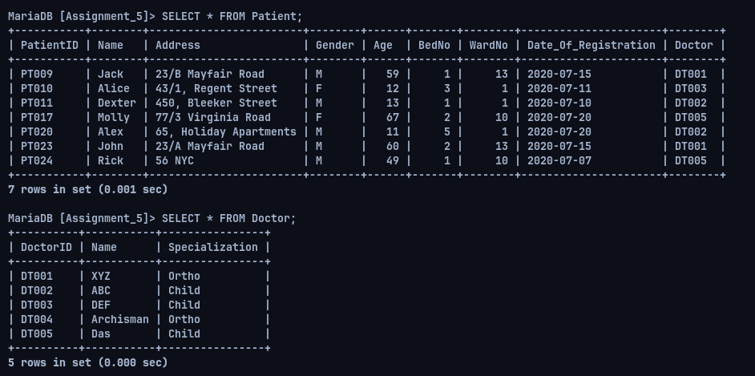

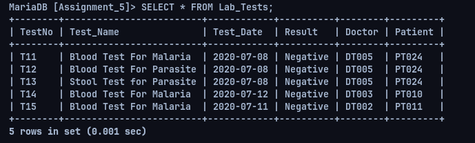

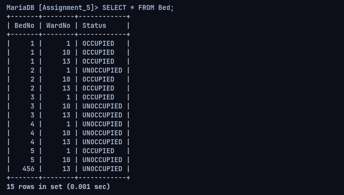

**Queries:**

1. Display the details of patients admitted between ‘20-jul-02’ and ’20-aug-08’.

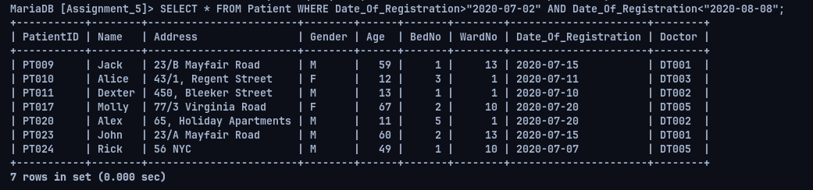

2. Change the name of the patient to ‘Ram’ whose patient id=’PT011’

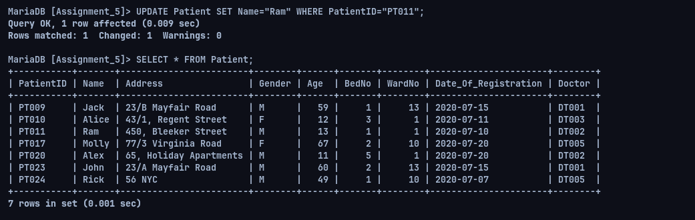

3. Display the names of the patients and lab test results performed on ‘20-jul-08’.

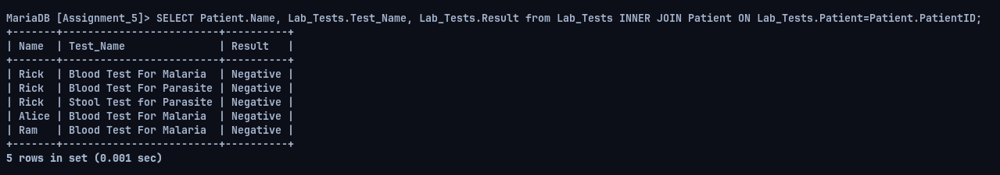

4. Display the number of patients taking treatment under doctor =’ABC’.

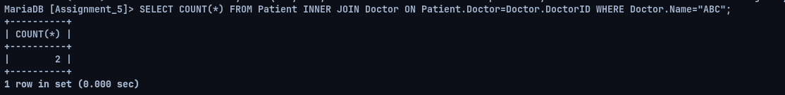

5. Retrieve the name of doctor who is taking care of maximum number of patients.

```sql
SELECT Doctor.Name FROM Patient INNER JOIN Doctor ON Patient.Doctor=Doctor.DoctorID GROUP BY Doctor.DoctorID HAVING COUNT(PatientID) = (SELECT MAX(patients) FROM (SELECT Doctor.Name, Count(PatientID) patients FROM Patient INNER JOIN Doctor ON Patient.Doctor=Doctor.DoctorID GROUP BY Doctor.DoctorID) s );
```

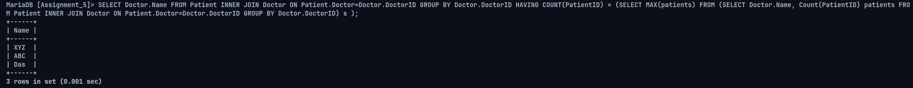

6. Change the bed number of the patient to 456 where patient id=’PT023’

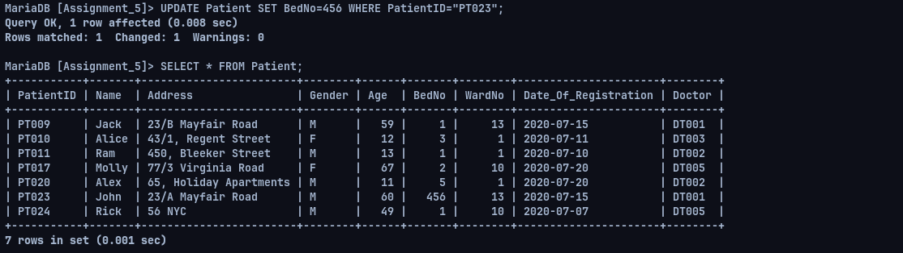

7. Change the status of bed with bed number 123 with ‘not allotted’.

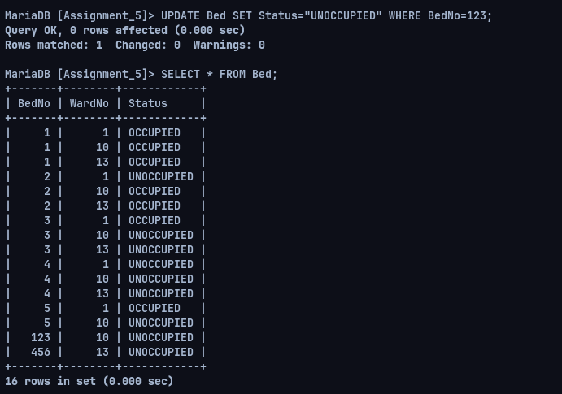

8. List the bed details which are free in ward number 10.

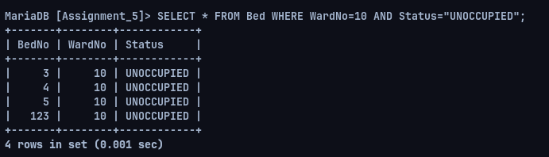

9. List the name of male patients in ward no 13 taking treatment under doctor ‘XYZ’

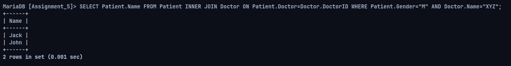

10. List the details of patients with age more than 50 taking treatment under a doctor, whose name like ‘das’.

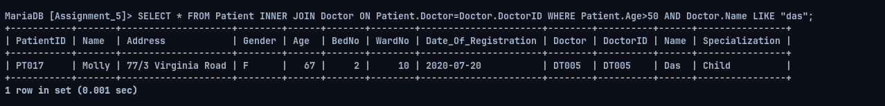
