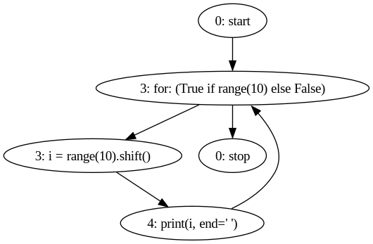
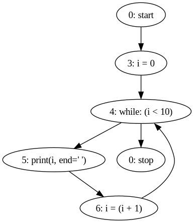
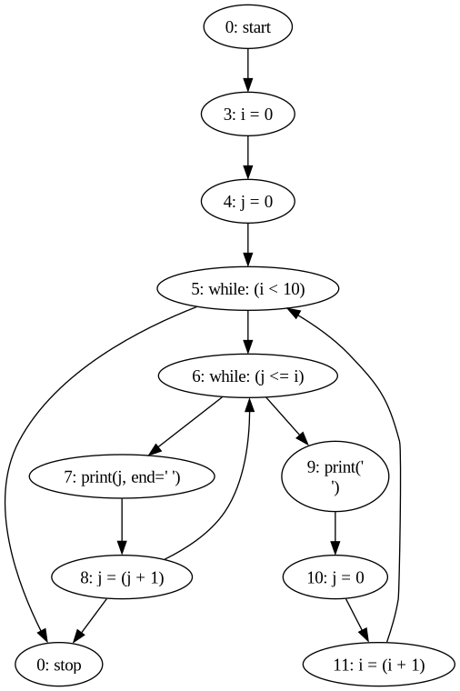
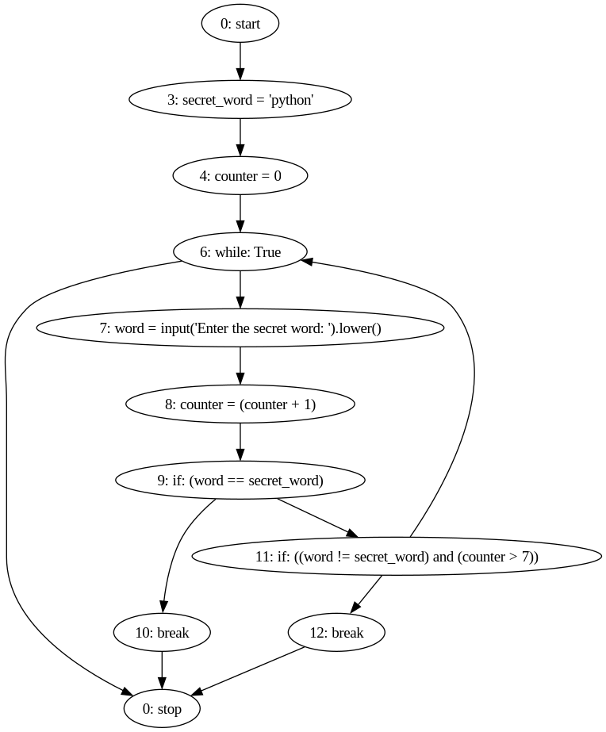
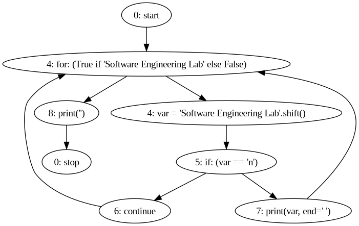
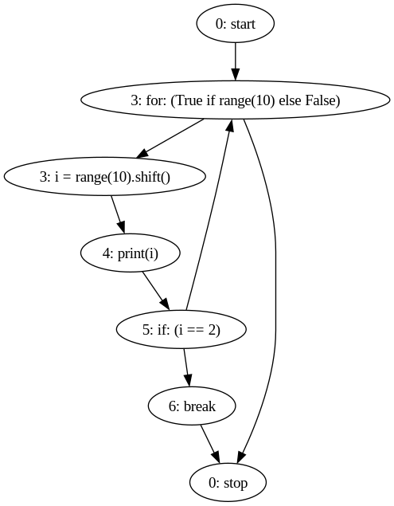
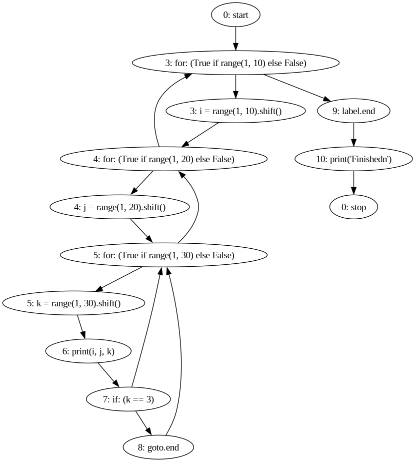
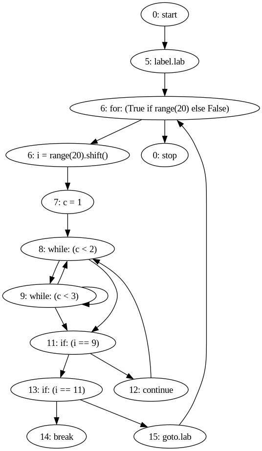
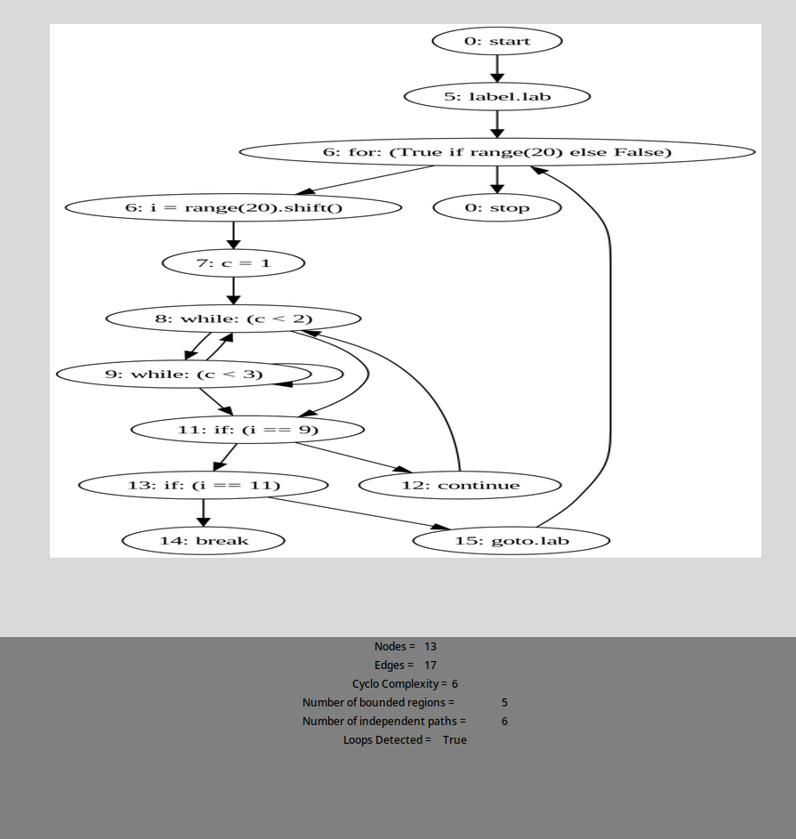

## **Software Engineering Lab**
---

- Name: Sayantani Karmakar
- Roll No: 20CS8024
- Assignment: 1

---

### Questions
INPUT: program segments with (i)for, (ii)while, (iii)nested-while, (iv)do-while, (v)continue, (vi)break, (vii)goto, (viii)all these.

1. Write a program to store and display the CFG for given program segment.

    I. Find maximal set of independent paths of the above generated CFG.
    II. Find the region and cyclomatic complexity of the CFG.

2. Write a program to detect loops from the generated CFG.

### Code for cfg generation: 

```python
# cfgGen.py

from pycfg.pycfg import PyCFG, CFGNode, slurp
import argparse
import tkinter as tk
from PIL import ImageTk, Image
import networkx as nx

def tarjan_scc(graph):
    index_counter = [0]
    stack = []
    lowlink = {}
    index = {}
    result = []

    def strongconnect(node):
        index[node] = index_counter[0]
        lowlink[node] = index_counter[0]
        index_counter[0] += 1
        stack.append(node)

        successors = graph.successors(node)
        for successor in successors:
            if successor not in index:
                strongconnect(successor)
                lowlink[node] = min(lowlink[node], lowlink[successor])
            elif successor in stack:
                lowlink[node] = min(lowlink[node], index[successor])

        if lowlink[node] == index[node]:
            connected_component = []
            while True:
                successor = stack.pop()
                connected_component.append(successor)
                if successor == node:
                    break
            result.append(connected_component)

    for node in graph.nodes():
        if node not in index:
            strongconnect(node)

    return result

if __name__ == '__main__':
    parser = argparse.ArgumentParser()
    parser.add_argument('pythonfile', help='The python file to be analyzed')
    args = parser.parse_args()
    arcs = []
    cfg = PyCFG()
    cfg.gen_cfg(slurp(args.pythonfile).strip())
    g = CFGNode.to_graph(arcs)
    g.draw(args.pythonfile + '.png', prog='dot')

    # Detect loops using Tarjan's algorithm.
    graph = nx.DiGraph(g)
    sccs = tarjan_scc(graph)
    has_loops = any(len(scc) > 1 for scc in sccs)

    root = tk.Tk()
    root.attributes('-fullscreen', True)
    root.title("Control Flow Graph")


    img1 = Image.open(str(args.pythonfile) + ".png")  # PIL solution
    img1 = img1.resize((800, 600), Image.LANCZOS)
    img = ImageTk.PhotoImage(img1)
    background = "gray"
    panel = tk.Label(root, height=600, image=img)
    panel.pack(side="top", fill="both", expand="yes")
    nodes = g.number_of_nodes()  # no. of nodes.
    edges = g.number_of_edges()  # no. of Edges.
    complexity = edges - nodes + 2  # Cyclomatic complexity
    frame = tk.Frame(root, bg=background)
    frame.pack(side="bottom", fill="both", expand="yes")
    tk.Label(frame, text="Nodes = \t"+str(nodes), bg=background).pack()
    tk.Label(frame, text="Edges = \t"+str(edges), bg=background).pack()
    tk.Label(frame, text="Cyclo Complexity = \t" +
            str(complexity), bg=background).pack()
    tk.Label(frame, text="Number of bounded regions = \t" +
            str(complexity-1), bg=background).pack()
    tk.Label(frame, text="Number of independent paths = \t" +
            str(complexity), bg=background).pack()
    tk.Label(frame, text="Loops Detected = \t" + str(has_loops), bg=background).pack()
    root.mainloop() 

```
### **Outputs:**
### (i) for
```py
# for loop 

for i in range(10):
    print(i, end = ' ')
``` 



### (ii) while
 
```py
# while loop

i = 0
while(i < 10):
    print(i, end = ' ')
    i = i + 1
```


### (iii) nested while
 

```py
# nested-while loop

i = 0
j = 0
while( i < 10):
    while ( j <= i):
        print(j, end = ' ')
        j = j+1
    print('\n')
    j = 0
    i = i+1

```


### (iv) do while 
 
```py
#do-while loop

secret_word = "python"
counter = 0

while True:
    word = input("Enter the secret word: ").lower()
    counter = counter + 1
    if word == secret_word:
        break
    if word != secret_word and counter > 7: 
        break
```



### (v) continue 
 
```py
# continue


for var in "Software Engineering Lab":
    if var == "n":
        continue
    print(var, end=' ')
print("")
```



### (vi) break
 
```py
# break

for i in range(10):
    print(i)
    if i == 2:
        break
```



### (vii) goto 

 
```py
from goto import goto, label

for i in range(1, 10):
    for j in range(1, 20):
        for k in range(1, 30):
            print (i, j, k)
            if k == 3:
                goto .end
label .end
print("Finishedn")
```



### (viii) all 

 
```py
# all in one

from goto import label, goto

label .lab
for i in range(20):
    c = 1
    while(c < 2):
        while(c < 3):
            c += 1
    if(i == 9):
        continue
    if(i == 11):
        break
    goto .lab
```



### Output for detecting loops and cyclomatic Complexity:

```bash
$ python cfgGen.py code_segments/8.py
```

