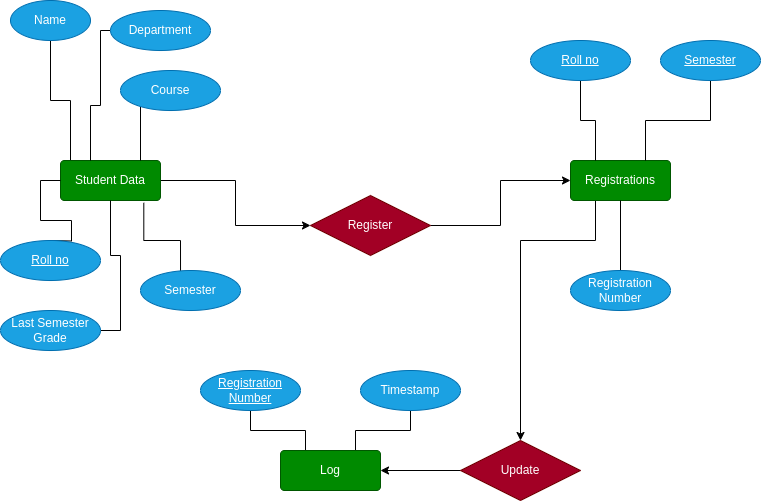
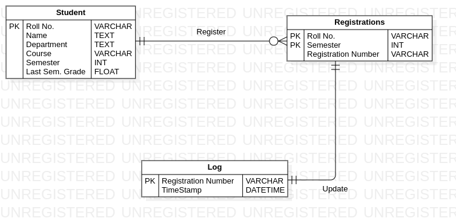
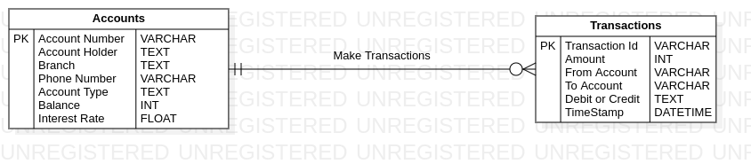
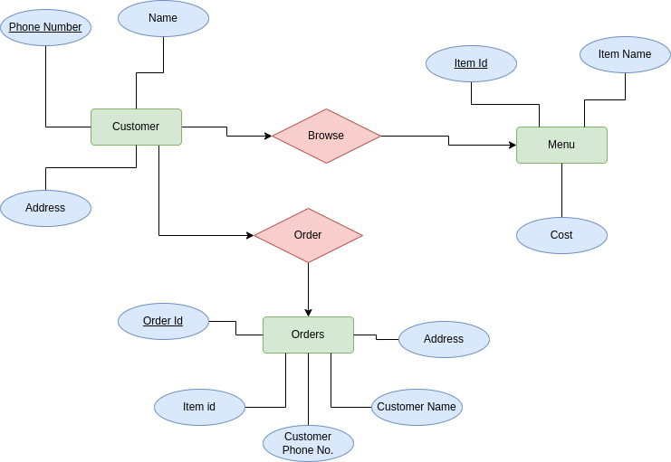
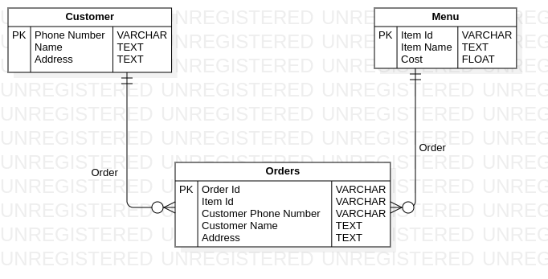

## **Software Engineering Lab**
---
- **Name:** Diptangshu Dey
- **Roll No.:** 20CS8018
- **Asignment:** 2
---

### **Problem 1.**
NIT Durgapur wants to automate the Student Registration System and seek for intranet based solution. The Candidates need to register for some specific semester may go online with the system and provide the necessary data (roll no., name, department, course, semester and last semester grade point etc.) as input data. The system must able check the input data entered by student from the pre-existing student database and then automatically generate the registration slip for the specific semester as student copy. The system also will maintain a log of the students already registered and it will restrict any duplicate registration. System Administrator can view and generate report of the list of registered students and list of unregistered students. Draw Suitable ER/EER Diagram, Convert it into suitable Relational Model and Data Definition Language of SQL. 

### **Solution:**

### ER Diagram: 



### Relational Model:



### DDL:

```sql
SET FOREIGN_KEY_CHECKS = 0;
DROP TABLE IF EXISTS `Student`;
DROP TABLE IF EXISTS `Registrations`;
DROP TABLE IF EXISTS `Log`;
SET FOREIGN_KEY_CHECKS = 1;

CREATE TABLE `Student` (
    `Roll No.` VARCHAR NOT NULL,
    `Name` TEXT NOT NULL,
    `Department` TEXT NOT NULL,
    `Course` VARCHAR NOT NULL,
    `Semester` INT NOT NULL,
    `Last Sem. Grade` FLOAT NOT NULL,
    PRIMARY KEY (`Roll No.`)
);

CREATE TABLE `Registrations` (
    `Roll No.` VARCHAR NOT NULL,
    `Semester` INT NOT NULL,
    `Registration Number` VARCHAR NOT NULL,
    PRIMARY KEY (`Roll No.`, `Semester`)
);

CREATE TABLE `Log` (
    `Registration Number` VARCHAR NOT NULL,
    `TimeStamp` DATETIME NOT NULL,
    PRIMARY KEY (`Registration Number`)
);

```

### **Problem 2.**

XYZ Bank is a facilitator for public banking system with many branches in different region. They would like to automate the banking Processing System. The bank facilitates deposit, withdrawal and fixed deposit system from its saving accounts. Customer may have joint account as well as many account in any branch of the bank. Withdrawal or deposit can be done from any branch of the bank. The bank also has facility of ATM. On any transaction, the system will able to maintain the transaction record in some log. Using which, system administrator can generate report for account wise transaction per day. Draw Suitable ER/EER Diagram, Convert it into suitable Relational Model and Data Definition Language of SQL. 

### **Solution:**

### ER Diagram:


### Relational Model:



### DDl:

```sql
SET FOREIGN_KEY_CHECKS = 0;
DROP TABLE IF EXISTS `Accounts`;
DROP TABLE IF EXISTS `Transactions`;
SET FOREIGN_KEY_CHECKS = 1;

CREATE TABLE `Accounts` (
    `Account Number` VARCHAR NOT NULL,
    `Account Holder` TEXT NOT NULL,
    `Branch` TEXT NOT NULL,
    `Phone Number` VARCHAR NOT NULL,
    `Account Type` TEXT NOT NULL,
    `Balance` INT NOT NULL,
    `Interest Rate` FLOAT NOT NULL,
    PRIMARY KEY (`Account Number`)
);

CREATE TABLE `Transactions` (
    `Transaction Id` VARCHAR NOT NULL,
    `Amount` INT NOT NULL,
    `From Account` VARCHAR NOT NULL,
    `To Account` VARCHAR NOT NULL,
    `Debit or Credit` TEXT NOT NULL,
    `TimeStamp` DATETIME NOT NULL,
    PRIMARY KEY (`Transaction Id`)
);

```

### **Problem 3.**

Case Study: Online Food Ordering System A restaurant chain wants to develop an online platform that allows customers to browse their menu, place orders for food items, and have the food delivered to their specified location. The system should also enable the restaurant staff to manage orders, update the menu, and track delivery status. Draw Suitable ER Diagram, Convert it into suitable Relational Model.

### **Solution:**

### ER Diagram: 



### Relational Model:



### DDL:

```sql
SET FOREIGN_KEY_CHECKS = 0;
DROP TABLE IF EXISTS `Customer`;
DROP TABLE IF EXISTS `Menu`;
DROP TABLE IF EXISTS `Orders`;
SET FOREIGN_KEY_CHECKS = 1;

CREATE TABLE `Customer` (
    `Phone Number` VARCHAR NOT NULL,
    `Name` TEXT NOT NULL,
    `Address` TEXT NOT NULL,
    PRIMARY KEY (`Phone Number`)
);

CREATE TABLE `Menu` (
    `Item Id` VARCHAR NOT NULL,
    `Item Name` TEXT NOT NULL,
    `Cost` FLOAT NOT NULL,
    PRIMARY KEY (`Item Id`)
);

CREATE TABLE `Orders` (
    `Order Id` VARCHAR NOT NULL,
    `Item Id` VARCHAR NOT NULL,
    `Customer Phone Number` VARCHAR NOT NULL,
    `Customer Name` TEXT NOT NULL,
    `Address` TEXT NOT NULL,
    PRIMARY KEY (`Order Id`)
);

```

---