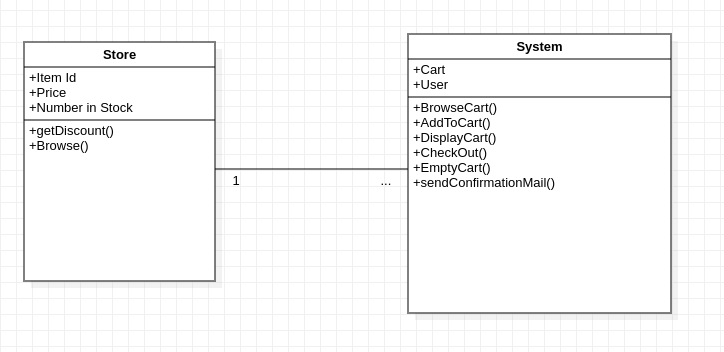

## **Assignment 3**
---
### **Name:** Sayantani Karmakar
### **Roll No:** 20CS8024
---

#### **Problem 1.**
 A Clinic Centre would like to implement a system to maintain the Patient’s Visit Records. The  system  will  keep  and  update  the  information  related  to  Registration,  Out  Patient Department visits, related Doctor Information and Medical history (Patient Wise). All records will be maintained with respect to the Registration Number of Patients. On Registration, each Patient is normally attached with a medical advisor (Role of Doctor) for necessary guidance. One advisor may guide several Patients at any point of time. Draw Class diagram for the above activities. 

#### **Sol:**

Class Diagram:

Object Diagram:

#### **Problem 2.**
 Librarian issues a book to member: - whenever a member asks for a book, the librarian checks the availability of book, if the book is available then the rack number of that book will be returned to librarian. Librarian then checks the validity of member by verifying the library card. If the member is valid, then the librarian checks the number of books issued to him is less than maximum allowed books and transaction is created. Librarian then update the number of books issued to member and status of book. Draw the Class diagram for said problem. 

#### **Sol:**

Class Diagram:

Object Diagram:

#### **Problem 3.**
 Considering, the object diagram of bank management system below, all three bank accounts tie back to the bank itself. The class titles show the type of accounts (savings, checking, and credit card) that a given customer could have with this particular bank. The class attributes are different for each account type. Balance, Identity, and minimum balance of Savings account are having values 52569, 125639, and 563 respectively. Balance, Identity of Checking account are having values 3168, 69874521 respectively. Balance, Identity of Credit card are having values 18569, 456987 respectively. The credit card object has a credit limit, while the savings and checking accounts have interest rates 2%, 3% respectively. 
 
#### **Sol:**

Class Diagram:

Object Diagram:

#### **Problem 4.**
 Consider an "Online Shopping System" where customers can browse products, add items to their carts, place orders, and manage their account settings. Create an object diagram to represent the state of the system at a particular point in time.   

Roles and Responsibilities: 
 - A Customer logs into the system and starts browsing Products. 
 - The Customer selects several Products to add to their Cart. 
 - The System updates the Cart by adding the selected Products. 
 - The Customer can continue browsing and adding more Products to the Cart. The Customer can view the list of Products in their Cart along with the calculated Total. 
 - The Customer proceeds to checkout, which involves providing payment and delivery details. 
 - Once the payment is successful, the System confirms the order and sends a confirmation email to the Customer. 
 - The Cart is cleared or emptied after a successful purchase. 
 
#### **Sol:**

Class Diagram:

Object Diagram:

