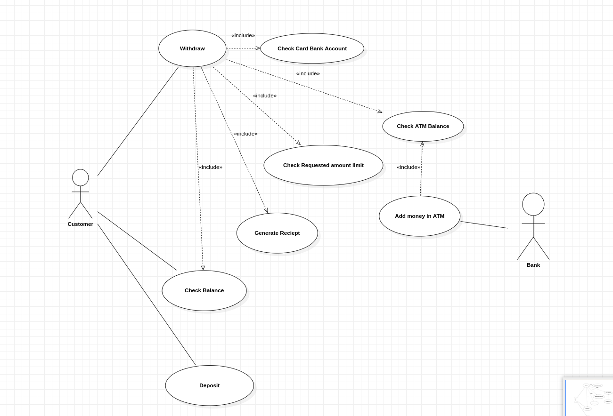
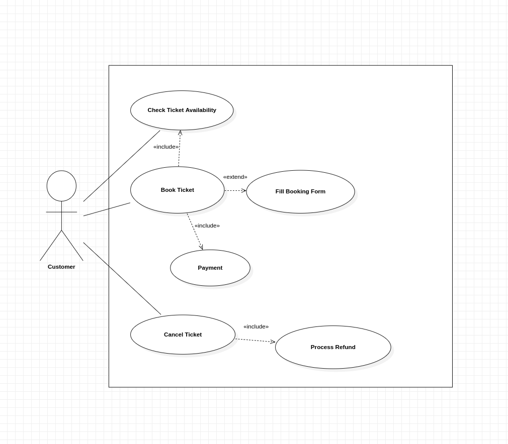
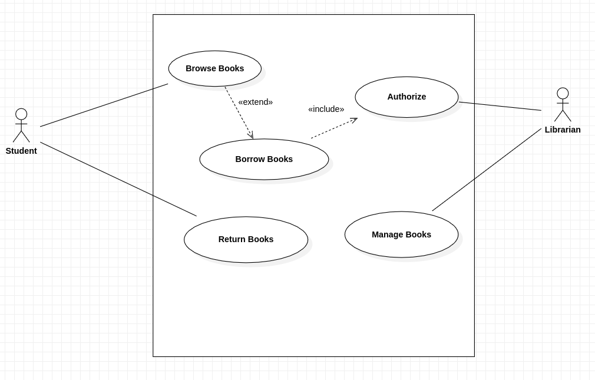
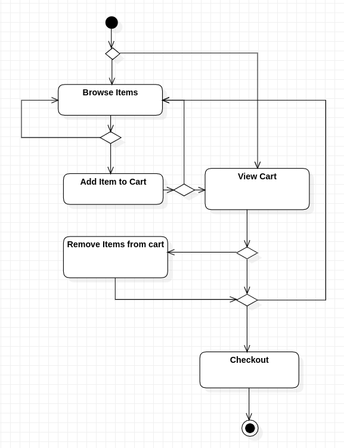
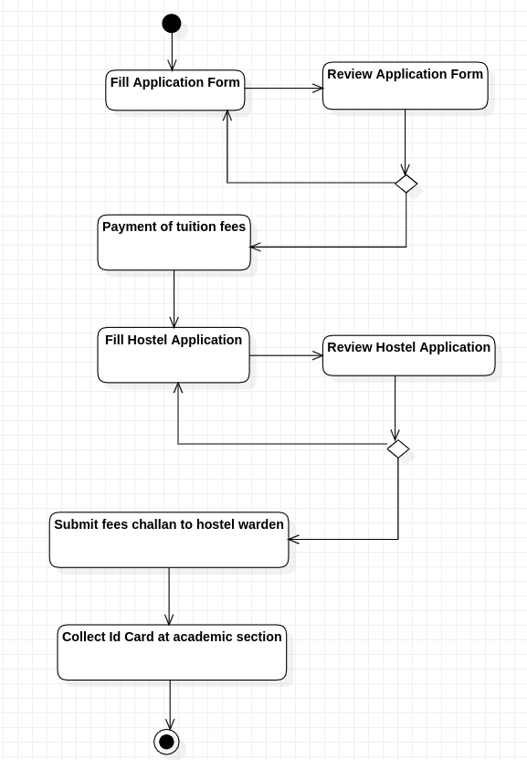
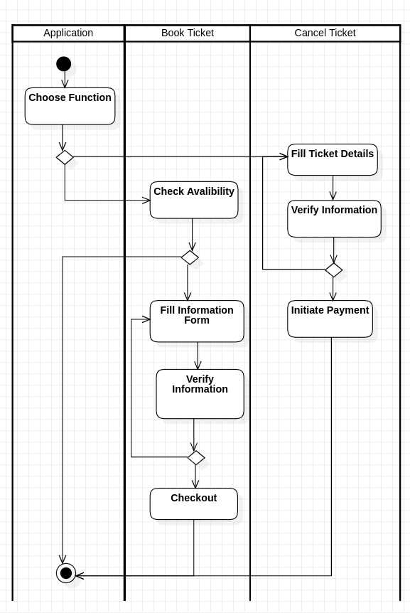

## **Assignment 4**

---

### **Name:** Diptangshu Dey    

### **Roll No:** 20CS8018

---

#### **Problem 1.**

Consider Automated Teller Machine (ATM) based withdrawal of cash. For any account, it will check if the minimum balance is available for withdrawal and can disburse cash maximum of INR 10,000/-. ATM can accept debit cards of pre-specified banks (more than one). On every transaction, the machine will generate a report. Draw a Use Case diagram for the above activities.

#### **Sol:**

Use Case Diagram:

#### **Problem 2.**

Railway reservation system is a system used for booking tickets over the internet. Any customer can book tickets for different trains. A customer can book a ticket only if the tickets are available. If the tickets are available, he/she books the tickets by initially filling details in a form. After booking a ticket, the customer must checkout by paying fares with different online payment modes. For cancellation of the ticket, the customer cancelled the ticket; then the refund is transferred to the customer account. Draw the Use Case diagram for the above activitie

#### **Sol:**

Use Case Diagram:

#### **Problem 3.**

Consider a Library Management System. The system will handle tasks such as managing books, borrowers, and library staff interactions. The library has physical books, and it operates in a traditional manner where borrowers can check out books and return them.
Design a Use Case Diagram that includes essential actors, use cases, and their relationships for the Library Management System. Ensure that the diagram is clear, and all major functionalities of the system are represented.

#### **Sol:**

Use Case Diagram:

#### **Problem 4.**

Online customers can browse or search items, view specific items, add it to the shopping cart, view and update the shopping cart, do check out. User can view their shopping cart at any time. Draw an activity diagram for the above problem.

#### **Sol:**

Activity Diagram:

#### **Problem 5.**

Design an activity diagram for the institute admission process. Initially, the students have to fill-up the application form. After verification of the application form, the fees are received in the account section. Then the student has to fill up the hostel application form for staying at the hostel. Similarly, the student has to submit the bank challan form at the warden's office. After completing all these activities, the identity card can be issued to a student by the academic section.

#### **Sol:**

Activity Diagram:

#### **Problem 6.**

Railway Reservation is a system used for booking tickets over the internet. Any Customer Can book tickets for different trains. A customer can book a ticket only if the tickets are available. If the tickets are available, he/she books the tickets by initially filling details in a form. After booking a ticket, the customer has to checkout by paying the fare amount with different online payment modes. For cancellation of the ticket, the customer cancelled the ticket; then, the refund is transferred to the customer's account. Draw an activity diagram for the above activities.

#### **Sol:**

Activity Diagram:

