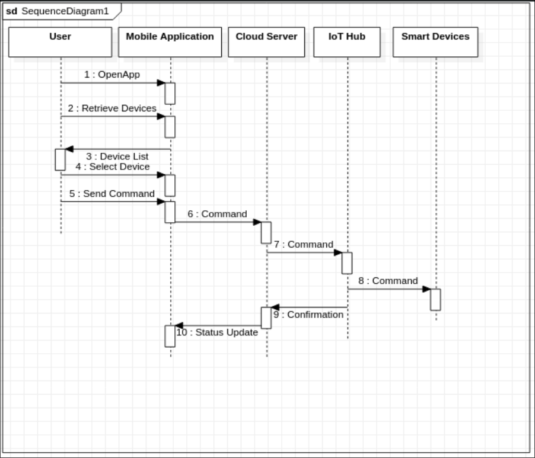
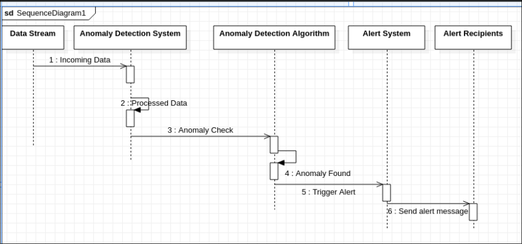
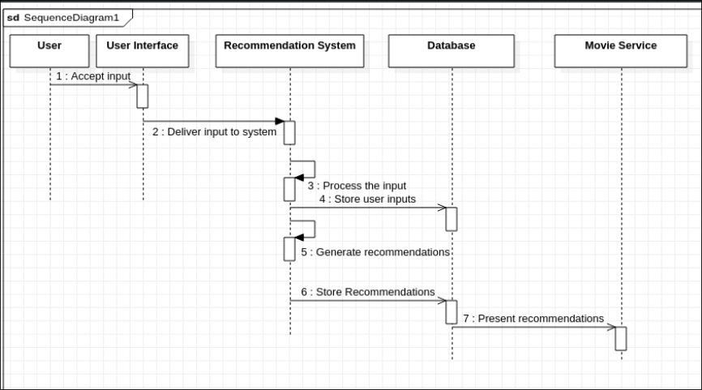
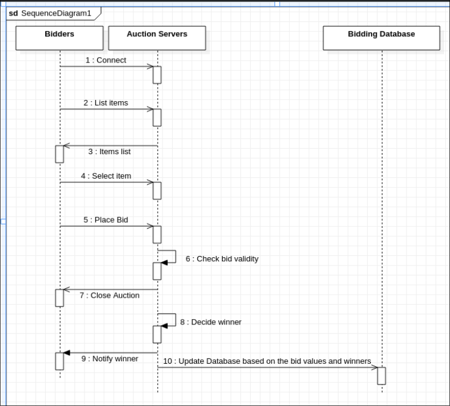

## **Assignment 5**

---

### **Name:** Sayantani Karmakar  

### **Roll No:** 20CS8024

---

#### **Problem 1.**

Design a Sequence Diagram for a Smart Home Automation System using IoT devices. The system allows users to control various smart devices within their home remotely using a mobile application.

- Identify the main components involved in the Smart Home Application and their relevant functions.

- Determine the interactions and communication between these components during a typical home automation session.

- Define the sequence of messages exchanged between components, indicating the type of messages (synchronous, asynchronous, etc.).

- Include conditions or loops if applicable to showcase different scenarios during the automation process.

- Provide a brief description of each component and its role in the system.

#### **Sol:**

#### **Problem 2.**

Design a Sequence Diagram for an Anomaly Detection System. The system is responsible for detecting anomalies in a streaming data environment, such as network traffic, and triggering alerts when unusual patterns are identified.

- The system processes incoming data streams in real-time.

- Anomaly detection algorithms are applied to the incoming data to identify abnormal patterns.

- When an anomaly is detected, an alert is generated and sent for further action.

#### **Sol:**

#### **Problem 3.**

Design a Sequence Diagram for a Movie Recommendation System that provides personalized movie recommendations to users based on their preferences and viewing history.

- The system takes input from the user regarding their movie preferences, genres, and past viewing history.

- The system processes this information to generate personalized movie recommendations.

- The system presents these recommendations to the user.

#### **Sol:**

#### **Problem 4.**

Develop a sequence diagram for an online auction system. Include interactions between bidders, the auction server, and the bidding database. Highlight steps such as item listing, bidding, bid validation, and auction closure.

#### **Sol:**

