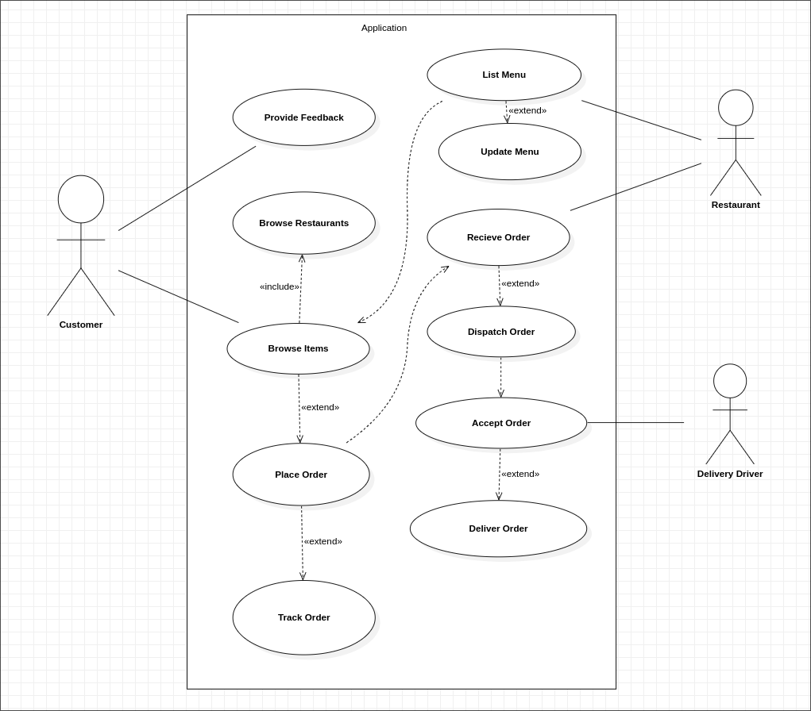
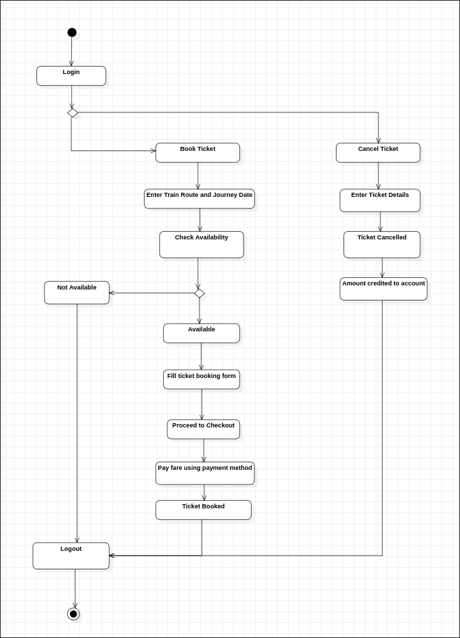

## **Software Engineering Lab Test**
---
### **Name:** Diptangshu Dey
### **Roll No:** 20CS8018 
---
### **Group-A**

Q1. Draw a Use Case Diagram for an Online Food Delivery System, which is an essential part of today's fast-paced, digital world. This system enables users to order food from a variety of restaurants, track their orders in real time, and provide feedback on their dining experience. Additionally, restaurants can list their menus, manage incoming orders, and ensure timely deliveries. Delivery drivers are also integral, responsible for accepting and fulfilling delivery requests. In this dynamic environment, design a comprehensive Use Case Diagram that captures the interactions and functionalities of users, restaurants, and delivery drivers, allowing for a clear visualization of the system's real-time operations.

Sol: 

### **Group-B**

Q3. Design an activity diagram on a railway reservation system. The admin and user will be able to login by using their credentials. After login, the user can view on train route and availability. It can also manage the operations on ticket booking and cancellation. A customer can book a ticket only if the tickets are available. If the tickets are available, he/she books the tickets by initially filling details in a form. After booking a ticket, the customer has to checkout by paying the fare amount with different online payment modes. The customer cancelled the ticket; then, the refund is transferred to the customer account.

Sol: 

