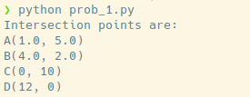
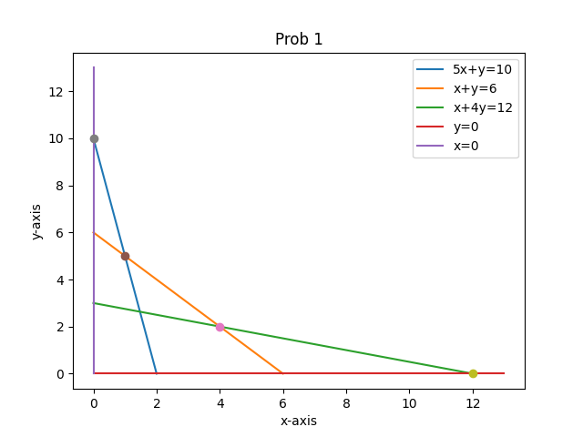
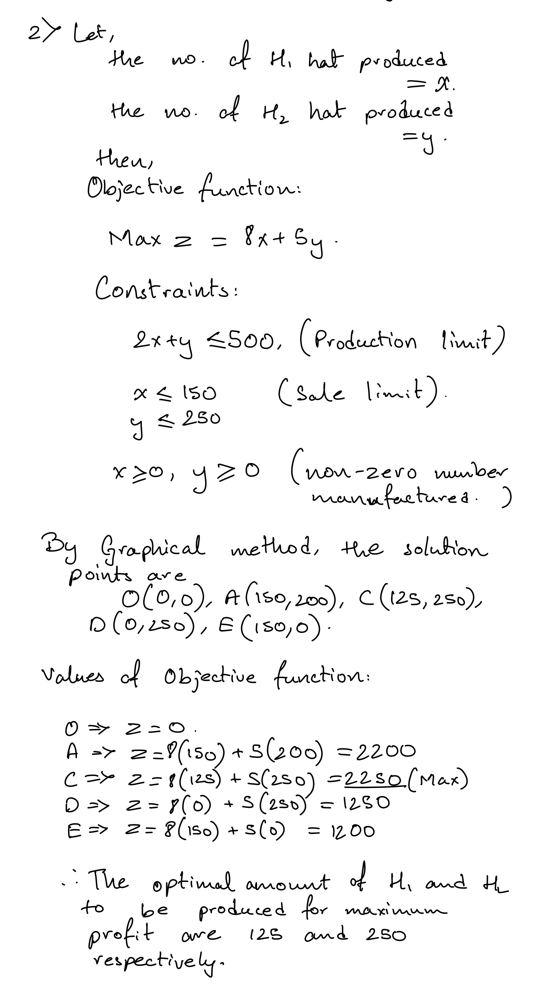
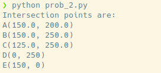
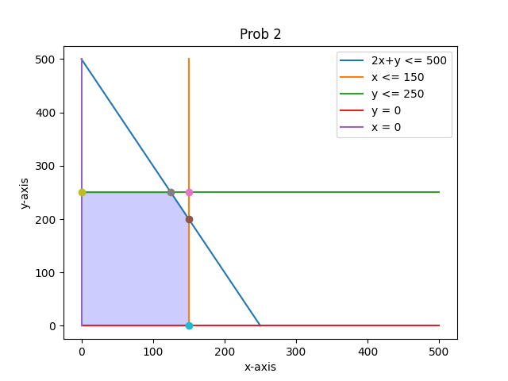

## Assignment 1
---
- **Name:** Diptangshu Dey
- **Roll No:** 20CS8018
- **Subject Name:** Modelling and Simulation Lab
- **Subject Code:** CSS752
---

### **Problem 1** 
A person requires 10, 12 and 12 units of chemicals A, B and C respectively for his gardens. A liquid product contains 5, 2 and 1 units of A, B and C respectively per jar. A dry product contains 1, 2 and 4 units of A, B and C per carton. If the liquid product sells for | 3 per jar and the dry product sells for | 2 per carton, how many of each should be purchased to optimize the cost and meet the requirements? Formulate the problem as a LPP and solve it by graphical method.

### **Solution:**


#### **Code:**

```py
from shapely.geometry import LineString
from matplotlib import pyplot as plt 
import numpy as np 

# Plot lines
x = [0, 2]
y = [10, 0]

plt.plot(x, y)

x = [0, 6]
y = [6, 0]

plt.plot(x, y)

x = [0, 12]
y = [3, 0]

plt.plot(x, y)

x = [0, 13]
y = [0, 0]

plt.plot(x, y)

x = [0, 0]
y = [0, 13]

plt.plot(x, y)

# Labels
plt.legend(["5x+y=10", "x+y=6", "x+4y=12", "y=0", "x=0"])
plt.xlabel('x-axis')
plt.ylabel('y-axis')
plt.title('Prob 1')

# define lines calculate inersection points
l1 = LineString([(2, 0), (0, 10)])
l2 = LineString([(6, 0), (0, 6)])
l3 = LineString([(12, 0), (0, 3)])
i1 = l1.intersection(l2)
i2 = l2.intersection(l3)

# plot and print intersection points
plt.plot(*i1.xy, 'o')
plt.plot(*i2.xy, 'o')
plt.plot(0, 10, 'o')
plt.plot(12, 0, 'o')

prn = f"Intersection points are: \nA({i1.xy[0][0]}, {i1.xy[1][0]}) \nB({i2.xy[0][0]}, {i2.xy[1][0]}) \nC(0, 10) \nD(12, 0)"
print(prn)

# Show result
plt.show()
```

#### **Outputs:**





### **Problem 2**
A company produces 2 types of hats. Every hat H1 requires twice as much labor as the second hat H2. If the company produces only hat H2 then it can produce a total of 500 hats a day. The market limits daily sales of hat H1 and H2 to 150 and 250 respectively. The profit on hat H1 and H2 are | 8 and | 5 respectively. Formulate the problem as a LPP and find the optimal solution using graphical method.

### **Solution:**



#### **Code:**

```py
from shapely.geometry import LineString
from matplotlib import pyplot as plt 
import numpy as np 

# Plot lines
x = [0, 250]
y = [500, 0]

plt.plot(x, y)

x = [150, 150]
y = [0, 500]

plt.plot(x, y)

x = [0, 500]
y = [250, 250]

plt.plot(x, y)

x = [0, 500]
y = [0, 0]

plt.plot(x, y)

x = [0, 0]
y = [0, 500]

plt.plot(x, y)

# Labels
plt.legend(["2x+y <= 500", "x <= 150", "y <= 250", "y = 0", "x = 0"])
plt.xlabel('x-axis')
plt.ylabel('y-axis')
plt.title('Prob 2')

# define lines calculate inersection points
l1 = LineString([(250, 0), (0, 500)])
l2 = LineString([(150, 0), (150, 500)])
l3 = LineString([(0, 250), (500, 250)])
i1 = l1.intersection(l2)
i2 = l2.intersection(l3)
i3 = l3.intersection(l1)

# plot and print intersection points
plt.plot(*i1.xy, 'o')
plt.plot(*i2.xy, 'o')
plt.plot(*i3.xy, 'o')
plt.plot(0, 250, 'o')
plt.plot(150, 0, 'o')

prn = f"Intersection points are: \nA({i1.xy[0][0]}, {i1.xy[1][0]}) \nB({i2.xy[0][0]}, {i2.xy[1][0]}) \nC({i3.xy[0][0]}, {i3.xy[1][0]}) \nD(0, 250) \nE(150, 0)"
print(prn)

# shade solution region
x = [0, i3.xy[0][0], i1.xy[0][0], 150]
y = [250, i3.xy[1][0], i1.xy[1][0], 0]
plt.fill_between(x, y, color='blue', alpha=0.2)

# Show result
plt.show()
```

#### **Outputs:**





---