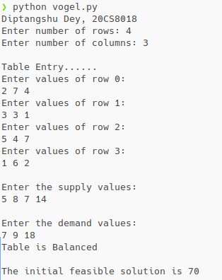
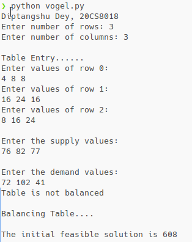

### Code:

```py
# Diptangshu Dey. 20CS8018
def getTable():
    r = int(input("Enter number of rows: "))
    c = int(input("Enter number of columns: "))

    table = []
    print("\nTable Entry......")
    for a in range(r):
        tmp = []
        print(f"Enter values of row {a}: ")
        tmp = list(map(int, input().split()))

        if len(tmp) != c:
            print("Incorrect number of elements")
            exit(1)

        table.append(tmp)

    supply = []
    print("\nEnter the supply values:")
    supply = list(map(int, input().split()))
    if len(supply) != r:
        print("Incorrect number of elements")
        exit(1)

    demand = []
    print("\nEnter the demand values:")
    demand = list(map(int, input().split()))
    if len(demand) != c:
        print("Incorrect number of elements")
        exit(1)

    return table, supply, demand

def getSum(ar):
    sum = 0
    for i in ar:
        sum += i
    return sum


def getPenalty(ar):
    ar.sort()
    if len(ar) > 1:
        return ar[1] - ar[0]
    else:
        return ar[0]


def getMinIndex(table, supply, demand, r=None, c=None):
    if r != None and c == None:  # if c is given
        m = 99999
        res = 0
        for j in range(len(table[r])):
            if table[r][j] < m and demand[j] != 0:
                m = table[r][j]
                res = j
            else:
                continue
        return [r, res]
    elif r == None and c != None:  # if r is given
        m = 99999
        res = 0
        for i in range(len(table)):
            if table[i][c] < m and supply[i] != 0:
                m = table[i][c]
                res = i
            else:
                continue
        return [res, c]
    else:
        return None


def genPenalty(table, supply, demand):
    row_penalty = []
    col_penalty = []

    for i, row in enumerate(table):  # row
        if supply[i] != 0:
            tmp = []
            for j, elem in enumerate(row):
                if demand[j] != 0:
                    tmp.append(elem)
                else:
                    continue
            row_penalty.append(getPenalty(tmp))
        else:
            row_penalty.append(-1)

    for j in range(len(table[0])):  # column
        if demand[j] != 0:
            tmp = []
            for i in range(len(table)):
                if supply[i] != 0:
                    tmp.append(table[i][j])
                else:
                    continue
            col_penalty.append(getPenalty(tmp))
        else:
            col_penalty.append(-1)

    return [row_penalty, col_penalty]

def lenNotNone(ar):
    cnt = 0
    for i in ar:
        if i != -1:
            cnt += 1
    
    return cnt

def getMaxPenalty(row_penalty, col_penalty):
    m = -1
    max_penalty = []
    for i in range(len(row_penalty)):
        if row_penalty[i] > m:
            m = row_penalty[i]
            max_penalty = [[m, 'r', i]]
        elif row_penalty[i] == m:
            max_penalty.append([m, 'r', i])
        else:
            continue

    for j in range(len(col_penalty)):
        if col_penalty[j] > m:
            m = col_penalty[j]
            max_penalty = [[m, 'c', j]]
        elif col_penalty[j] == m:
            max_penalty.append([m, 'c', j])
        else:
            continue
    
    if lenNotNone(row_penalty) + lenNotNone(col_penalty) == 2:
        max_penalty = [max_penalty[0]]

    return max_penalty
# Diptangshu Dey. 20CS8018

def vogel(table, supply, demand):
    r = len(table)
    c = len(table[0])

    if getSum(supply) + getSum(demand) == 0:
        return 0
    else:
        pass

    # Populate the penalties
    row_penalty, col_penalty = genPenalty(table, supply, demand)

    # Calculate max penalty
    max_penalty = getMaxPenalty(row_penalty, col_penalty)

    # assignment
    s = 99999999

    for pen in max_penalty:
        i = -1
        j = -1

        if pen[1] == 'r':
            i, j = getMinIndex(table, supply, demand, r=pen[2])
        elif pen[1] == 'c':
            i, j = getMinIndex(table, supply, demand, c=pen[2])
        else:
            print("Incorrect value")
            exit(1)

        if supply[i] <= demand[j]:
            tdemnd = demand.copy()
            tsupp = supply.copy()
            tdemnd[j] -= supply[i]
            tsupp[i] = 0
            st = (table[i][j] * supply[i]) + vogel(table, tsupp, tdemnd)

            if st < s:
                s = st
                supply = tsupp
                demand = tdemnd

            else:
                pass
        elif demand[j] < supply[i]:
            tdemnd = demand.copy()
            tsupp = supply.copy()
            tsupp[i] -= demand[j]
            tdemnd[j] = 0
            st = (table[i][j] * demand[j]) + vogel(table, tsupp, tdemnd)

            if st < s:
                s = st
                supply = tsupp
                demand = tdemnd
            else:
                pass

    return s

# Diptangshu Dey. 20CS8018

# main body
if __name__ == '__main__':
    print("Diptangshu Dey, 20CS8018")
    table, supply, demand = getTable()

    if getSum(supply) != getSum(demand):
        print("Table is not balanced")

        print("\nBalancing Table....\n")
        if getSum(demand) < getSum(supply):
            for i in range(len(table)):
                table[i].append(0)
            demand.append(getSum(supply) - getSum(demand))
        elif getSum(supply) < getSum(demand):
            tmp = [0] * len(table[0])
            table.append(tmp)
            supply.append(getSum(demand) - getSum(supply))
    else:
        print("Table is Balanced\n")

    res = vogel(table, supply, demand)

    print(f"The initial feasible solution is {res}")

```

### Output for problem 1:

  

&nbsp;  
&nbsp;  
&nbsp;  
&nbsp;  
&nbsp;  
&nbsp;  
&nbsp;  
&nbsp;  
&nbsp;  
&nbsp;  
&nbsp;  
&nbsp;  
&nbsp;  


### Output for problem 2:

