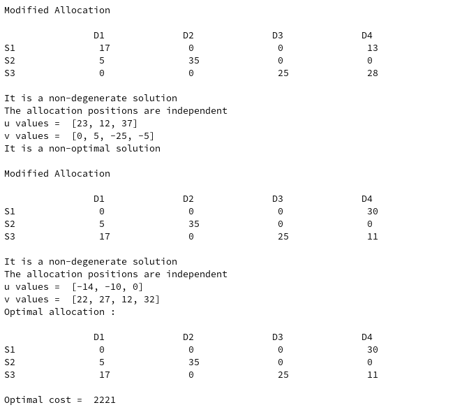
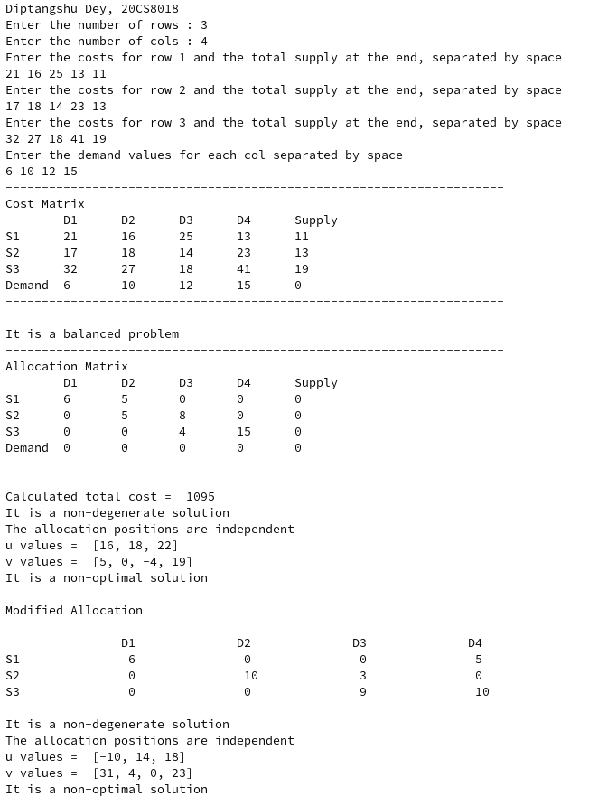
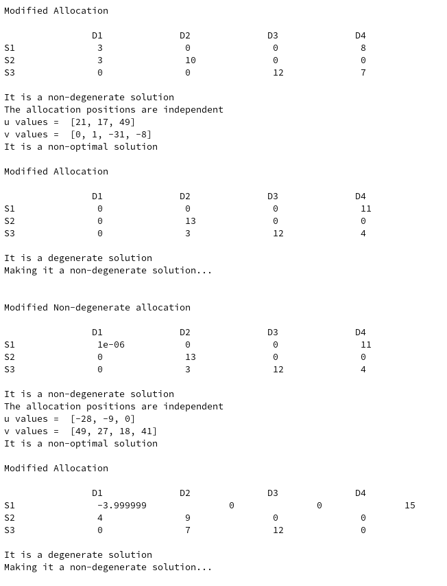

### Code for problem 1:

```py
import sys
# Diptangshu Dey, 20CS8018

def getCostMatrix():
    numRows = int(input('Enter the number of rows : '))+1
    numCols = int(input('Enter the number of cols : '))+1
    costMatrix = []
    for i in range(numRows-1):
        rowCostArray=list(map(int, input('Enter the costs for row %s and the total supply at the end, separated by space\n'%(i+1)).split()))
        costMatrix.append(rowCostArray)
    rowCostArray = list(map(int, input('Enter the demand values for each col separated by space\n').split()))
    costMatrix.append(rowCostArray)
    if len(costMatrix[numRows-1]) != numCols:
        costMatrix[numRows-1].append(0)
    return costMatrix

def printMatrix(matrixType, matrix):
    print("---------------------------------------------------------------------")
    if matrixType=='cost':
        print("Cost Matrix")
    elif matrixType=='allocation':
        print("Allocation Matrix")
    for i in range(len(matrix[0])-1):
        print('\tD%s'%(i+1), end='')
    print('\tSupply')
    
    for i in range(len(matrix)-1):
        print('S%s'%(i+1), end='')
        for j in range(len(matrix[0])):
            print('\t%s'%(matrix[i][j]), end='')
        print()
    print('Demand', end='')
    for i in range(len(matrix[0])):
        print('\t%s'%(matrix[-1][i]),end='')
    print("\n---------------------------------------------------------------------")
    print()
    
def isBalanced(costMatrix):
    return sum(costMatrix[-1])==sum([costMatrix[i][-1] for i in range(len(costMatrix))])

def getTotalCost(costMatrix):
    m = len(costMatrix)
    n = len(costMatrix[0])
    allocMatrix = [[0 for _ in range(len(costMatrix[0]))] for _ in range(len(costMatrix))]
    numAllocated = 0
    totalCost = 0
    i=0
    j=0
    while i<m-1 and j<n-1:
        x = min(costMatrix[i][n-1], costMatrix[m-1][j])
        costMatrix[m-1][j] -= x
        costMatrix[i][n-1] -= x
        numAllocated += 1

        allocMatrix[i][j] = x
        allocMatrix[m-1][j] = costMatrix[m-1][j]
        allocMatrix[i][n-1] = costMatrix[i][n-1]
        
        totalCost = totalCost + x*costMatrix[i][j]

        if costMatrix[m-1][j] < costMatrix[i][n-1]:
            j+=1
        elif costMatrix[m-1][j] > costMatrix[i][n-1]:
            i+=1
        else:
            i+=1
            j+=1

    return totalCost, numAllocated, allocMatrix

# Diptangshu Dey, 20CS8018
def isDegenerate(costMatrix, numAllocated):
    m = len(costMatrix)-1
    n = len(costMatrix[0])-1
    return numAllocated!=(m+n-1)

def balanceProblem(costMatrix):
    totalDemand = sum(costMatrix[-1])
    totalSupply = sum([x[-1] for x in costMatrix])
    if totalDemand > totalSupply:
        #add new row
        dummySource = [0 for _ in range(len(costMatrix[0]))]
        dummySource[-1] = totalDemand-totalSupply
        costMatrix.insert(-1, dummySource)
    else:
        for cost in costMatrix:
            cost.insert(-1, 0)
        costMatrix[-1].insert(-1, totalSupply-totalDemand)
        pass
    return costMatrix

def isIndependentAllocation( allocMatrix ):
    elimRows = [0 for _ in range(len(allocMatrix))]
    elimCols = [0 for _ in range(len(allocMatrix[0]))]
    while 1:
        flag = 0
        #eliminate row
        for i in range(len(allocMatrix)):
            if elimRows[i]==0:
                if len([allocMatrix[i][j] for j in range(len(allocMatrix[0])) if (elimCols[j]==0 and (allocMatrix[i][j]!=0 and allocMatrix[i][j]!=-1))]) < 2:
                    elimRows[i]=1
                    flag=1

        #eliminate column
        for j in range(len(allocMatrix[0])):
            if elimCols[j]==0:
                if len([allocMatrix[i][j] for i in range(len(allocMatrix)) if (elimRows[i]==0 and allocMatrix[i][j]!=0 and allocMatrix[i][j]!=-1)  ]) < 2:
                    elimCols[j]=1
                    flag=1
                    
        if flag==0:
            #either all cells are eliminated  ---> independent allocation
            if 0 not in elimRows and 0 not in elimCols:
                return True,1,1
            else:
                #dependent allocation
                return False,elimRows,elimCols

def findUV( costMatrix, allocMat ):
    #find the max allocated row/col
    u = [None for _ in range(len(allocMat))]
    v = [None for _ in range(len(allocMat[0]))]
    
    maxRow=[-1,0] #(row no., allocs)
    for i in range(len(allocMat)):
        allocs = len([allocMat[i][j] for j in range(len(allocMat[0])) if allocMat[i][j]!=0])
        if allocs > maxRow[1]:
            maxRow[0] = i
            maxRow[1] = allocs

    maxCol = [-1,0]
    for j in range(len(allocMat[0])):
        allocs = len([ allocMat[i][j] for i in range(len(allocMat)) if allocMat[i][j]!=0 ])
        if allocs > maxCol[1]:
            maxCol[0] = j
            maxCol[1] = allocs

    if maxRow[1] > maxCol[1] :
        u[maxRow[0]] = 0
        for j in range(len(v)):
            if allocMat[maxRow[0]][j]!=0 and v[j] is None:
                v[j] = costMatrix[maxRow[0]][j] - u[maxRow[0]]

        for i in range(len(u)):
            for j in range(len(v)):
                if allocMat[i][j]!=0 and v[j] is not None and u[i] is None:
                    u[i] = costMatrix[i][j] - v[j]
                    
    else:
        v[maxCol[0]] = 0
        for i in range(len(u)):
            if allocMat[i][maxCol[0]]!=0 and u[i] is None:
                u[i] = costMatrix[i][maxCol[0]] - v[maxCol[0]]

        for j in range(len(v)):
            for i in range(len(u)):
                if allocMat[i][j]!=0 and v[j] is None and u[i] is not None:
                    v[j] = costMatrix[i][j] - u[i]
# 
    while None in u or None in v:
        if None in u:
            ind = u.index(None)
            for j in range(len(v)):
                if allocMat[ind][j]!=0 and v[j] is not None:
                    u[ind] = costMatrix[ind][j] - v[j]
        if None in v:
            ind = v.index(None)
            for i in range(len(u)):
                if allocMat[i][ind]!=0 and u[i] is not None:
                    v[ind] = costMatrix[i][ind] - u[i]
            
    return u,v
    
def findDeltas(cstMat, allMat, u,v ):
    deltas = [[None for _ in range(len(allMat[0]))] for _ in range(len(allMat))]
    for i in range(len(allMat)):
        for j in range(len(allMat[0])):
            if allMat[i][j]==0:
                deltas[i][j] = cstMat[i][j] - u[i] - v[j]

    return deltas

def isOptimal(deltas):
    for i in range(len(deltas)):
        for j in range(len(deltas[0])):
            if deltas[i][j] is not None and deltas[i][j] < 0:
                return False
    return True

def newAlloc(allMat, deltas):
    #find the most negative
    ij= [-1,-1]
    mostNeg = 1
    for i in range(len(deltas)):
        for j in range(len(deltas[0])):
            if deltas[i][j] is not None and deltas[i][j] < 0 and deltas[i][j] < mostNeg:
                mostNeg = deltas[i][j]
                ij[0] = i
                ij[1] = j

    #find loop
    allMat[ij[0]][ij[1]] = sys.maxsize
    _,elimRows,elimCols = isIndependentAllocation( allMat )
    rowinds = [i for i in range(len(elimRows)) if elimRows[i]==0]
    colinds = [i for i in range(len(elimCols)) if elimCols[i]==0]
    path = [[ij[0],ij[1]]]
    indices = [[x,y] for x in rowinds for y in colinds if allMat[x][y]!=0]
    indices.remove(path[0])
    dist = sys.maxsize
    inds = []
    n = len(indices)+1
    while len(path)!=n:
        t = len(indices)
        dist = sys.maxsize
        for i in range(t):
            d = abs(path[-1][0]-indices[i][0])+abs(path[-1][1] - indices[i][1])
            if d < dist:
                dist = d
                inds.append([indices[i][0],indices[i][1]])
        path.append(inds[0])
        inds.clear()
        indices.remove(path[-1])

    #modify allocation
    val = min([allMat[path[t][0]][path[t][1]] for t in range(1,len(path),2) if allMat[path[t][0]][path[t][1]]!=0.000001])
    allMat[path[0][0]][path[0][1]] = 0
    for i in range(len(path)):
        if i%2==0:
            allMat[path[i][0]][path[i][1]] += val
        else:
            allMat[path[i][0]][path[i][1]] -= val

    #num Allocs
    numAlloc=0
    for i in range(len(allMat)):
        for j in range(len(allMat[0])):
            if allMat[i][j]>0:
                numAlloc+=1
                
    return allMat, numAlloc

def removeDeg(allMat, cstMat):
    for i in range(len(allMat)):
        for j in range(len(allMat[0])):
            if allMat[i][j]==0:
                allMat[i][j] = 0.000001
                isIndep = isIndependentAllocation( allMat )[0]
                if isIndep:
                    return allMat
                else:
                    allMat[i][j] = 0
    
    return allMat

def main():
    print("Diptangshu Dey, 20CS8018")
    #1. get the cost matrix
    costMatrix = getCostMatrix()
    printMatrix('cost', costMatrix)

    #2. check if the problem is balanced
    isBal = isBalanced(costMatrix)
    if isBal:
        print('It is a balanced problem')
    else:
        print('It is an unbalanced problem')
        costMatrix = balanceProblem(costMatrix)

    #3. calculate the cost
    cost, numAllocated, allocMatrix = getTotalCost(costMatrix)
    printMatrix('allocation', allocMatrix)
    print('Calculated total cost = ',cost)

    cstMat = [x[:-1] for x in costMatrix]
    cstMat.pop()
    allMat = [x[:-1] for x in allocMatrix]
    allMat.pop()
    while 1:
        #4. check for degeneracy
        isDeg = isDegenerate(costMatrix, numAllocated)
        if isDeg:
            print('It is a degenerate solution\nMaking it a non-degenerate solution...\n')
            allMat = removeDeg(allMat, cstMat)
            numAllocated+=1
            print('\nModified Non-degenerate allocation\n')
            for i in range(len(allMat[0])):
                print('\t\tD%s'%(i+1), end='')
            print()
            for i in range(len(allMat)):
                print('S%s'%(i+1), end='')
                for j in range(len(allMat[0])):
                    print('\t\t',allMat[i][j],end='')
                print()
            print()
            continue
            return
        else:
            print('It is a non-degenerate solution')

        #5 check for independent allocation position
        isIndep = isIndependentAllocation( allMat )[0]
        if isIndep:
            print( 'The allocation positions are independent' )
        else:
            print( 'The allocation positions are not independent' )
            return

        #6 calculate u and v values
        u,v = findUV( cstMat, allMat )
        print('u values = ',u)
        print('v values = ',v)

        #find delta[i,j] at unallocated positions
        deltas = findDeltas(cstMat, allMat,u,v)

        if (isOptimal(deltas)):
            print('Optimal allocation : \n')
            for i in range(len(allMat[0])):
                print('\t\tD%s'%(i+1), end='')
            print()
            for i in range(len(allMat)):
                print('S%s'%(i+1), end='')
                for j in range(len(allMat[0])):
                    print('\t\t',allMat[i][j],end='')
                print()
            print()

            cost = 0
            for i in range(len(cstMat)):
                for j in range(len(cstMat[0])):
                    cost = cost + cstMat[i][j]*allMat[i][j]
            print('Optimal cost = ',cost)
            return
        else:
            print('It is a non-optimal solution')
            allocMatrix, numAllocated = newAlloc(allMat, deltas)
            print('\nModified Allocation\n')
            for i in range(len(allMat[0])):
                print('\t\tD%s'%(i+1), end='')
            print()
            for i in range(len(allMat)):
                print('S%s'%(i+1), end='')
                for j in range(len(allMat[0])):
                    print('\t\t',allMat[i][j],end='')
                print()
            print()
            
main()
```

### Output for problem 1:


  
 
&nbsp;  
&nbsp;  
&nbsp;  
&nbsp;  
&nbsp;  
&nbsp;  
&nbsp;  
&nbsp;  
&nbsp;  
&nbsp;  
&nbsp;  
&nbsp;  
&nbsp;  
&nbsp;  
&nbsp;  
&nbsp;  
&nbsp;  
&nbsp;  
&nbsp;  
&nbsp;  


### Code for problem 2:


```py
import sys
# Diptangshu Dey, 20CS8018

def getCostMatrix():
    numRows = int(input('Enter the number of rows : '))+1
    numCols = int(input('Enter the number of cols : '))+1
    costMatrix = []
    for i in range(numRows-1):
        rowCostArray=list(map(int, input('Enter the costs for row %s and the total supply at the end, separated by space\n'%(i+1)).split()))
        costMatrix.append(rowCostArray)
    rowCostArray = list(map(int, input('Enter the demand values for each col separated by space\n').split()))
    costMatrix.append(rowCostArray)
    if len(costMatrix[numRows-1]) != numCols:
        costMatrix[numRows-1].append(0)
    return costMatrix

def printMatrix(matrixType, matrix):
    print("---------------------------------------------------------------------")
    if matrixType=='cost':
        print("Cost Matrix")
    elif matrixType=='allocation':
        print("Allocation Matrix")
    for i in range(len(matrix[0])-1):
        print('\tD%s'%(i+1), end='')
    print('\tSupply')
    
    for i in range(len(matrix)-1):
        print('S%s'%(i+1), end='')
        for j in range(len(matrix[0])):
            print('\t%s'%(matrix[i][j]), end='')
        print()
    print('Demand', end='')
    for i in range(len(matrix[0])):
        print('\t%s'%(matrix[-1][i]),end='')
    print("\n---------------------------------------------------------------------")
    print()
    
def isBalanced(costMatrix):
    return sum(costMatrix[-1])==sum([costMatrix[i][-1] for i in range(len(costMatrix))])

def getTotalCost(costMatrix):
    m = len(costMatrix)
    n = len(costMatrix[0])
    allocMatrix = [[0 for _ in range(len(costMatrix[0]))] for _ in range(len(costMatrix))]
    numAllocated = 0
    totalCost = 0
    i=0
    j=0
    while i<m-1 and j<n-1:
        x = min(costMatrix[i][n-1], costMatrix[m-1][j])
        costMatrix[m-1][j] -= x
        costMatrix[i][n-1] -= x
        numAllocated += 1

        allocMatrix[i][j] = x
        allocMatrix[m-1][j] = costMatrix[m-1][j]
        allocMatrix[i][n-1] = costMatrix[i][n-1]
        
        totalCost = totalCost + x*costMatrix[i][j]

        if costMatrix[m-1][j] < costMatrix[i][n-1]:
            j+=1
        elif costMatrix[m-1][j] > costMatrix[i][n-1]:
            i+=1
        else:
            i+=1
            j+=1

    return totalCost, numAllocated, allocMatrix

# Diptangshu Dey, 20CS8018
def isDegenerate(costMatrix, numAllocated):
    m = len(costMatrix)-1
    n = len(costMatrix[0])-1
    return numAllocated!=(m+n-1)

def balanceProblem(costMatrix):
    totalDemand = sum(costMatrix[-1])
    totalSupply = sum([x[-1] for x in costMatrix])
    if totalDemand > totalSupply:
        #add new row
        dummySource = [0 for _ in range(len(costMatrix[0]))]
        dummySource[-1] = totalDemand-totalSupply
        costMatrix.insert(-1, dummySource)
    else:
        for cost in costMatrix:
            cost.insert(-1, 0)
        costMatrix[-1].insert(-1, totalSupply-totalDemand)
        pass
    return costMatrix

def isIndependentAllocation( allocMatrix ):
    elimRows = [0 for _ in range(len(allocMatrix))]
    elimCols = [0 for _ in range(len(allocMatrix[0]))]
    while 1:
        flag = 0
        #eliminate row
        for i in range(len(allocMatrix)):
            if elimRows[i]==0:
                if len([allocMatrix[i][j] for j in range(len(allocMatrix[0])) if (elimCols[j]==0 and (allocMatrix[i][j]!=0 and allocMatrix[i][j]!=-1))]) < 2:
                    elimRows[i]=1
                    flag=1

        #eliminate column
        for j in range(len(allocMatrix[0])):
            if elimCols[j]==0:
                if len([allocMatrix[i][j] for i in range(len(allocMatrix)) if (elimRows[i]==0 and allocMatrix[i][j]!=0 and allocMatrix[i][j]!=-1)  ]) < 2:
                    elimCols[j]=1
                    flag=1
                    
        if flag==0:
            #either all cells are eliminated  ---> independent allocation
            if 0 not in elimRows and 0 not in elimCols:
                return True,1,1
            else:
                #dependent allocation
                return False,elimRows,elimCols

def findUV( costMatrix, allocMat ):
    #find the max allocated row/col
    u = [None for _ in range(len(allocMat))]
    v = [None for _ in range(len(allocMat[0]))]
    
    maxRow=[-1,0] #(row no., allocs)
    for i in range(len(allocMat)):
        allocs = len([allocMat[i][j] for j in range(len(allocMat[0])) if allocMat[i][j]!=0])
        if allocs > maxRow[1]:
            maxRow[0] = i
            maxRow[1] = allocs

    maxCol = [-1,0]
    for j in range(len(allocMat[0])):
        allocs = len([ allocMat[i][j] for i in range(len(allocMat)) if allocMat[i][j]!=0 ])
        if allocs > maxCol[1]:
            maxCol[0] = j
            maxCol[1] = allocs

    if maxRow[1] > maxCol[1] :
        u[maxRow[0]] = 0
        for j in range(len(v)):
            if allocMat[maxRow[0]][j]!=0 and v[j] is None:
                v[j] = costMatrix[maxRow[0]][j] - u[maxRow[0]]

        for i in range(len(u)):
            for j in range(len(v)):
                if allocMat[i][j]!=0 and v[j] is not None and u[i] is None:
                    u[i] = costMatrix[i][j] - v[j]
                    
    else:
        v[maxCol[0]] = 0
        for i in range(len(u)):
            if allocMat[i][maxCol[0]]!=0 and u[i] is None:
                u[i] = costMatrix[i][maxCol[0]] - v[maxCol[0]]

        for j in range(len(v)):
            for i in range(len(u)):
                if allocMat[i][j]!=0 and v[j] is None and u[i] is not None:
                    v[j] = costMatrix[i][j] - u[i]
# 
    while None in u or None in v:
        if None in u:
            ind = u.index(None)
            for j in range(len(v)):
                if allocMat[ind][j]!=0 and v[j] is not None:
                    u[ind] = costMatrix[ind][j] - v[j]
        if None in v:
            ind = v.index(None)
            for i in range(len(u)):
                if allocMat[i][ind]!=0 and u[i] is not None:
                    v[ind] = costMatrix[i][ind] - u[i]
            
    return u,v
    
def findDeltas(cstMat, allMat, u,v ):
    deltas = [[None for _ in range(len(allMat[0]))] for _ in range(len(allMat))]
    for i in range(len(allMat)):
        for j in range(len(allMat[0])):
            if allMat[i][j]==0:
                deltas[i][j] = cstMat[i][j] - u[i] - v[j]

    return deltas

def isOptimal(deltas):
    for i in range(len(deltas)):
        for j in range(len(deltas[0])):
            if deltas[i][j] is not None and deltas[i][j] < 0:
                return False
    return True

def newAlloc(allMat, deltas):
    #find the most negative
    ij= [-1,-1]
    mostNeg = 1
    for i in range(len(deltas)):
        for j in range(len(deltas[0])):
            if deltas[i][j] is not None and deltas[i][j] < 0 and deltas[i][j] < mostNeg:
                mostNeg = deltas[i][j]
                ij[0] = i
                ij[1] = j

    #find loop
    allMat[ij[0]][ij[1]] = sys.maxsize
    _,elimRows,elimCols = isIndependentAllocation( allMat )
    rowinds = [i for i in range(len(elimRows)) if elimRows[i]==0]
    colinds = [i for i in range(len(elimCols)) if elimCols[i]==0]
    path = [[ij[0],ij[1]]]
    indices = [[x,y] for x in rowinds for y in colinds if allMat[x][y]!=0]
    indices.remove(path[0])
    dist = sys.maxsize
    inds = []
    n = len(indices)+1
    while len(path)!=n:
        t = len(indices)
        dist = sys.maxsize
        for i in range(t):
            d = abs(path[-1][0]-indices[i][0])+abs(path[-1][1] - indices[i][1])
            if d < dist:
                dist = d
                inds.append([indices[i][0],indices[i][1]])
        path.append(inds[0])
        inds.clear()
        indices.remove(path[-1])

    #modify allocation
    val = min([allMat[path[t][0]][path[t][1]] for t in range(1,len(path),2) if allMat[path[t][0]][path[t][1]]!=0.000001])
    allMat[path[0][0]][path[0][1]] = 0
    for i in range(len(path)):
        if i%2==0:
            allMat[path[i][0]][path[i][1]] += val
        else:
            allMat[path[i][0]][path[i][1]] -= val

    #num Allocs
    numAlloc=0
    for i in range(len(allMat)):
        for j in range(len(allMat[0])):
            if allMat[i][j]>0:
                numAlloc+=1
                
    return allMat, numAlloc

def removeDeg(allMat, cstMat):
    for i in range(len(allMat)):
        for j in range(len(allMat[0])):
            if allMat[i][j]==0:
                allMat[i][j] = 0.000001
                isIndep = isIndependentAllocation( allMat )[0]
                if isIndep:
                    return allMat
                else:
                    allMat[i][j] = 0
    
    return allMat

def main():
    print("Diptangshu Dey, 20CS8018")
    #1. get the cost matrix
    costMatrix = getCostMatrix()
    printMatrix('cost', costMatrix)

    #2. check if the problem is balanced
    isBal = isBalanced(costMatrix)
    if isBal:
        print('It is a balanced problem')
    else:
        print('It is an unbalanced problem')
        costMatrix = balanceProblem(costMatrix)

    #3. calculate the cost
    cost, numAllocated, allocMatrix = getTotalCost(costMatrix)
    printMatrix('allocation', allocMatrix)
    print('Calculated total cost = ',cost)

    cstMat = [x[:-1] for x in costMatrix]
    cstMat.pop()
    allMat = [x[:-1] for x in allocMatrix]
    allMat.pop()
    while 1:
        #4. check for degeneracy
        isDeg = isDegenerate(costMatrix, numAllocated)
        if isDeg:
            print('It is a degenerate solution\nMaking it a non-degenerate solution...\n')
            allMat = removeDeg(allMat, cstMat)
            numAllocated+=1
            print('\nModified Non-degenerate allocation\n')
            for i in range(len(allMat[0])):
                print('\t\tD%s'%(i+1), end='')
            print()
            for i in range(len(allMat)):
                print('S%s'%(i+1), end='')
                for j in range(len(allMat[0])):
                    print('\t\t',allMat[i][j],end='')
                print()
            print()
            continue
            return
        else:
            print('It is a non-degenerate solution')

        #5 check for independent allocation position
        isIndep = isIndependentAllocation( allMat )[0]
        if isIndep:
            print( 'The allocation positions are independent' )
        else:
            print( 'The allocation positions are not independent' )
            return

        #6 calculate u and v values
        u,v = findUV( cstMat, allMat )
        print('u values = ',u)
        print('v values = ',v)

        #find delta[i,j] at unallocated positions
        deltas = findDeltas(cstMat, allMat,u,v)

        if (isOptimal(deltas)):
            print('Optimal allocation : \n')
            for i in range(len(allMat[0])):
                print('\t\tD%s'%(i+1), end='')
            print()
            for i in range(len(allMat)):
                print('S%s'%(i+1), end='')
                for j in range(len(allMat[0])):
                    print('\t\t',allMat[i][j],end='')
                print()
            print()

            cost = 0
            for i in range(len(cstMat)):
                for j in range(len(cstMat[0])):
                    cost = cost + cstMat[i][j]*allMat[i][j]
            print('Optimal cost = ',cost)
            return
        else:
            print('It is a non-optimal solution')
            allocMatrix, numAllocated = newAlloc(allMat, deltas)
            print('\nModified Allocation\n')
            for i in range(len(allMat[0])):
                print('\t\tD%s'%(i+1), end='')
            print()
            for i in range(len(allMat)):
                print('S%s'%(i+1), end='')
                for j in range(len(allMat[0])):
                    print('\t\t',allMat[i][j],end='')
                print()
            print()
            
main()
```

### Output for problem 2:






