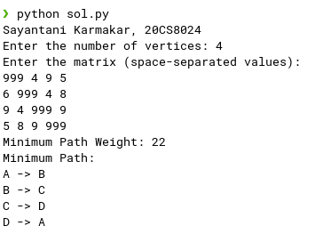
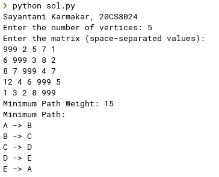

### **Code 1:**

```py
# Sayantani Karmakar, 20CS8024
labels = []

def calculatePathWeight(path, graph):
	total_weight = 0
	for i in range(len(path) - 1):
		total_weight += graph[path[i]][path[i + 1]]
	total_weight += graph[path[-1]][path[0]] 
	return total_weight

# Function to convert numerical indices to labels (A, B, C, D)
def index_to_label(index):
	return labels[index]

# Function to convert numerical indices in the path to labels
def convert_indices_to_labels(indices):
	return [index_to_label(index) for index in indices]	

# Implementation of traveling Salesman Problem
def travellingSalesmanProblem(graph):
	V = len(graph)

	vertices = list(range(V))

	min_path_weight = float('inf')
	min_path = []
	
	def generate_permutations(arr, i):
		if i == len(arr):
			nonlocal min_path_weight, min_path
			path_weight = calculatePathWeight(arr, graph)
			if path_weight < min_path_weight:
				min_path_weight = path_weight
				min_path = arr[:]
		else:
			for j in range(i, len(arr)):
				arr[i], arr[j] = arr[j], arr[i]
				generate_permutations(arr, i + 1)
				arr[i], arr[j] = arr[j], arr[i]
	generate_permutations(vertices, 0)
	return min_path, min_path_weight

if __name__=="__main__":
	print("Sayantani Karmakar, 20CS8024")
	# Input the number of vertices
	V = int(input("Enter the number of vertices: "))
	for i in range(V):
		labels.append(chr(ord('A')+i))

	# Input the matrix
	graph = []
	print("Enter the matrix (space-separated values):")
	for _ in range(V):
		row = list(map(int, input().split()))
		graph.append(row)


	s = 0

	# Calculate the minimum path and path weight
	min_path, min_path_weight = travellingSalesmanProblem(graph)

	# Convert the indices in the path to labels (A, B, C, D)
	min_path = convert_indices_to_labels(min_path)

	# Print the minimum path and path weight
	print("Minimum Path Weight:", min_path_weight)
	print("Minimum Path:")

	for i in range(len(min_path) - 1):
		print(min_path[i], "->", min_path[i + 1])

	print(min_path[-1], "->",min_path[0])
```
### **Output 1:**

 

&nbsp;  
&nbsp;  
&nbsp;  
&nbsp;  
&nbsp;  
&nbsp;  
&nbsp;  
&nbsp;  
&nbsp;  


### **Code 2:** 

```py
# Sayantani Karmakar, 20CS8024
labels = []

def calculatePathWeight(path, graph):
	total_weight = 0
	for i in range(len(path) - 1):
		total_weight += graph[path[i]][path[i + 1]]
	total_weight += graph[path[-1]][path[0]] 
	return total_weight

# Function to convert numerical indices to labels (A, B, C, D)
def index_to_label(index):
	return labels[index]

# Function to convert numerical indices in the path to labels
def convert_indices_to_labels(indices):
	return [index_to_label(index) for index in indices]	

# Implementation of traveling Salesman Problem
def travellingSalesmanProblem(graph):
	V = len(graph)

	vertices = list(range(V))

	min_path_weight = float('inf')
	min_path = []
	
	def generate_permutations(arr, i):
		if i == len(arr):
			nonlocal min_path_weight, min_path
			path_weight = calculatePathWeight(arr, graph)
			if path_weight < min_path_weight:
				min_path_weight = path_weight
				min_path = arr[:]
		else:
			for j in range(i, len(arr)):
				arr[i], arr[j] = arr[j], arr[i]
				generate_permutations(arr, i + 1)
				arr[i], arr[j] = arr[j], arr[i]
	generate_permutations(vertices, 0)
	return min_path, min_path_weight

if __name__=="__main__":
	print("Sayantani Karmakar, 20CS8024")
	# Input the number of vertices
	V = int(input("Enter the number of vertices: "))
	for i in range(V):
		labels.append(chr(ord('A')+i))

	# Input the matrix
	graph = []
	print("Enter the matrix (space-separated values):")
	for _ in range(V):
		row = list(map(int, input().split()))
		graph.append(row)


	s = 0

	# Calculate the minimum path and path weight
	min_path, min_path_weight = travellingSalesmanProblem(graph)

	# Convert the indices in the path to labels (A, B, C, D)
	min_path = convert_indices_to_labels(min_path)

	# Print the minimum path and path weight
	print("Minimum Path Weight:", min_path_weight)
	print("Minimum Path:")

	for i in range(len(min_path) - 1):
		print(min_path[i], "->", min_path[i + 1])

	print(min_path[-1], "->",min_path[0])
```
### **Output 2:**

