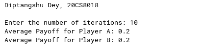

### **Code for problem 1:**

```py
import random

print("DIptangshu Dey, 20CS8018 \n")
# Define the payoffs
payoffs = {
    ('C', 'C'): (3, 3),
    ('D', 'D'): (1, 1),
    ('C', 'D'): (0, 5),
    ('D', 'C'): (5, 0),
}

# Initialize variables
total_payoff_A = 0
total_payoff_B = 0
num_rounds = int(input("Enter the number of rounds: "))

for round in range(num_rounds):
    choice_A = random.choice(['C', 'D'])
    choice_B = random.choice(['C', 'D'])

    # Calculate and display the payoffs for both players
    payoff_A, payoff_B = payoffs[(choice_A, choice_B)]  # type: ignore
    print(
        f"Round {round + 1}: Player A chose {choice_A}, Player B chose {choice_B}")
    print(f"Player A payoff: {payoff_A}, Player B payoff: {payoff_B}")

    # DIptangshu Dey, 20CS8018
    # Update the total payoff for each player
    total_payoff_A += payoff_A
    total_payoff_B += payoff_B

# Calculate the average payoff for each player
average_payoff_A = total_payoff_A / num_rounds
average_payoff_B = total_payoff_B / num_rounds

# Analyze the results
print("\nResults:")
print(f"Average payoff for Player A: {average_payoff_A}")
print(f"Average payoff for Player B: {average_payoff_B}")

# Determine if there is a dominant strategy
if average_payoff_A > average_payoff_B:
    dominant_strategy = 'A'
elif average_payoff_B > average_payoff_A:
    dominant_strategy = 'B'
else:
    dominant_strategy = None

if dominant_strategy:
    print(f"Player {dominant_strategy} has a dominant strategy.")
else:
    print("There is no dominant strategy.")

```

### Output: 

  
 
  
&nbsp;  
&nbsp;   
&nbsp;  
&nbsp;  
&nbsp;  
&nbsp;  
&nbsp;  
&nbsp;  
&nbsp;  
&nbsp;  
&nbsp;  
&nbsp;  
&nbsp;  
&nbsp;  
&nbsp;  


### **Code for problem 2:**

```py
import random

print("DIptangshu Dey, 20CS8018 \n")
# Initialize the payoff matrices
payoff_matrix_a = [[0, 1, -1], [-1, 0, 1], [1, -1, 0]]
payoff_matrix_b = [[0, -1, 1], [1, 0, -1], [-1, 1, 0]]

# Initialize the mixed strategies for both players (e.g., random initial strategies)
p_R = random.random()
p_P = random.random()
p_S = 1 - p_R - p_P

q_R = random.random()
q_P = random.random()
q_S = 1 - q_R - q_P

# Number of iterations for the simulation
num_iterations = int(input("Enter the number of iterations: "))

# Initialize cumulative payoffs
cumulative_payoff_a = 0
cumulative_payoff_b = 0

# Simulation loop
for _ in range(num_iterations):
    # Randomly choose actions based on mixed strategies
    action_a = random.choices(
        ['Rock', 'Paper', 'Scissors'], weights=[p_R, p_P, p_S])[0]
    action_b = random.choices(
        ['Rock', 'Paper', 'Scissors'], weights=[q_R, q_P, q_S])[0]

    # DIptangshu Dey, 20CS8018
    # Update cumulative payoffs
    cumulative_payoff_a += payoff_matrix_a[['Rock', 'Paper', 'Scissors'].index(
        action_a)][['Rock', 'Paper', 'Scissors'].index(action_b)]
    cumulative_payoff_b += payoff_matrix_b[['Rock', 'Paper', 'Scissors'].index(
        action_b)][['Rock', 'Paper', 'Scissors'].index(action_a)]

# Calculate average payoffs
average_payoff_a = cumulative_payoff_a / num_iterations
average_payoff_b = cumulative_payoff_b / num_iterations

print("Average Payoff for Player A:", average_payoff_a)
print("Average Payoff for Player B:", average_payoff_b)

```

### Output: 

