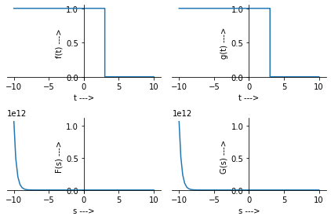
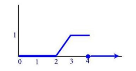
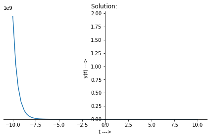
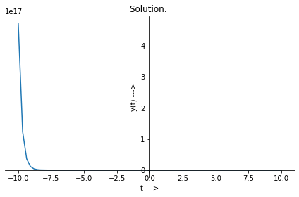
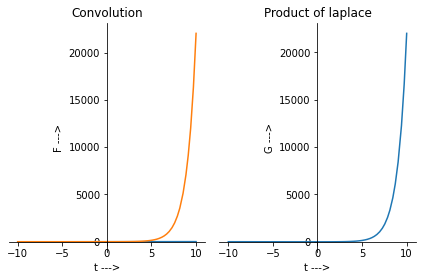

### Name: DIPTANGSHU DEY

### Roll no: 20CS8018

### Reg no: 20U10043

<hr>

### Subject: Signal and Systems Laboratory


### Subject Code: CSS453 

### Lab 5: Laplace Transforms

<hr>

#### Common import statements and declarations for all code snippets 


```python
import sympy
sympy.init_printing()

import sympy.plotting as plt
%matplotlib inline

from IPython.display import display, Math

import numpy as np

t, s = sympy.symbols('t, s', real = True)
a = sympy.symbols('a', real=True, positive=True)
```

##### 1. Find the Laplace transform of the following:

**(a)** $ y = t^2 $

```python
f = t * t
display(sympy.laplace_transform(f, t, s)[0])
```

###### Output:
>ans=
>
> $ \frac{2}{s^3) $

**(b)** $ y = e^{-at} + e^{-3at} $

```python
f = sympy.exp(-a*t)+sympy.exp(-3*a*t)
display(sympy.laplace_transform(f, t, s)[0])
```

###### Output:

>ans =
>
> $ \frac{1}{(a + s)} + \frac{1}{(3a + s)} $

**(c)** $y = e^{2at} \sin(2t)$

```python
f = sympy.exp(2*t)*sympy.sin(2*t)
display(sympy.laplace_transform(f, t, s)[0])
```

###### Output:

>ans =
>
> $ \frac{2}{((s - 2)^2 + 4)} $

**(d)** $ y = e^{3t} + \cos{6t} - e^{-3t} \cos{6t}$

```python
f = sympy.exp(3*t) + sympy.cos(6*t) - sympy.exp(-3*t)*sympy.cos(6*t);
display(sympy.laplace_transform(f, t, s)[0])
```

###### Output:

>ans =
>
> $ \frac{1}{(s - 3)} - \frac{(s + 3)}{((s + 3)^2 + 36)} + \frac{s}{(s^2 + 36)} $

**(e)** $ y = u(t-2) + 2u(t-3) - 2r(t-2)$

```python
f = sympy.Heaviside(t-2) + 2*sympy.Heaviside(t-3) - 2*(t-3)*sympy.Heaviside(t-3)
display(sympy.laplace_transform(f, t, s)[0])
```

###### Output:

> ans =
>
> $ \frac{(se^s + 2s - 2)e^{-3s}}{s}  $

##### 2. Consider the two functions $f(t) = u(t)u(3-t)$ and $g(t) = u(t) - u(t-3)$

​			**(a)**    Are the two functions identical

​			**(b)**    Show that $L[f(t)] = L[g(t)]$

```python
f = sympy.Heaviside(t)*sympy.Heaviside(3-t)
p1 = plt.plot(f, xlabel='t --->', ylabel='f(t) --->', show=False)
g = sympy.Heaviside(t) - sympy.Heaviside(t-3)
p2 = plt.plot(g, xlabel='t --->', ylabel='g(t) --->', show=False)
F = sympy.laplace_transform(f, t, s)[0]
G = sympy.laplace_transform(g, t, s)[0]
p3 = plt.plot(F, xlabel='s --->', ylabel='F(s) --->', show=False)
p4 = plt.plot(G, xlabel='s --->', ylabel='G(s) --->', show=False)
plt.PlotGrid(2, 2, p1, p2, p3, p4)
display(F)
display(G)
```

###### Output:

> $ \frac{1-e^{-3s}}{s} $
>
> $ \frac{1}{s} - \frac{e^{-3s}}{s} $



From plots 1 and 2 it is evident that the two functions are identical

From plots 3 and 4 it can be proved that Laplace transforms of both $f$ and $g$ are equal

##### 3. Find the Laplace transform of:

$$
f(t) =
  \begin{cases}
    0       & \quad 0 \le t <\ 1\\
    t-1  	& \quad 1 \le t < 2\\
    0       & \quad 2 \le t \\
  \end{cases}
$$

```python
f = (t-1)*sympy.Heaviside(t-1) + (1-t)*sympy.Heaviside(t-2)
display(sympy.laplace_transform(f, t, s)[0])
```

###### Output:

> $ \frac{(-s+e^s-1)e^{-2s}}{s^2} $

##### 4. Find the inverse laplace of:

**(a)** $ F(s)  = \frac{1}{s} $

```python
F = 1/s
display(sympy.inverse_laplace_transform(F, s, t))
```

###### Output:
>ans=
>
> 1

**(b)** $F(s) = \frac{10}{s^2+25} + \frac{4}{s-3}$

```python
F = 10/(s**2 + 25) + 4/(s-3)
display(sympy.inverse_laplace_transform(F, s, t))
```

###### Output:
>ans=
>
> $ 4e^{3t} + 2sin(5t) $

**(c)** $ F = \frac{e^{-3s}(2s+7)}{s^2+16}$

```python
F = sympy.exp(-3*s)*(2*s + 7)/(s**2 + 16)
display(sympy.inverse_laplace_transform(F, s, t))
```

###### Output:

> ans =
>
> $ 2sin(12)sin(4t) + \frac{7sin(4t)cos(12)}{4} - \frac{7sin(12)cos(4t)}{4} + 2cos(12)cos(4t) $

**(d)** $F = \frac{s^2+5s-3}{(s^2+16)(s-2)}$

```python
F = (s**2 + 5*s -3)/((s**2 +16)*(s-2))
display(sympy.inverse_laplace_transform(F, s, t))
```

###### Output:

> ans =
>
> $ \frac{9cos(4t)}{20} + \frac{11e^{2t}}{20} + \frac{59sin(4t)}{40} $

##### 5.  The graph of $f(t)$ is given below. Represent $f(t)$ as a combination of Heaviside step functions
calculate the Laplace transform of $f(t)$.



```python
f = (t-2)*sympy.Heaviside(t-2) + (2-t)*sympy.Heaviside(t-4)
display(sympy.laplace_transform(f, t, s)[0])
```

###### Output:

> ans =
>
> $ \frac{(-2s+e^{2s}-1)e^{-4s}}{s^2} $

##### 6. Solve the initial value problem using Laplace transform:

​				**(a)**			$ y' + 2y = 4t \quad\text{,}\quad y(0) = 3 $

```python
t, s, Y = sympy.symbols('t, s, Y', positive=True)
f = 4*t
F = sympy.laplace_transform(f, t, s)[0]
Y1 = s*Y - 3
Sol = sympy.solvers.solve(Y1 + 2*Y - F, Y)
y = sympy.inverse_laplace_transform(Sol[0], s, t)
display(y)
plt.plot(y, xlabel='t --->', ylabel='y(t) --->', title='Solution: ')
```

###### Output:

> y =
>
> $ 2t + 4e^{-2t} - 1 $



​				**(b)**			$ y'' + 3y' + 2y = 6 e^-t \text{,}\quad y(0) = 1,\quad y'(0) = 2 $

```python
t, s, Y = sympy.symbols('t, s, Y', positive=True)
f = (12*sympy.Heaviside(t-1) - 12*sympy.Heaviside(t-3))
F = sympy.laplace_transform(f, t, s)[0]
Y1 = s*Y -2
sol = sympy.solvers.solve(Y1 + 4*Y - F, Y)[0]
y = sympy.inverse_laplace_transform(sol, s, t)
display(y)
plt.plot(y, xlabel='t --->', ylabel='y(t) --->', title='Solution: ')
```


###### Output:

> y =
>
> $ 3e^{-2t} - 2e^{-t} + 6te^{-t} $



​				**(c)**			$ y' + 4y + 2y = g(t) \text{,}\quad y(0) = 2,\text{ where  } g(t) = 12 \quad \text{if ,  }(1 < t < 3) \quad \text{else ,  } 0$

```python
t, s, Y = sympy.symbols('t, s, Y', positive=True)
f = (12*sympy.Heaviside(t-1) - 12*sympy.Heaviside(t-3)) 
F = sympy.laplace_transform(f, t, s, noconds=True)
Y1 = s*Y - 2
sol = sympy.solvers.solve(Y1 + 4*Y - F, Y)
y = sympy.inverse_laplace_transform(sol[0], s, t)
display(y)
plt.plot(y, xlabel='t --->', ylabel='y(t) --->', title='Solution: ')
```

###### Output:

>y =
>
>$ (-3e^{4t}\theta(t-3) + 3e^{4t}\theta(t-1) + 3e^{12}\theta(t-3) -3e^4\theta(t-1)+2)e^{-4t} $ 

Here $ \theta(t) $ is `sympy.Heaviside(t)`


##### 7. Verify that multiplication in s domain is equivalent to convolution in time domain.

```python
t, s, a = sympy.symbols('t, s, a', positive=True)
x = sympy.symbols('x')
f = t
f1 = sympy.exp(t)
F = sympy.integrate(f.subs(t, x)*f1.subs(t, t-x),(x, 0, oo))
G = sympy.inverse_laplace_transform(sympy.laplace_transform(f, t, s, noconds=True)*sympy.laplace_transform(f1, t, s, noconds=True), s, t, noconds=True)
p1 = plt.plot(t, F.subs({a:4}), xlabel='t --->', ylabel='F --->', title='Convolution', show=False)
p2 = plt.plot(G.subs({a:4}), xlabel='t --->', ylabel='G --->', title='Product of laplace', show=False)
plt.PlotGrid(1, 2, p1, p2)
```

###### Output:



We can see that the graphs are same, hence they are equal.

